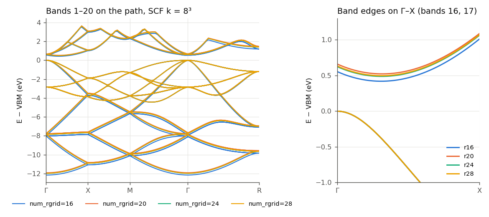
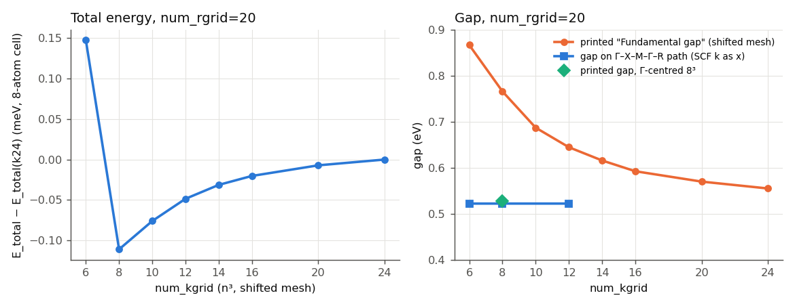
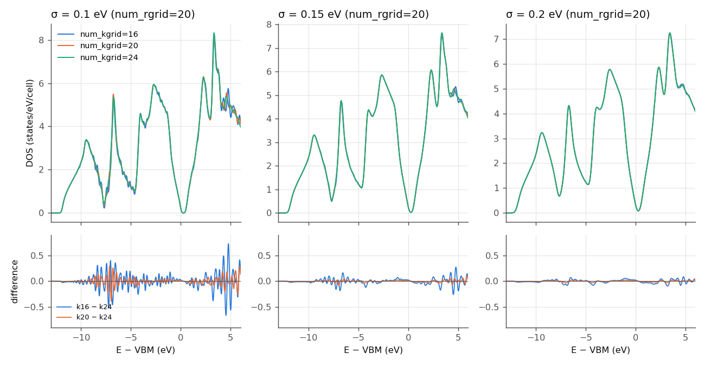
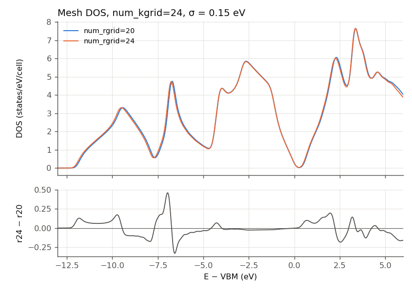

# Learning objective

Choose `num_rgrid`, `num_kgrid`, `nstate`, and the DOS broadening of a
periodic SALMON ground state by checking convergence separately for each
observable that will be reported, then confirm the combined choice with one
final run.

# Summary

Starting from the official bulk-Si ground-state sample (`num_kgrid=4,4,4`,
`num_rgrid=12,12,12`), the parameters needed differed by observable:

- the total energy converged in k by `num_kgrid=8` (sub-meV), but the printed
  `Fundamental gap` and the DOS kept changing with k;
- the band structure, measured relative to the valence-band maximum (VBM),
  required `num_rgrid=24` (r20 to r24 moved bands by up to 75 meV), while the
  SCF k mesh was already sufficient at `num_kgrid=6`;
- the DOS depended jointly on k and on the Gaussian width `out_dos_width`, and
  could not be reduced to a single percentage.

The adoption rule was: check convergence per observable, then run once more at
the intersection of the requirements. The confirmation run at `num_rgrid=24`,
24^3 k-points reproduced the total energy and bands of a much cheaper run to
0.016 meV and 0.29 meV. The adopted set for total energy, bands, and DOS is
`num_rgrid=24`, `num_kgrid=16`, `nstate=32`, `out_dos_width=0.15` eV.

These are observations for one model (eight-atom cubic Si, PZ-LDA, FHI98PP
pseudopotential, SALMON v2.3.0) and must not be transferred to other systems
without repeating the ladders.

## Context and objective

The official sample is a minimal, fast example. It does not enable DOS
output, and its printed gap is a mesh gap. Before using bulk Si as a reference
ground state for band-structure and DOS work, we needed to know which
discretization each of three observables requires:

1. total energy `E_total`;
2. band energies along Gamma-X-M-Gamma-R (bands 1–20, relative to the VBM);
3. the DOS on −14 to +9 eV relative to the VBM.

Tutorial [002](../002-si-hhg-convergence-and-restart-validation/) judged the
k mesh on an HHG observable; this tutorial applies the same principle to
ground-state observables.

## Conditions

- SALMON: v2.3.0, tag `v.2.3.0`, commit
  `30ba64694ec761cdb6288f01a75b8bcabf05721f`, unmodified for every
  convergence run. One diagnostic build containing a single-line patch was used
  only for [SALMON-TS-001](../../troubleshooting/SALMON-TS-001-dft-band-off-mesh-eigenvalues.md).
- Platform: Fugaku (A64FX), Fujitsu compiler (tcsds-1.2.43, `mpifrtpx`),
  `-Kfast`, SSL2. LibXC 4.3.4, ScaLAPACK (SSL2), and EigenExa 2.4b were
  linked but not used by this `xc='PZ'` calculation.
- Parallel configuration: four MPI processes per node and 12 OpenMP threads
  per process; `nproc_k` equal to the process count, `nproc_ob=1`,
  `nproc_rgrid=1,1,1`. Run sizes ranged from 1 to 27 nodes.
- Structure: eight-atom cubic Si cell, `al(1:3)=5.43d0` Angstrom, the
  `&atomic_red_coor` block of the official sample.
- Pseudopotential: ABINIT FHI98PP LDA `14-Si.LDA.fhi` (four valence
  electrons, `lloc_ps(1)=2`), not the `Si_rps.dat` shipped with the sample.
  Checksums are in [provenance/run.yaml](provenance/run.yaml).
- Electronic structure: `theory='dft'`, `xc='PZ'`, `nelec=32`,
  `nstate=32` unless stated, `nscf=300`, `threshold=1.0d-9`.
- k meshes: SALMON's default shifted mesh (`yn_gamma_centered='n'`) unless
  stated.

## Procedure

1. **Decide the observables first** and enable the outputs that measure them.
   The official sample has no `&analysis` block, so a DOS was not written. The
   first ladder had to be rerun after adding:

   ```fortran
   &analysis
     yn_out_dos = 'y'
     yn_out_dos_set_fe_origin = 'y'
     out_dos_start = -14.0d0
     out_dos_end = 9.0d0
     out_dos_nenergy = 1841
     out_dos_width = 0.1d0
     out_dos_function = 'gaussian'
   /
   ```

   See [SALMON-TS-003](../../troubleshooting/SALMON-TS-003-sample-deck-has-no-dos-output.md).
2. **r ladder** at fixed k (`num_kgrid=6`: r12/16/20/24/28/32) with DOS output.
   The DOS at k6 is not k-converged and was not used to quantify r effects.
3. **k ladder** at `num_rgrid=20` (k6 to k24) with DOS output.
4. **Band path.** v2.3.0 `theory='dft_band'` gave wrong eigenvalues away from
   the SCF mesh ([SALMON-TS-001](../../troubleshooting/SALMON-TS-001-dft-band-off-mesh-eigenvalues.md)).
   Bands were therefore computed in an ordinary `theory='dft'` run whose
   `file_kw` list contains the SCF mesh plus 128 path points with weight
   1e-9 each. SALMON renormalizes the weights to sum to 1 when it reads the
   file. The path points carry 1.28e-7 of the total weight, so they have a
   negligible effect on the density. Their eigenvalues are converged with the
   same Hamiltonian. The file contains the number of points, followed by
   `index kx ky kz weight` in reduced coordinates. The k8 example has 512
   mesh points followed by the path:

   ```text
   640
       1 -0.437500000000000 -0.437500000000000 -0.437500000000000 1.953125000000e-03
     ...
     513  0.000000000000000  0.000000000000000  0.000000000000000 1.000000000000e-09
   ```

   The mesh part must reproduce SALMON's own default mesh: the shifted mesh
   with points at (i − 0.5)/n − 0.5, with kx varying fastest. The 24^3 list
   was checked against SALMON's internally generated mesh to 4e-16.

   Band-path runs: k8 at r16/20/24/28; SCF k6 and k12 at r20; and k8, r20 with
   `nstate=48`.
5. **DOS versus broadening.** DOS files were re-broadened offline from
   `*_eigen.data` and `*_k.data` with the same Gaussian, factor-2 spin, and
   VBM origin as SALMON. The offline procedure reproduced SALMON's
   `*_dos.data` to 4e-13 states/eV.
6. **Adopt and confirm.** Take the strictest requirement for each parameter
   and run once at that set. The confirmation run used `num_rgrid=24`, the
   24^3 shifted mesh written explicitly through `file_kw`, plus the same 128
   path points and `out_dos_width=0.15d0`.

The representative input
[inputs/si-gs-adopted.inp](inputs/si-gs-adopted.inp) is the adopted set:
`num_rgrid=24`, a plain `num_kgrid=16` mesh, and no `file_kw`. It was not
executed in exactly this form. The confirmation run differed only in the k
list (24^3 + path via `file_kw`) and `nproc_k`.

## Observed result

Unless marked *estimated*, every number below was measured from a converged
SCF (residual below 1e-9) that ended with `end SALMON` and empty standard
error. Gap and band numbers are differences between eigenvalues of each run;
absolute energies are compared only where stated.

### Starting point: the official sample

With FHI98PP Si, the official settings (k4, r12) converged in 43 iterations
to `E_total = -850.9305` eV with a printed gap of 0.777 eV. Total energy and
gap alone were not enough to judge convergence, and the first seven-point
ladder had no DOS. It was rerun with the `&analysis` block above. The rerun
reproduced every SCF iteration exactly, so adding DOS output does not change
the physics.

### Real-space grid



| `num_rgrid` (SCF k8) | path-resolved gap (eV) | max band change vs previous, bands 1–20 (eV) |
|---:|---:|---:|
| 16 | 0.419 | – |
| 20 | 0.522 | 0.276 |
| 24 | 0.488 | 0.075 |
| 28 | 0.497 | 0.021 |

- The gap is not monotonic in r. The deep valence bands (1–8) and the
  conduction bands (17–20) shift with r, while the upper valence bands (9–16)
  move by at most 24 meV. The conduction-band-minimum (CBM) position on Gamma-X is
  stable to about 0.002 (2π/a).
- A judgment of "r20 converged" was first made by eye from σ = 0.1 eV DOS
  overlays at k6. It did not hold for bands: r20 to r24 moved bands by 75 meV.
  Bands were judged at r24 (r24 to r28 = 21 meV).
- The k6 DOS overlays used for that judgment are not converged in k. Coarse-k
  DOS is spiky, and those spikes exaggerate the effect of any energy shift.
  For this reason, this tutorial does not quantify r convergence of the DOS
  from the k6 or k8 data. The only r effect quantified on a k-converged DOS is
  r20 to r24 at k24, reported under the confirmation run below. r24 to r28 on a
  k-converged DOS was not measured.
- Observation: the absolute `E_total` at k6 is −864.431, −864.631, −864.501,
  and −864.731 eV for r20, 24, 28, and 32. It is not monotonic and is not
  converged to 0.1 eV even at r32. This tutorial claims k convergence of
  `E_total` only. It does not claim r convergence of the absolute total
  energy. The choice of r24 is set by the bands.

### k-point mesh (num_rgrid=20)



- `E_total`: k6 to k24 differ by at most 0.26 meV (8-atom cell). The entire
  spread is in the k6 to k8 step; from k8 onward, each step is below 0.04 meV.
- Printed `Fundamental gap` for k6/8/10/12/14/16/20/24: 0.867, 0.766,
  0.687, 0.645, 0.616, 0.592, 0.570, and 0.555 eV, still decreasing at k24.
  This is a sampling artifact of the shifted mesh, not a k-convergence
  problem of the electronic structure
  ([SALMON-TS-002](../../troubleshooting/SALMON-TS-002-printed-gap-depends-on-k-mesh.md)).
- Bands on the path versus SCF k: path-resolved gaps were 0.52218, 0.52221,
  and 0.52221 eV for k6, k8, and k12. Bands 1–17 agree to 3e-5 eV, so the
  SCF density is converged for bands at k6. The Gamma-centered 8^3 mesh
  (`yn_gamma_centered='y'`) printed 0.528 eV.
- `nstate=48` versus `nstate=32` (k8, r20): bands 1–20 agree to 1.1e-4 eV,
  the gap to 1.5e-8 eV, and `E_total` to 1.2e-7 eV. Bands above 20 are the
  unrefined top of the `nstate=32` window and were not used.

### DOS: k mesh and broadening together



DOS convergence was judged by inspecting the overlays and difference panels.
It is not reduced to one percentage, because localized states, energy shifts,
and sampling ripple mean different things. The relative L1 differences,
`sum|D_a-D_b| / sum D_b`, on the common 0.0125 eV axis are reference numbers
only. Valence is [−14, 0] eV and conduction is (0, 5.5] eV relative
to each run's VBM; r20 is used throughout:

| step | σ = 0.10 eV | σ = 0.15 eV | σ = 0.20 eV |
|---|---:|---:|---:|
| k14 to k16 | 4.7% / 3.4% | 1.6% / 1.3% | 0.6% / 0.6% |
| k16 to k20 | 3.2% / 3.5% | 1.0% / 1.3% | 0.6% / 0.6% |
| k20 to k24 | 1.4% / 1.1% | 0.4% / 0.5% | 0.3% / 0.3% |
| k16 vs k24 (direct) | 3.2% / 3.3% | 1.2% / 1.5% | 0.9% / 0.9% |

The direct k16-versus-k24 row was computed for this tutorial from the same
data.

The same percentage can come from different kinds of change, so read it
together with the overlays:

- at σ = 0.1 eV, the k16 and k20 differences are sampling ripple around
  sharp van Hove features near −10 to −6 eV and +4 to +5.5 eV;
- a rigid energy shift, such as moving the DOS origin by 10 meV, already
  changes the L1 metric by about 0.7% at σ = 0.15 eV without any change in
  shape;
- localized changes in one peak and broad shifts of whole band groups can give
  the same percentage.

A larger σ converges faster in k because it removes structure. The choice of
σ is a decision about the resolution required, not only a convergence
parameter. The conduction DOS is complete only below about +5.9 eV relative to
the VBM at `nstate=32`.

### Confirmation run at the intersection (r24, 24^3 + path)

- `#GS converged at 68 : 0.88842326E-09`; electron number 32 throughout.
- `E_total = -864.63156` eV, within 0.016 meV of the k8, r24 path run.
- Bands 1–20 on all 128 path points: maximum difference 0.29 meV from the
  k8, r24 run.
- Path-resolved gap: 0.4877 eV, with the VBM at Gamma and CBM at
  (0.1625, 0, 0)·2π/a of the eight-atom cubic cell on Gamma-X. The printed
  `Fundamental gap` equals this value because the path points are included in
  the k list.
- DOS, mesh points only, σ = 0.15 eV, aligned VBM origins, r20 to r24 at k24:
  valence 2.95% and conduction 2.51% on (0, 9] eV, or 1.91% on (0, 5.5] eV.
  This is about 7.5 times the k20 to k24 step. It consists mainly of an about 50–70 meV
  downward shift of deep valence bands 1–8 relative to the VBM and a 35 meV
  smaller mesh gap. This is a reference number; the overlay below shows what
  changes. The effect of r24 to r28 on a k-converged DOS was not measured.

  

### Adopted set

| parameter | value | deciding observable |
|---|---|---|
| `num_rgrid` | 24,24,24 | bands (r20 to r24 75 meV; r24 to r28 21 meV) |
| `num_kgrid` | 16,16,16 | DOS at σ = 0.15 eV; `E_total` and bands need only k8 and k6 |
| `out_dos_width` | 0.15 eV | DOS resolution versus k cost |
| `nstate` | 32 | bands 1–20 unchanged at 48 |

The k16 mesh was chosen over k24 because a 1% DOS criterion was not required.
*Estimated:* at r24 and σ = 0.15 eV, the k16 DOS differs from k24 by about
1–1.5%. This estimate comes from the r20 ladder, where the measured direct
k16-versus-k24 difference was 1.2% / 1.5%; k16 at r24 was not run. Whether
r24 is sufficient for the DOS was not established: r24 to r28 was not measured
on a k-converged DOS. If the DOS is the main observable, run that comparison
at k24.

## Validation

- Every run was checked for `#GS converged`, residual below 1e-9,
  electron number 32 at every iteration, no NaN, `end SALMON`, and empty
  standard error.
- Controlled comparisons: decks within a ladder differed only in the ladder
  variable, `sysname`, and `nproc_k`.
- The 1e-9-weight path method was checked against true-weight k-points.
  Gamma and (0.125, 0, 0) eigenvalues in the Gamma-centered run agreed with the path
  run to 4e-6 eV. Adding the path changed `E_total` by 1.2e-7 eV and the
  mesh-only gap by 3e-8 eV.
- The offline DOS reproduced SALMON's `*_dos.data` to below 1e-12 states/eV
  before being used at other broadenings or with a mesh-only VBM origin.
- The confirmation run checked the k-converged `E_total` and bands at r24
  against an independent k8 run, with tolerances set before the run.

## Lessons learned

- **Decide the observables before the first run** and enable their output.
  Total energy and the printed gap could not decide convergence. See
  [SALMON-TS-003](../../troubleshooting/SALMON-TS-003-sample-deck-has-no-dos-output.md).
- **The required grid depends on the observable.** Do not reuse an
  `num_rgrid` judged from one quantity, especially a broadened DOS judged by
  eye, for band energies. Compare grids only on data that are converged in
  the other parameters, such as k.
- **`E_total` k convergence does not imply gap or DOS k convergence.** Here,
  `E_total` was flat from k8, the band-path gap from SCF k6, and the DOS needed
  k16–k24 depending on σ.
- **The printed `Fundamental gap` is a k mesh sample.** On a shifted mesh, it
  misses Gamma and the CBM. Use a path or Gamma-centered mesh for gaps
  ([SALMON-TS-002](../../troubleshooting/SALMON-TS-002-printed-gap-depends-on-k-mesh.md)).
- **DOS convergence is not one number.** Localized states, energy shifts,
  and sampling ripple mean different things. Report σ together with the k
  mesh, align energy origins before comparing, and judge from overlays. Use
  percentages only as reference values.
- **Official samples are minimal.** They demonstrate execution and are not
  converged references; they do not enable DOS output.
- **In v2.3.0, compute bands with `theory='dft'` and zero-weight `file_kw`
  path points** rather than `theory='dft_band'`
  ([SALMON-TS-001](../../troubleshooting/SALMON-TS-001-dft-band-off-mesh-eigenvalues.md)).
- **Check per observable, then confirm once at the intersection.** A single
  confirmation run catches interactions between parameters that separate
  ladders cannot.

## Limitations and applicability

This covers one structure (eight-atom cubic Si, a = 5.43 Angstrom), PZ-LDA,
FHI98PP `14-Si.LDA.fhi`, norm-conserving pseudopotentials, spin-unpolarized
calculations, and SALMON v2.3.0 on Fugaku (A64FX). Other pseudopotentials,
including the sample's `Si_rps.dat`, can require different grids. The
absolute total energy was not shown to converge in r, and bands were tested
only to r28. The r dependence of a k-converged DOS was measured only for
r20 to r24. The DOS metric and windows are one choice; no general threshold is
implied. The adopted k16, r24 set itself was not run as a plain-mesh
calculation. The PZ-LDA gap of about 0.49 eV is a property of this model, not
an experimental reference.

## References

- [SALMON2 v.2.3.0 Si ground-state sample](https://github.com/SALMON-TDDFT/SALMON2/tree/30ba64694ec761cdb6288f01a75b8bcabf05721f/samples/exercise_04_bulkSi_gs)
- [SALMON2 v.2.3.0 `file_kw` reader and k mesh generation (`src/common/lattice.f90`)](https://github.com/SALMON-TDDFT/SALMON2/blob/30ba64694ec761cdb6288f01a75b8bcabf05721f/src/common/lattice.f90#L127-L209)
- [SALMON2 v.2.3.0 `&analysis` DOS defaults (`src/io/inputoutput.f90`)](https://github.com/SALMON-TDDFT/SALMON2/blob/30ba64694ec761cdb6288f01a75b8bcabf05721f/src/io/inputoutput.f90#L925-L931)
- [ABINIT LDA FHI pseudopotential collection](https://www.abinit.org/atomic_data/psps/miscellaneous/ATOMICDATA/LDA_FHI/)
- Related tutorials: [001 official Si exercise](../001-si-hhg-official-exercise-reproduction/),
  [002 convergence judged on HHG observables](../002-si-hhg-convergence-and-restart-validation/),
  [004 FHI pseudopotentials from CIF](../004-4h-sic-gs-from-cif-fhi/)
- Troubleshooting: [TS-001](../../troubleshooting/SALMON-TS-001-dft-band-off-mesh-eigenvalues.md),
  [TS-002](../../troubleshooting/SALMON-TS-002-printed-gap-depends-on-k-mesh.md),
  [TS-003](../../troubleshooting/SALMON-TS-003-sample-deck-has-no-dos-output.md)
- Run provenance: [provenance/run.yaml](provenance/run.yaml). Raw outputs are not committed.
