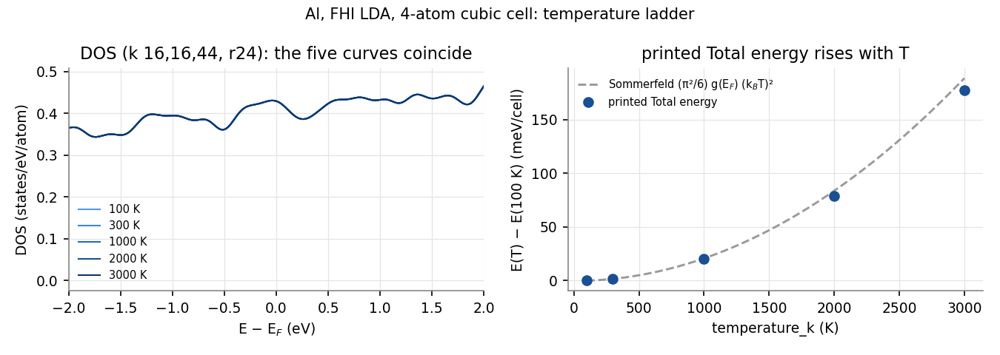
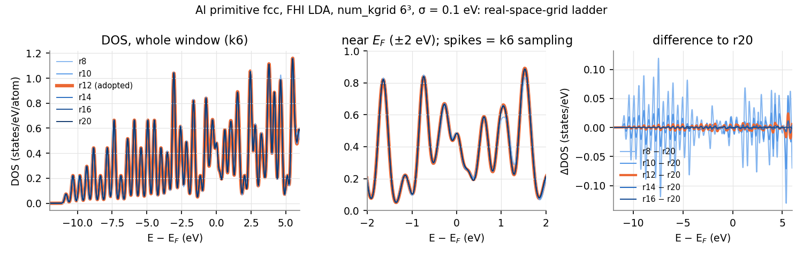
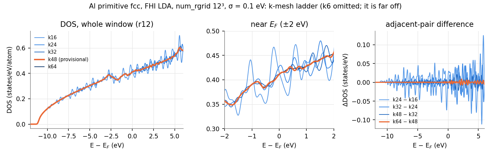
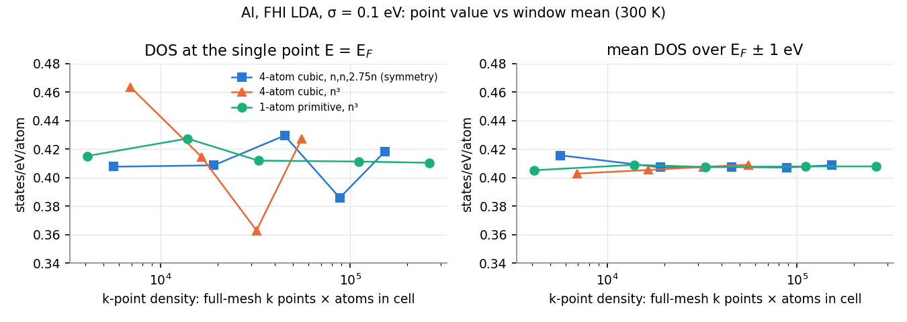

# Learning objective

Choose `num_rgrid`, `num_kgrid`, and the smearing temperature of a metallic
ground state whose density of states (DOS) near the Fermi level will be
reported. Judge convergence from DOS overlays rather than from a single number,
and record the reason for every judgment.

> **Draft.** Both convergence judgments were made or confirmed by the maintainer:
> the real-space grid (`num_rgrid=12`) was the maintainer's judgment, and the
> k mesh (`num_kgrid=48` in the primitive cell) was proposed by the AI
> assistant that drafted this tutorial and confirmed by the maintainer.

# Summary

The starting point was the published SALMON-inputs Al ground-state input,
which is written for a strong-field Maxwell-TDDFT calculation. Its parameters
are not a converged reference for a ground-state DOS. We followed the maintainer's
established procedure: use the one-atom primitive fcc cell, run an r ladder
at a thin k mesh, and then a k ladder at the chosen r. The results were as
follows:

- **Real-space grid.** `num_rgrid=12` in the primitive cell (grid spacing
  0.239 Angstrom). The maintainer judged that its DOS overlaps those of r16 and
  r20. The published value r24 in the four-atom cubic cell (0.169 Angstrom)
  is finer than the ground-state DOS needs.
- **k mesh.** The total energy and Fermi level were flat from about k24, but
  the DOS near E_F needed much denser sampling. The choice is
  `num_kgrid=48,48,48` (110592 k-points, no symmetry): from k48 to k64, the
  DOS changed by at most 1.44% of its peak and the Fermi level by 0.23 meV.
  The DOS at the single point E = E_F is not a usable convergence measure
  ([SALMON-TS-004](../../troubleshooting/SALMON-TS-004-metal-dos-near-ef-converges-slowly-in-k.md)).
- **Smearing temperature.** `temperature_k=300` was kept. The DOS written by
  SALMON did not change between 100 and 3000 K. The printed `Total energy`
  rises with T because it is not a free energy
  ([SALMON-TS-005](../../troubleshooting/SALMON-TS-005-total-energy-with-temperature-is-not-free-energy.md)).

The (r12, k48) run is itself the confirmation run at the intersection of the
two ladders. These are observations for one model: Al, PZ-LDA, the ABINIT
FHI98PP pseudopotential, a = 4.0494 Angstrom, and SALMON v2.3.0. They must
not be transferred to other metals without repeating the ladders.

## Context and objective

Bulk Al is the simplest metal for SALMON ground-state work. We wanted a
ground state whose DOS within a few eV of E_F could be reported. The
starting point was the published input of
[SALMON-inputs `AYamada2024_PhysRevB109_245130/Al_ms/gs`](https://github.com/SALMON-TDDFT/SALMON-inputs/tree/e5cf45d7378cc1aec6bb4dd4c3b534cbee8a81b9/inputfiles/AYamada2024_PhysRevB109_245130/Al_ms/gs).
It is the ground state for a Maxwell-TDDFT study of intense-pulse
irradiation of Al and was written for SALMON v.2.0.1. Tutorial
[005](../005-si-gs-convergence-bands-dos/) showed for Si that each observable
needs its own convergence check. This tutorial applies that approach to a
metal, where the Fermi surface and the smearing add further choices.

**Judgment rule used in this tutorial.** The maintainer judges convergence by
looking at overlays of the DOS and of the differences between rungs. The
numbers quoted below (maximum deviation, relative L1 distance, window means,
energy differences) are reference values only. No script decides convergence.
For each judgment, the reason is recorded, including judgments that were
later withdrawn; see [Judgment record](#judgment-record).

## Conditions

- SALMON: v2.3.0, tag `v.2.3.0`, commit
  `30ba64694ec761cdb6288f01a75b8bcabf05721f`, unmodified for every run.
- Platform: Fugaku (A64FX), Fujitsu compiler (tcsds-1.2.43, `mpifrtpx`),
  `-Kfast`, SSL2. LibXC 4.3.4, ScaLAPACK (SSL2), and EigenExa 2.4b were
  linked but not used by these `xc='PZ'` calculations.
- Parallel configuration: four MPI processes per node, 12 OpenMP threads
  per process, `nproc_k` equal to the process count, `nproc_ob=1`,
  `nproc_rgrid=1,1,1`. Runs used 1 to 24 nodes; the k64 run used 64 nodes.
- Published input: SALMON-inputs commit
  `e5cf45d7378cc1aec6bb4dd4c3b534cbee8a81b9`. All 27 distinct input keys of
  `gs/Al.inp` exist in v2.3.0, and the input ran unchanged. Whether any
  default or meaning changed between v2.0.1 and v2.3.0 was not checked.
- Pseudopotentials: the published `Al.psp8` (ONCVPSP, PBE) for the first run
  only; ABINIT FHI98PP LDA `13-Al.LDA.fhi` (three valence electrons,
  `lloc_ps(1)=2`) for every other run. Checksums are in
  [provenance/run.yaml](provenance/run.yaml).
- Electronic structure: `theory='dft'`, `xc='PZ'`, Fermi-Dirac occupations
  through `temperature_k`, spin-unpolarized.
- DOS: `yn_out_dos='y'`, `yn_out_dos_set_fe_origin='y'` (origin at E_F),
  `out_dos_function='gaussian'`, `out_dos_width=0.1d0` eV, 0.0125 eV
  spacing. The published input has no `&analysis` block, so this block was
  added to every run (compare
  [SALMON-TS-003](../../troubleshooting/SALMON-TS-003-sample-deck-has-no-dos-output.md)).
- k meshes: SALMON's default half-shifted mesh. An even n contains no Gamma
  point.

## Procedure

The path below includes the steps that were later replaced. The reason for
each step is given because the reasons are what transfers to other systems.

1. **Run the published input once, unchanged.** Only `sysname`, `nproc_k`,
   `write_gs_restart_data='no'`, and the DOS block were changed. The input
   uses:
   - a four-atom cubic cell, a = 4.0494 Angstrom, `nstate=12`;
   - an anisotropic mesh `num_kgrid=16,16,44` with `yn_symmetry='yyn'` and a
     `sym.dat` file;
   - `num_rgrid=24,24,24`;
   - `temperature_k=300`;
   - the PBE pseudopotential `Al.psp8` with `xc='PZ'` (LDA).

   Each of these choices serves the downstream calculation, not a
   ground-state DOS study. The light is polarized along z
   (`epdir_re1 = 0.,0.,1.`). The fine grid matches the real-time propagation.
   *Assumption:* the denser kz mesh is also chosen for the z-polarized
   response; the README does not state its purpose. The PBE pseudopotential
   with LDA `xc` is a functional mismatch
   ([SALMON-TS-006](../../troubleshooting/SALMON-TS-006-pseudopotential-functional-differs-from-xc.md)).
2. **Switch to FHI LDA.** The maintainer decided to use `13-Al.LDA.fhi` so that
   the pseudopotential matches `xc='PZ'` and the Si work of tutorial 005.
   Only `file_pseudo` and `lloc_ps` (4 to 2) changed.
3. **Four-atom ladders around the published center (k 16,16,44, r24,
   300 K).** These were the anisotropic k ladder (n,n,2.75n for n = 8 to 24),
   the r ladder (r16 to r32), and the temperature ladder (100 to 3000 K).
   Each deck differed from the center only in the ladder variable, `sysname`,
   and `nproc_k`.
4. **Isotropic k ladder, four-atom cell, no symmetry** (n^3 for n = 12 to 24,
   r24). Reason: a cubic ground state calls for an isotropic mesh. `sym.dat`
   only reduces cost and does not change the result. Removing it gives the
   input a typical user would write.
5. **Primitive cell, the maintainer's established procedure.** The maintainer's own
   earlier Al work used the following procedure, which was adopted here:
   - use the one-atom fcc primitive cell;
   - run the r ladder at a thin k mesh, which is legitimate because r and k
     are largely independent;
   - run the k ladder at the chosen r;
   - judge from the DOS shape over the whole window, both below and above
     E_F;
   - read the deviations relative to the DOS peak, not as window integrals.
   - r ladder: `num_rgrid` 8, 10, 12, 14, 16, 20 at `num_kgrid=6`.
   - k ladder: `num_kgrid` 6, 16, 24, 32, 48, 64 at `num_rgrid=12`.
   - Common settings: `nstate=20`, 300 K, `yn_symmetry='n'`, `ncg=4`,
     `method_mixing='broyden'`, `threshold=1d-9`.
6. **Adopt.** The (r12, k48) run is the k48 rung of the k ladder, so it is
   already the run at the intersection of the two choices.

The representative input
[inputs/al-gs-adopted.inp](inputs/al-gs-adopted.inp) is the (r12, k48) deck.
Only `sysname`, the pseudopotential path, and comments differ.

## Observed result

Unless stated otherwise, every run reached `#GS converged`, finished with
`end SALMON`, wrote nothing to standard error, and conserved the electron
number to better than 5e-8. Every occupation lay in [0, 2]. No run reached
`nscf=300`; the maximum was 214 iterations (four-atom r32).

### 1. Published input (four-atom, PBE psp8) and FHI LDA at the same settings

- The published input converged in 122 iterations. Its occupied bandwidth was
  11.071 eV, and DOS(E_F) was 1.730 states/eV/cell.
- With FHI LDA at the same settings, it converged in 131 iterations. Its
  bandwidth was 11.059 eV (−0.1%), and DOS(E_F) was 1.718 (−0.7%). See
  [SALMON-TS-006](../../troubleshooting/SALMON-TS-006-pseudopotential-functional-differs-from-xc.md).
- The fine DOS structure on the 0.0125 eV grid was common to both
  pseudopotentials at the same mesh (high-pass correlation 0.92). This
  indicated that the structure is k-sampling structure, not physics.

### 2. Four-atom ladders (FHI LDA)

- **r ladder (k 16,16,44).** Against r32, r16 differed by 8 meV in E_F,
  14 meV in occupied bandwidth, and 0.20% in relative L1 over ±2 eV. The
  largest point deviation was 1.2% of the local DOS. The absolute `E_total`
  was not monotonic in r (+62.8, +36.2, +5.8, +6.4, 0 meV/cell for r16–r32)
  and was not used for the r decision. The maintainer judged that **r16 is
  sufficient** for the DOS. The published r24 was the center only because it
  was the published value.
- **Anisotropic k ladder.** `E_total` scattered by ±2 meV/cell from k12. DOS
  window means over ±1–2 eV agreed to 0.1–0.4% from k12. DOS(E_F) at a
  single point varied by 11% without a trend up to 24,24,66.
- **Isotropic k ladder.** E_F scattered over 43 meV, and DOS(E_F) at a
  point varied by 24% (k12–k24). The ±1 eV window mean still rose by 0.4%
  per rung at k24. The DOS peak near +2.1 eV and the dip near −0.5 eV
  followed the in-plane mesh number in both mesh families, so they are
  sampling features. Isotropic k24 and anisotropic 24,24,66 agreed to
  0.36 meV/cell in `E_total` and 0.3 meV in E_F. The maintainer judged that **k
  is not converged at 24**; the k ladder must be extended to k48 and beyond.
- **Temperature ladder.** The DOS did not change between 100 and 3000 K: the
  relative L1 distance to 300 K was at most 0.07%, and E_F moved by at most
  4 meV. The printed `Total energy` rose by +0.020, +0.079, and +0.178 eV
  at 1000, 2000, and 3000 K relative to 100 K. The maintainer kept **300 K**.

### 3. Primitive cell: r ladder at k6

The spikes are k6 sampling structure. They are the same in every rung, so the
overlay compares r at a fixed sampling.

| pair | max_dev (% of peak) | rel-L1 whole window | ΔE_F (meV) | Δ bandwidth (meV) | ΔE_total (meV) |
|---|---:|---:|---:|---:|---:|
| r8 to r10 | 7.54 | 6.05% | −8.3 | −31.8 | +3.7 |
| r10 to r12 | 4.70 | 2.50% | −11.5 | −13.6 | −28.3 |
| r12 to r14 | 1.10 | 0.47% | −2.3 | −0.9 | −5.0 |
| r14 to r16 | 1.03 | 0.33% | −0.3 | +0.1 | −0.7 |
| r16 to r20 | 0.19 | 0.15% | −0.0 | −0.3 | +0.8 |

Here max_dev is 100 · max|D_b − D_a| / max D_b over the window from −14 to
+6 eV, and b is the denser rung. The maxima of r10 to r16 lie near +5.5 eV,
where the DOS peak used for normalization is. The ±1 eV window mean changed
by at most 0.03% from r12 onward.

**Judgment (maintainer): r12**, "it overlaps r16 and above". For reference, a
rule requiring two consecutive pairs below a tolerance gives r10 at 5% and
r12 at 3%. The maintainer's choice agrees with the 3% result and with the
maintainer's earlier Al work.

### 4. Primitive cell: k ladder at r12

| pair | max_dev (% of peak) | rel-L1 whole | rel-L1 ±1 eV | ΔE_F (meV) | ΔE_total (meV) | Δ bandwidth (meV) |
|---|---:|---:|---:|---:|---:|---:|
| k6 to k16 | 99.1 | 49.9% | 32.1% | +59.2 | −9.01 | +221.1 |
| k16 to k24 | 19.8 | 6.03% | 6.15% | +20.2 | +0.06 | +34.9 |
| k24 to k32 | 9.50 | 2.80% | 2.17% | +0.02 | −0.22 | +5.2 |
| k32 to k48 | 3.59 | 1.13% | 0.93% | −0.57 | −0.04 | +3.1 |
| k48 to k64 | 1.44 | 0.30% | 0.38% | +0.23 | −0.001 | +1.5 |

- From k24, `E_total` changed by less than 0.3 meV per atom and E_F by less
  than 0.6 meV. However, the DOS still changed by 9.5% of its peak at
  k24 to k32.
- The differences are oscillations with a period of about 0.3–0.8 eV, not a
  shift. The best rigid shift removed less than 1% of the k48 to k64
  difference. The ripple amplitude fell by a factor of about 90 from
  k6 to k16 to k48 to k64.
- The window means converged faster than the point value. At k48 and k64,
  the means over ±0.25, ±0.5, ±1, and ±2 eV all lie between 0.405 and 0.409
  states/eV, with each pair difference at most 0.09%. DOS(E_F) at the single
  point was 0.415, 0.428, 0.412, 0.411, and 0.411 for k16–k64.
- The bandwidth still increased by 1.5 meV at k48 to k64. All even meshes miss
  Gamma, where the band bottom lies, and the nearest point approaches Gamma as 1/n.
  *Interpretation, not measured:* this Gamma exclusion contributes to the
  drift. No odd-n or Gamma-centered control was run.

**Judgment: k48 (proposed by the AI assistant, confirmed by the maintainer).**
Reasons:

- The k48 to k64 change is ripple-scale (period about 0.33 eV) with no shift.
- The window means and E_F changed by 0.1% or less and 0.23 meV.
- The result agrees with the maintainer's earlier Al work, which also chose k48
  and found 1.53% for the same pair. That calculation used a lattice
  constant 0.26% smaller and an older SALMON build.

The two-consecutive-pairs rule gives k48 at a 5% tolerance and no lock at
3%. The maintainer had earlier asked for the ladder to reach "k48 and beyond".
The k64 run exists, so k64 is the alternative if a finer DOS is needed.

### 5. Adopted set

| parameter | value | deciding observation | judged by |
|---|---|---|---|
| cell | primitive fcc, a = 4.0494 Angstrom, 1 atom | the maintainer's established procedure | maintainer |
| pseudopotential / `xc` | `13-Al.LDA.fhi`, `lloc_ps=2` / `'PZ'` | matching functional; consistent with Si | maintainer |
| `num_rgrid` | 12,12,12 (0.239 Angstrom) | DOS overlay against r14–r20 | maintainer |
| `num_kgrid` | 48,48,48, `yn_symmetry='n'` | DOS overlay against k64; window means | AI proposal, confirmed by the maintainer |
| `temperature_k` | 300 | DOS unchanged from 100 to 3000 K | maintainer |
| `nstate` | 20 | DOS complete to more than +41 eV above E_F | not varied |
| DOS | Gaussian, σ = 0.1 eV | unchanged from the maintainer's procedure | not varied |

The (r12, k48) run converged at iteration 36 (residual 8.9e-10), with
`E_total = -57.16372` eV and E_F = 7.6385 eV on the absolute eigenvalue
scale. It took 389 s on 24 nodes and used 19.2 GiB per node.

## Judgment record

| # | object | conclusion | judged by | what was looked at | reason, including rejected alternatives |
|---|---|---|---|---|---|
| 1 | pseudopotential | FHI LDA instead of the published PBE psp8 | maintainer | psp8 header `pspxc=11` against `xc='PZ'`; one run with each | a matching functional, consistent with Si; the published run was kept as a record |
| 2 | k mesh shape | isotropic, no `sym.dat` | assistant proposed, maintainer agreed | the published mesh 16,16,44 is for a z-polarized calculation | the cubic ground state calls for isotropy; `sym.dat` only saves cost and adds a file to check |
| 3 | temperature | keep 300 K | maintainer | T ladder overlays; E_F ≤ 4 meV | the DOS is built from eigenvalues and does not change with T |
| 4 | r, four-atom cell | r16 is sufficient; r24 was not chosen from data | maintainer | r16–r32 overlays and E_F/bandwidth | the published r24 reflects the strong-field real-time calculation; the assistant had used it as the center only because it was published |
| 5 | k, four-atom cell | not converged at 24; extend to k48 and beyond | maintainer | iso and aniso ladders; ±1 eV window mean still +0.4%/rung | convergence not yet visible; the E_F point value was unusable |
| 6 | r, primitive cell | r12 | maintainer | k6 overlays (whole window, ±2 eV, top of window, band bottom) | "it roughly overlaps r16 and above" (maintainer, translated); the 5% rule's r10 (4.70%, ΔE_F 11.5 meV) was not taken |
| 7 | k, primitive cell | k48 | assistant proposal; confirmed by the maintainer | k6–k64 overlays and adjacent differences | ripple without a shift at 48 to 64; window means and E_F flat; matches earlier maintainer lock; k64 remains the alternative |

## Validation

- Each run was checked for `#GS converged`, electron-number conservation,
  occupations in [0, 2], no NaN or Inf in the outputs, `end SALMON`, and an
  empty standard error. In every run, the 1e-9 or 1e-10 threshold was
  crossed only at the last iteration after a residual plateau. `E_total` and
  E_F were stable to 1e-6 eV and 1e-8 a.u. well before that point.
- Controlled comparisons: within each ladder, a comment-stripped `diff` of
  every deck against the center deck showed only the ladder variable,
  `sysname`, and `nproc_k`.
- The written `*_dos.data` was rebuilt offline from `*_eigen.data` and
  `*_k.data` for every primitive k rung, and the two agreed to 2e-6
  states/eV or better. The figures use the written files.
- The four-atom no-symmetry runs were checked for consistency. Eigenvalues at the 48 cubic
  images of each k agreed to 3e-9 eV below E_F and 8e-4 eV up to +3 eV.
  Bands more than about 3 eV above E_F in the `nstate=12` four-atom runs are
  not converged by the ground-state solver. They lie outside every window
  used in the four-atom analysis.
- The intersection (r12, k48) is a member of the k ladder. No separate run
  was needed.
- **Not validated:** the k48 choice has not been confirmed by the maintainer. No
  Gamma-containing control mesh was run. The k convergence of a response
  calculation, such as a linear-response or real-time calculation, was not
  checked; see Limitations.

## Lessons learned

- **A published input serves the purpose of its paper.** The Al input was
  built for a z-polarized strong-field Maxwell-TDDFT calculation: the fine
  real-space grid, the anisotropic k mesh, and `sym.dat` all serve that
  purpose. Before using such an input as the center of a ground-state
  ladder, ask what each parameter is for. Here, using r24 because it was
  published cost time; the data showed that r16 (four-atom) or r12
  (primitive) is enough for the ground-state DOS.
- **For a metal, judge k on the DOS shape and window means, never on one
  point at E_F.** `E_total` and E_F stopped moving around k24, while the DOS
  needed about k48
  ([SALMON-TS-004](../../troubleshooting/SALMON-TS-004-metal-dos-near-ef-converges-slowly-in-k.md)).
- **Decide whether a feature is real before you quote it.** A feature that
  moves with the mesh number is sampling structure. Peaks and dips that
  appear at one mesh and disappear at the next are not physics.
- **Compare energies only at equal `temperature_k`.** The printed
  `Total energy` contains the thermal excitation energy and has no −TS term
  ([SALMON-TS-005](../../troubleshooting/SALMON-TS-005-total-energy-with-temperature-is-not-free-energy.md)).
- **Check that the pseudopotential functional matches `xc`**
  ([SALMON-TS-006](../../troubleshooting/SALMON-TS-006-pseudopotential-functional-differs-from-xc.md)).
- **Use the smallest cell and the thin-k r ladder.** In the primitive cell,
  each rung costs a quarter of the four-atom grid points at the same
  spacing. An r ladder at k6 takes about 10 s per rung.
- **The person who reports the result judges convergence.** Numbers such as
  max_dev or rel-L1 depend on their normalization and window. Here the same
  ladder locks at r10 or r12 depending on whether a 5% or 3% threshold is
  chosen. Record what was looked at and why it was accepted, including
  judgments that were later withdrawn.

## Limitations and applicability

This tutorial covers Al in the fcc structure only (a = 4.0494 Angstrom),
PZ-LDA, FHI98PP `13-Al.LDA.fhi`, norm-conserving pseudopotentials,
spin-unpolarized calculations, Fermi-Dirac smearing at 300 K, a Gaussian DOS
broadening of 0.1 eV, and SALMON v2.3.0 on Fugaku (A64FX).

- The k mesh needed for a ground-state DOS is a necessary condition for a
  response calculation, not a sufficient one. For metals in particular, the k
  convergence of an optical or real-time observable must be checked on that
  observable.
- A broader DOS width would converge at a coarser k mesh; only σ = 0.1 eV was
  studied.
- The absolute `E_total` was not shown to be converged in r.
- The four-atom r judgment (r16) and the primitive r judgment (r12) were made
  on different k meshes. They are consistent in grid spacing (0.253 and 0.239
  Angstrom), but were not cross-checked in the same cell.
- The k48 choice was confirmed by the maintainer; k64 exists if a finer DOS is needed.

## References

- [SALMON-inputs `AYamada2024_PhysRevB109_245130/Al_ms` (gs input, psp8, sym.dat, README)](https://github.com/SALMON-TDDFT/SALMON-inputs/tree/e5cf45d7378cc1aec6bb4dd4c3b534cbee8a81b9/inputfiles/AYamada2024_PhysRevB109_245130/Al_ms)
- A. Yamada and K. Yabana, Phys. Rev. B **109**, 245130 (2024), the
  publication of that input.
- [SALMON2 v.2.3.0 `&analysis` DOS defaults (`src/io/inputoutput.f90`)](https://github.com/SALMON-TDDFT/SALMON2/blob/30ba64694ec761cdb6288f01a75b8bcabf05721f/src/io/inputoutput.f90#L925-L931)
- [ABINIT LDA FHI pseudopotential collection](https://www.abinit.org/atomic_data/psps/miscellaneous/ATOMICDATA/LDA_FHI/)
- Related tutorial: [005 Si ground-state convergence](../005-si-gs-convergence-bands-dos/)
- Troubleshooting: [TS-003](../../troubleshooting/SALMON-TS-003-sample-deck-has-no-dos-output.md),
  [TS-004](../../troubleshooting/SALMON-TS-004-metal-dos-near-ef-converges-slowly-in-k.md),
  [TS-005](../../troubleshooting/SALMON-TS-005-total-energy-with-temperature-is-not-free-energy.md),
  [TS-006](../../troubleshooting/SALMON-TS-006-pseudopotential-functional-differs-from-xc.md)
- Run provenance: [provenance/run.yaml](provenance/run.yaml). Raw outputs are not committed.
