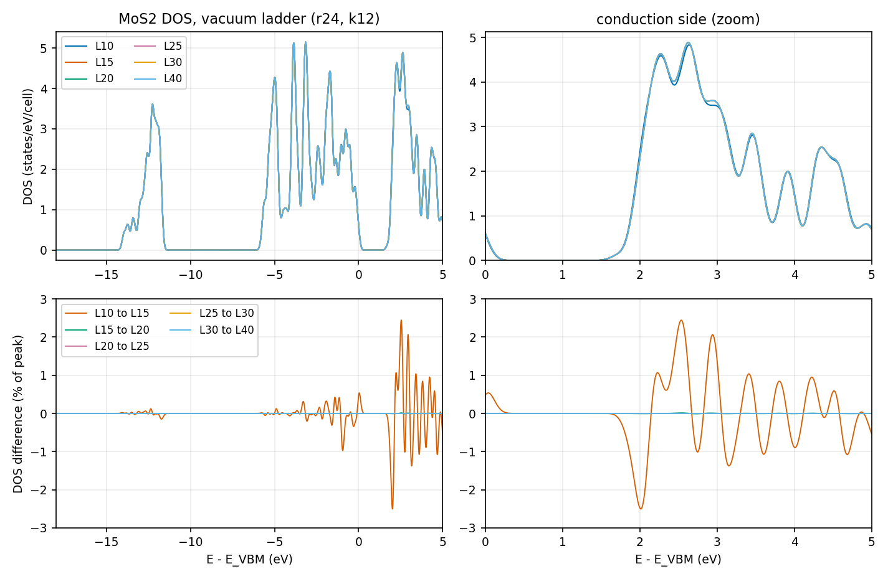
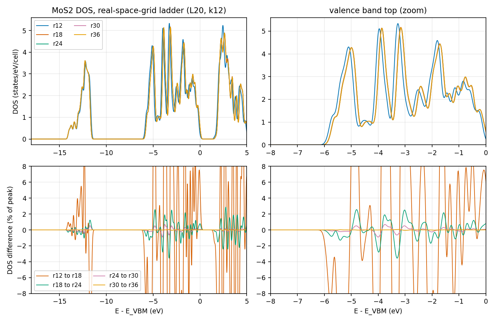
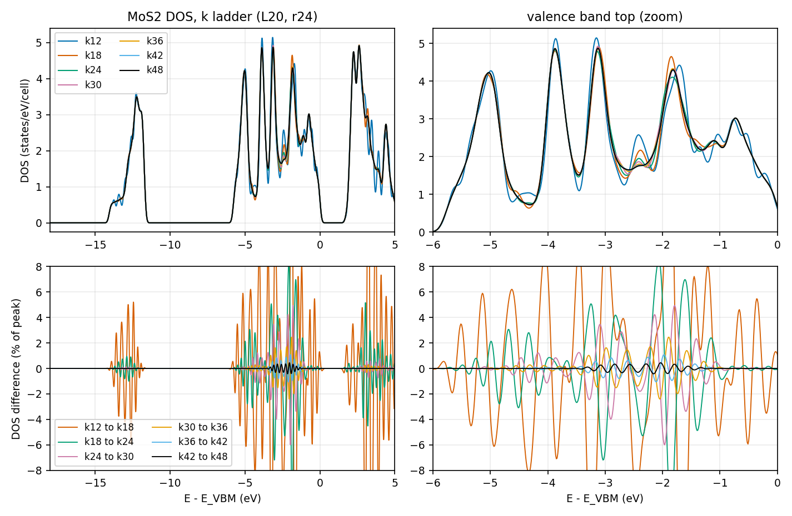
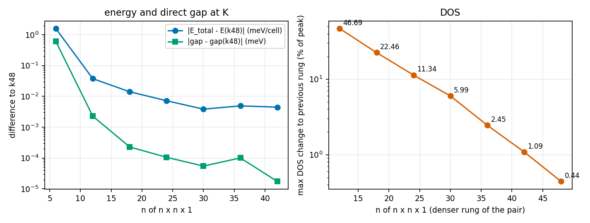

# Learning objective

Choose the vacuum length, `num_rgrid`, and the in-plane k mesh for the ground
state of a two-dimensional semiconductor whose density of states (DOS) and
direct gap at K will be reported. Learn that the total energy and the gap
converge on a far coarser k mesh than the DOS does, and how to get the total
energy, the DOS, and the gap at K from one SCF run.

> **Draft; pending maintainer confirmation.** Every convergence choice in this
> tutorial (vacuum `Lz`, `num_rgrid`, `num_kgrid`) is **provisional (AI assistant) —
> awaiting maintainer confirmation**. They were made by the AI assistant that
> drafted this tutorial, from the overlays and numbers shown below. No human
> has judged these figures yet. The structure, pseudopotentials, and every
> numerical setting that was not varied were also assumptions of the
> assistant; they are listed in [Assumptions](#assumptions-made-by-the-assistant).

# Summary

We ran three one-variable ladders around one base point: the vacuum length
`Lz`, the real-space grid, and the in-plane k mesh of an MoS2 monolayer
(LDA, FHI98PP Mo and S, SALMON v2.3.0). Each ladder shares the base point
(`Lz` = 20 Angstrom, `num_rgrid` = 24,24,144, 12 x 12 x 1 k-points), so the
three ladders are controlled against each other. The results were as follows.

- **Vacuum.** `Lz` = 15 Angstrom is already converged: the DOS differs from
  that at 20 Angstrom by 0.01% of its peak, and the total energy by
  0.3 neV. `Lz` = 10 Angstrom is not converged (total energy +2.0 meV,
  conduction-band DOS 2.5%). Provisional choice: **`Lz` = 20 Angstrom**
  (15 Angstrom would also do).
- **Real-space grid.** `num_rgrid` = 24,24,144 (spacing 0.1325 Angstrom in
  plane, 0.1389 Angstrom along z). From r24 to r30 the DOS changes by 0.90%
  of its peak, from r30 to r36 by 0.07%. Provisional choice: **r24**.
- **k mesh.** The total energy and the direct gap at K converge at
  **12 x 12 x 1**: the gap agrees within 2.5e-7 eV from 18 x 18 x 1
  to 48 x 48 x 1. The DOS does not: 30 to 36 changes it by 2.45%, 36 to 42 by
  1.09%, and 42 to 48 by 0.44%. Provisional choice: **36 x 36 x 1**.
- **Gap.** With these settings the direct gap at K, which is also the
  fundamental gap, is 1.722 eV (LDA, no spin-orbit coupling). Only the
  coarsest grid (r12) puts the conduction-band minimum slightly off K.
- **Time-reversal check.** The k lists hold only half of each mesh (k and -k
  are equivalent without spin-orbit coupling). A control run with the full
  12 x 12 x 1 mesh gives the same total energy to 1.2e-3 meV and the same DOS
  to 0.003% of its peak.

These are observations for one model: a fixed, unrelaxed MoS2 monolayer,
PZ-LDA, FHI98PP pseudopotentials with 6 valence electrons per atom,
`nstate = 24`, a Gaussian DOS width of 0.1 eV, and SALMON v2.3.0. They must
not be transferred to other two-dimensional materials without repeating the
ladders.

## Context and objective

MoS2 is a standard two-dimensional semiconductor with a direct gap at K.
Tutorial [005](../005-si-gs-convergence-bands-dos/) showed for bulk Si that
each observable needs its own convergence check and that the k mesh limits
the DOS. This tutorial applies the same approach to a slab-like cell, where a
vacuum length is an extra parameter, the cell is hexagonal, and the point of
interest (K) is not on SALMON's default k mesh.

**Judgment rule used in this tutorial.** Convergence is judged from overlays
of the DOS and of the differences between neighboring rungs. The numbers
below (maximum deviation, relative L1 distance, energy and gap differences)
are reference values. No script decides convergence. For each judgment, the
reasons and the alternatives that were rejected are written in the
[Judgment record](#judgment-record). The definitions are:

- `max_dev` = 100 * max|D_b - D_a| / max(D_b) over the whole DOS window, where
  b is the denser rung (or the larger vacuum) of the pair;
- `rel-L1` = 100 * sum|D_b - D_a| / sum(D_b) over the same window;
- a rule "two consecutive pairs below a tolerance" is used only as a reference.
  It names the first rung from which the next two neighbor differences are
  both below the tolerance.

## Conditions

- SALMON: v2.3.0, tag `v.2.3.0`, commit
  `30ba64694ec761cdb6288f01a75b8bcabf05721f`, unmodified for every run.
- Platform: Fugaku (A64FX), Fujitsu compiler (`mpifrtpx`), `-Kfast`, SSL2.
  Four MPI processes per node and 12 OpenMP threads per process.
  `nproc_k` equals the number of MPI processes, `nproc_ob = 1`,
  `nproc_rgrid = 1,1,1`. The number of k-points was chosen to be divisible by
  `nproc_k` in every run. Runs used 2 to 16 nodes.
- Structure: hexagonal primitive cell, 3 atoms, in-plane lattice constant
  a = 3.18 Angstrom, S height 1.5638 Angstrom above and below the Mo plane
  (S-S 3.1276 Angstrom, Mo-S 2.4117 Angstrom). This is a fixed structure taken
  from an earlier plane-wave PBE calculation. It is not relaxed with LDA and
  does not need to be for a numerical convergence study.
- Cell vectors: a1 = (a, 0, 0), a2 = (-a/2, a sqrt(3)/2, 0), a3 = (0, 0, Lz).
  Mo at (1/3, 2/3, 1/2); S at (2/3, 1/3, 1/2 +- 1.5638/Lz) in reduced
  coordinates.
- Pseudopotentials: ABINIT FHI98PP LDA, Mo `42-Mo.LDA.fhi` (6 valence
  electrons, 4d5 5s1; the 4s4p shell is in the core) and S `16-S.LDA.fhi`
  (6 valence electrons). Checksums are in
  [provenance/run.yaml](provenance/run.yaml). `xc = 'PZ'`; the FHI files are
  LDA tables, and the difference between PZ and the table's own LDA
  parametrization was not examined.
- Electronic structure: `theory = 'dft'`, spin-unpolarized, no spin-orbit
  coupling, fixed occupations (`temperature_k` not set), `nelec = 18`,
  `nstate = 24` (9 occupied and 15 empty bands).
- SCF: `method_init_wf = 'random'`, `ncg = 5`, `nscf = 500`,
  `threshold = 1d-9`, Broyden mixing with `alpha_mb = 0.5` and
  `nmemory_mb = 8`. All 18 runs converged.
- DOS: `yn_out_dos = 'y'`, `yn_out_dos_set_fe_origin = 'y'` (origin at the
  valence-band maximum, the maximum over all k including the path points),
  Gaussian width 0.1 eV, window -18 to +5 eV, 1841 points (0.0125 eV).
  SALMON prints how far above the valence-band maximum the DOS is complete
  (11.7 eV with `nstate = 24`); the window end is well inside it.
- k-points: an explicit list through `file_kw`; see the next section.

## Procedure

1. **Decide what will be judged.** The DOS over the whole window, the total
   energy, and the direct gap at K. The DOS is the demanding one, so it is
   the main judge.
2. **Write the k-points explicitly.** The default SALMON mesh is
   half-shifted, so for an even n it contains neither Gamma nor K, and the
   printed gap is a minimum over mesh points only (compare
   [SALMON-TS-002](../../troubleshooting/SALMON-TS-002-printed-gap-depends-on-k-mesh.md)).
   Instead, `file_kw` gives a list with two parts:
   - the Gamma-centered n x n x 1 mesh, reduced by time reversal. Without
     spin-orbit coupling, E(k) = E(-k) and |psi_k|^2 = |psi_-k|^2, so a k
     point and its partner -k give the same density; the list keeps one of
     them with weight 2/n^2 (1/n^2 for the four points that are their own
     partner). This halves the number of k-points and the memory. K = (1/3, 1/3)
     is on the mesh when n is a multiple of 3; every n here is a multiple of 6;
   - a Gamma - M - K - Gamma path with weight 1e-9 per point. The weight is so
     small that the path does not change the SCF density, but SALMON writes
     eigenvalues for these points, so the energy, the DOS, and the band edges
     at K come from one SCF run (the same trick as in tutorial 005 for Si).
     `theory = 'dft_band'` was not used; see
     [SALMON-TS-001](../../troubleshooting/SALMON-TS-001-dft-band-off-mesh-eigenvalues.md).

   [scripts/make_kpoints.py](scripts/make_kpoints.py) writes the list
   (`make_kpoints.py 36 54 > kmos_k.dat`). The number of path points changes
   between runs only so that the total number of k-points is divisible by
   `nproc_k`. SALMON ignores `num_kgrid` and `dk_shift` when `file_kw` is
   given; the deck keeps them for the reader. The explicit lists for the 36 x 36
   and the 12 x 12 (reduced and full) meshes were regenerated with the script
   and are byte-identical to those used in the runs (SHA-256 compared).
3. **Choose the base point and fix the other variables.** `Lz` = 20 Angstrom,
   `num_rgrid` = 24,24,144, 12 x 12 x 1. Each ladder changes one variable:
   - vacuum: `Lz` = 10, 15, 20, 25, 30, 40 Angstrom with the z spacing fixed at
     5/36 Angstrom (`nz` = 72, 108, 144, 180, 216, 288), so that `Lz` is the
     only change;
   - real-space grid: `num_rgrid` = nxy,nxy,6 nxy with nxy = 12, 18, 24, 30,
     36. The multiples of 6 keep the three-fold symmetry of the discretized
     cell about the Mo site. The in-plane and z spacings change together
     (their ratio is fixed at 1.05); an in-plane-versus-z split was not run;
   - k mesh: n x n x 1 with n = 6, 12, 18, 24, 30, 36, 42, 48.
4. **Run a control for the time-reversal reduction.** The 12 x 12 x 1 mesh
   without reduction (192 k-points including the path) against the reduced one
   (132 k-points).
5. **Compare neighboring rungs on overlays and differences**, then look at the
   total energy and the gap separately from the DOS.

The representative input [inputs/mos2-gs-adopted.inp](inputs/mos2-gs-adopted.inp)
is the (Lz = 20, r24, k36) deck. Only `sysname`, the pseudopotential paths, and
comments differ from the executed deck.

## Observed result

All 18 runs reached `#GS converged`, wrote nothing to standard error, finished
with `end SALMON`, and printed a DOS whose energy axis equals the requested
window (no clamping). The integral of the DOS up to the valence-band maximum
was 17.95 states for 18 electrons in the k36 run (the 0.05 difference is the
Gaussian tail of the edge state). The valence-band maximum and the
conduction-band minimum are both at K in every run except r12, so the direct
gap at K is the fundamental gap. In the r12 run the conduction-band minimum
lies on the path point next to K (toward Gamma), and the fundamental gap
(1.5904 eV) is 3.7 meV below the direct gap at K (1.5941 eV); no other run
shows such a difference.

### 1. Vacuum ladder (r24, 12 x 12 x 1)

| pair | max_dev (% of peak) | where | rel-L1 | ΔE_total (meV/cell) | Δgap (meV) |
|---|---:|---|---:|---:|---:|
| L10 to L15 | 2.51 | +2.0 eV (conduction) | 0.71% | -1.97 | -0.163 |
| L15 to L20 | 0.014 | +2.5 eV | 0.003% | -0.0003 | +0.0004 |
| L20 to L25 | 0.00007 | | 0.00002% | -0.0001 | -0.00002 |
| L25 to L30 | 0.00004 | | 0.00002% | +0.0003 | +0.00002 |
| L30 to L40 | 0.00014 | | 0.00007% | -0.0036 | -0.00007 |

The L10 to L15 difference is mostly in the conduction band (valence part
0.97%). From L15 on, the DOS curves cannot be told apart on the overlay.

### 2. Real-space-grid ladder (L20, 12 x 12 x 1)

| pair | max_dev (% of peak) | where | rel-L1 | ΔE_total (meV/cell) | Δgap (meV) |
|---|---:|---|---:|---:|---:|
| r12 to r18 | 44.8 | -3.4 eV | 21.0% | -953 | +117.5 |
| r18 to r24 | 3.55 | -3.3 eV | 2.00% | -51.1 | +14.1 |
| r24 to r30 | 0.90 | -4.0 eV | 0.36% | -8.65 | +1.06 |
| r30 to r36 | 0.07 | +2.4 eV | 0.03% | -0.53 | -0.08 |

The gap at r12 is 1.590 eV and at r18 1.708 eV, against 1.722 eV from r24
onward. The total energy keeps falling with r: -9.2 meV/cell from r24 to r36,
which is much larger than any k or vacuum effect. It was not used as a
criterion. The SCF needed more iterations with finer grids (53, 108, 109,
148, 277 for r12 to r36).

### 3. k ladder (L20, r24): the energy and the gap converge long before the DOS

| pair | max_dev (% of peak) | where | max_dev valence / conduction | rel-L1 | ΔE_total (meV/cell) | Δgap (meV) |
|---|---:|---|---|---:|---:|---:|
| k6 to k12 | 46.7 | +3.5 eV | 39.3 / 46.7 | 28.3% | -1.54 | +0.600 |
| k12 to k18 | 22.5 | -1.7 eV | 22.5 / 20.5 | 9.55% | -0.023 | +0.002 |
| k18 to k24 | 11.3 | -1.9 eV | 11.3 / 5.2 | 2.96% | -0.007 | +0.0001 |
| k24 to k30 | 5.99 | -2.0 eV | 6.0 / 0.75 | 1.15% | -0.003 | +0.00005 |
| k30 to k36 | 2.45 | -1.9 eV | 2.45 / 0.31 | 0.49% | -0.009 | -0.00005 |
| k36 to k42 | 1.09 | -2.0 eV | 1.09 / 0.03 | 0.19% | +0.009 | +0.0001 |
| k42 to k48 | 0.44 | -2.0 eV | 0.44 / 0.01 | 0.08% | -0.004 | -0.00002 |

- **Energy and gap.** The total energy at 12 x 12 x 1 differs from that at
  48 x 48 x 1 by 0.04 meV per cell, and from 18 x 18 x 1 on by less than
  0.015 meV. The direct gap at K is 1.721990 eV at k12 and 1.721992 eV for
  every mesh from k18 to k48; the scatter among them is 2.5e-7 eV.
  Every mesh from k12 to k48 contains K, so the gap printed by SALMON
  was not a mesh artifact here.
- **DOS.** The maximum deviation falls by about a factor of two for each step
  of six in n (47, 22, 11, 6.0, 2.5, 1.1, 0.44%). The largest differences lie in
  the valence band between -2.5 and -1.5 eV, where Mo d and S p states
  produce several peaks (no projected DOS was computed, so this assignment is
  an expectation); the conduction band converges earlier (at most 0.31% from
  k30). On the overlay the differences look like oscillations about 0.2-0.5 eV
  apart, not a shift of the bands; no rigid-shift fit was made.
- **Cost.** The wall time of the larger meshes was still only 4 to 10
  minutes on 12 to 16 nodes (memory up to 16 GiB per node at k48), so the
  cost does not force the choice.

### 4. Time-reversal control

The full (unreduced) 12 x 12 x 1 mesh and the reduced one agree in total
energy to 1.2e-3 meV, in the gap to 1.7e-4 meV, and in the DOS to 0.003% of its
peak (rel-L1 0.001%). The reduction is exact here only because there is no
spin-orbit coupling.

### 5. Adopted set (provisional)

| parameter | value | deciding observation | judged by |
|---|---|---|---|
| structure | MoS2, a = 3.18 Angstrom, S-S 3.1276 Angstrom, fixed | not varied | assumed by the AI assistant |
| pseudopotentials / `xc` | FHI LDA Mo (6e), S (6e) / `'PZ'` | not varied | assumed by the AI assistant |
| `Lz` | 20 Angstrom (vacuum between S planes 16.9 Angstrom) | DOS identical to L15 (0.01%), L25-L40 | **provisional (AI assistant) — awaiting maintainer confirmation** |
| `num_rgrid` | 24,24,144 | r24 to r30 0.90%, r30 to r36 0.07% | **provisional (AI assistant) — awaiting maintainer confirmation** |
| k mesh | 36 x 36 x 1 (Gamma-centered, 704 k-points including 54 path points) | k36 to k42 1.09%; gap and energy converged at k12 | **provisional (AI assistant) — awaiting maintainer confirmation** |
| `nstate` | 24 | DOS complete to 11.7 eV above the valence-band maximum | not varied |
| DOS | Gaussian, 0.1 eV | convention carried over from tutorials 005 and 006 | not varied |

The (L20, r24, k36) run is the k36 rung of the k ladder, so it is itself the
run at the intersection of the three choices. It converged in 116 iterations
(residual 1.8e-10), gave `E_total = -782.143895` eV and a gap of 1.721992 eV,
and took 272 s on 16 nodes with 10.4 GiB per node.

### 6. All runs

| run | nodes | k-points | iterations | E_total (eV) | gap (eV) | calc. time (s) | memory (GiB/node) |
|---|---:|---:|---:|---:|---:|---:|---:|
| L10 r24 k12 | 3 | 132 | 112 | -782.141879 | 1.722153 | 127 | 5.9 |
| L15 r24 k12 | 3 | 132 | 125 | -782.143852 | 1.721990 | 217 | 8.1 |
| L20 r24 k12 (base) | 3 | 132 | 109 | -782.143853 | 1.721990 | 254 | 10.4 |
| L25 r24 k12 | 4 | 128 | 104 | -782.143853 | 1.721990 | 218 | 9.8 |
| L30 r24 k12 | 4 | 128 | 168 | -782.143853 | 1.721990 | 421 | 11.5 |
| L40 r24 k12 | 6 | 144 | 114 | -782.143856 | 1.721990 | 286 | 12.0 |
| L20 r12 k12 | 3 | 132 | 53 | -781.139399 | 1.590386 | 21 | 2.3 |
| L20 r18 k12 | 3 | 132 | 108 | -782.092735 | 1.707870 | 130 | 5.1 |
| L20 r30 k12 | 6 | 144 | 148 | -782.152498 | 1.723047 | 371 | 11.6 |
| L20 r36 k12 | 12 | 144 | 277 | -782.153024 | 1.722967 | 608 | 11.9 |
| L20 r24 k06 | 2 | 72 | 112 | -782.142313 | 1.721390 | 215 | 8.9 |
| L20 r24 k18 | 6 | 216 | 108 | -782.143876 | 1.721992 | 207 | 8.9 |
| L20 r24 k24 | 8 | 352 | 221 | -782.143883 | 1.721992 | 520 | 10.4 |
| L20 r24 k30 | 12 | 528 | 163 | -782.143886 | 1.721992 | 381 | 10.4 |
| L20 r24 k36 | 16 | 704 | 116 | -782.143895 | 1.721992 | 272 | 10.4 |
| L20 r24 k42 | 16 | 960 | 170 | -782.143886 | 1.721992 | 542 | 13.4 |
| L20 r24 k48 | 16 | 1216 | 112 | -782.143890 | 1.721992 | 449 | 16.4 |
| L20 r24 k12, full mesh (control) | 4 | 192 | 151 | -782.143854 | 1.721990 | 386 | 11.1 |

The iteration column is the number printed after `#GS converged at`. The
number of iterations changes erratically (for example 221 at k24 against 116
at k36 on the same grid), so it should not be used to compare rungs.

## Judgment record

| # | object | conclusion | judged by | what was looked at | reason, including rejected alternatives |
|---|---|---|---|---|---|
| 1 | vacuum | `Lz` = 20 Angstrom; 15 Angstrom would also do | provisional (AI assistant) — awaiting maintainer confirmation | DOS overlays and neighbor differences of L10 to L40; ΔE_total and Δgap | L15 to L20 0.014%, E 0.3 neV, so L15 is converged for every observable; L10 is not (E +2.0 meV, conduction DOS 2.5%). L20 was kept because the grid and k ladders are centered on it and L20 costs about 1.2 times L15 (254 s against 217 s on 3 nodes); L15 is the alternative if cost matters. L25 to L40 were run only to confirm that nothing changes. |
| 2 | grid | r24 | provisional (AI assistant) — awaiting maintainer confirmation | r12 to r36 overlays at k12; max_dev, ΔE_total, Δgap | r24 to r30 is 0.90% (Δgap 1.1 meV, ΔE -8.6 meV/cell), r30 to r36 is 0.07%. A rule "two consecutive pairs below the tolerance" gives r18 at 5% (r18 to r24 is 3.55%, but Δgap 14 meV and ΔE 51 meV/cell) and r24 at 3% and at 1%. r18 was rejected because its gap is 14 meV low. r30 is the alternative: it costs about three times the node-time (371 s on 6 nodes against 254 s on 3) and moves the energy by another 8.6 meV/cell. |
| 3 | k mesh | 36 x 36 x 1 | provisional (AI assistant) — awaiting maintainer confirmation | k6 to k48 overlays and neighbor differences; energy and gap against DOS | For the DOS: k30 to k36 2.45%, k36 to k42 1.09%, k42 to k48 0.44%; the remaining differences look like oscillations in the valence band at -2 eV, not shifts. The two-consecutive-pairs rule gives k30 at 5% and at 3%, and no lock at 1% inside the ladder. k36 was taken instead of k30 because the k36 to k42 step (1.1%) is the point at which the DOS differences become small oscillations, and because the intersection run already exists. k48 is the alternative if a DOS accurate to below 1% is needed; it costs 1.7 times more than k36 (449 s against 272 s, both on 16 nodes). For the energy and the gap alone, k12 would have been enough. |
| 4 | time-reversal reduction | valid for these runs | provisional (AI assistant) — awaiting maintainer confirmation | control run with the full 12 x 12 x 1 mesh | ΔE 1.2e-3 meV, DOS 0.003% of peak. The reduction is exact without spin-orbit coupling only. |
| 5 | structure, pseudopotentials, `nstate`, DOS settings | not varied | assumed by the AI assistant | | see [Assumptions](#assumptions-made-by-the-assistant) |

## Assumptions made by the assistant

These were fixed by the drafting assistant, not varied, and are not
convergence results.

- The structure (a = 3.18 Angstrom, S height 1.5638 Angstrom) is a fixed
  structure from an earlier plane-wave PBE relaxation, not the LDA minimum.
  The LDA lattice constant would be somewhat smaller.
- The pseudopotentials are the FHI98PP LDA tables with 6 valence electrons per
  atom. They have no 4s4p semicore states for Mo and no nonlinear core
  correction. The quality of this Mo pseudopotential was not measured; for
  example, the position of the K gap could shift by tens of meV with a
  semicore pseudopotential. No semicore pseudopotential was tried. The gap in
  this tutorial must not be quoted as a MoS2 gap without such a check.
- Scalar-relativistic, no spin-orbit coupling: the valence-band splitting at K
  (of order 0.15 eV with spin-orbit coupling) is absent by construction.
- The hexagonal primitive cell was used rather than an orthorhombic supercell
  because it has half the atoms and K is a point of the mesh. SALMON v2.3.0
  runs it with the non-orthogonal-cell stencil (the log prints
  "non-orthogonal cell: using al_vec[1,2,3]").
- `nstate = 24`, `ncg = 5`, `alpha_mb = 0.5`, `nscf = 500`, Gaussian width
  0.1 eV, and the DOS window -18 to +5 eV.

## Validation

- Each run was checked for `#GS converged`, an empty standard error, no NaN,
  the namelists read without error, `nelec = Zps(Mo) + 2 Zps(S) = 18`, the
  three `num_rgrid` values echoed by SALMON, the number of k-points and their
  weight sum (1), and the DOS energy axis equal to the requested window.
- The row of the K path point in `*_k.data` was converted to reduced
  coordinates and checked to be (1/3, 1/3, 0), and the direct gap at K taken
  from the path point agreed with the gap at the same K on the SCF mesh
  (equal to the 8 digits printed, with a largest difference of 1e-8 eV; the VBM
  printed by SALMON equals the one found in `*_eigen.data`).
- Controlled comparisons: every deck was checked before submission against
  one plan manifest that pins all keys except the ladder variable, `nproc_k`,
  and the k list. The three ladders share the base point.
- The k lists were regenerated by `make_kpoints.py` and compared by SHA-256
  with the lists used in the runs (36 x 36 reduced, 12 x 12 reduced, 12 x 12
  full).
- **Not validated:** no human has judged the figures. No semicore
  pseudopotential, no LDA-relaxed structure, and no other functional was
  tried. The grid ladder was run at 12 x 12 x 1 and the vacuum ladder at r24
  and 12 x 12 x 1, where the DOS is not yet k-converged; the pairs compare the
  same k sampling, but r30 and r36 were not repeated at 36 x 36 x 1. The
  in-plane and the z grid spacing were not separated.

## Surprises and failures recorded

- **The DOS needed 36 x 36 x 1 although the gap and the energy needed
  12 x 12 x 1.** This is the same pattern as in tutorial 005 (Si): a quantity
  that converges early (energy, gap) says nothing about the DOS. Had the
  ladder been judged on the gap, `num_kgrid` would have stopped at 12.
- **Post-processing of the output files misled the checker.** The first
  job ran correctly (converged, gap 1.722 eV) but the job script marked it as
  failed, because it misread two files.
  `*_k.data` has "nonorthogonal coordinate" in its header, but the columns are
  Cartesian coordinates in atomic units (`kx[a.u.]`); the reduced coordinates
  have to be obtained with the reciprocal lattice vectors printed in the
  `#brl` lines of the same file. `*_eigen.data` is already in eV when
  `unit_system = 'A_eV_fs'` (header `esp[eV]`) and must not be multiplied by
  27.211. After fixing the checker, all runs passed.
- **The number of SCF iterations is not a smooth function of the settings.**
  For the same grid it was 108 to 221 across k meshes, and it grows with the
  grid (52 at r12 to 277 at r36).
- **Slab cell with the default initial guess: not tested.** From reading
  `src/gs/init_gs.f90` we expected the default `method_init_wf = 'gauss'` to
  place its Gaussians uniformly over the whole cell height, that is, mostly in
  the vacuum, and we used `'random'` as the published WSe2 monolayer input
  does. We never ran the default, so this is a reading of the source, not an
  observed failure.
- **Mixing option.** The `simple_dm` mixing of that published WSe2 input stops
  with an error when `yn_spinorbit` is not `'y'`, so it cannot be used for a
  calculation without spin-orbit coupling.

## Lessons learned

- **Judge the k mesh on the DOS, not on the energy or the gap**, and look at
  the differences between neighboring meshes: they show whether the change is
  a shift or an oscillation.
- **For a point of interest that is not on the default mesh (K here), write
  the k list yourself.** An explicit list that holds the mesh and a
  zero-weight path gives the energy, the DOS, and the gap at the point from
  one SCF run. Check that the K row is what you intended.
- **Vacuum converges fast and cheaply if the z spacing is held fixed.** Keeping
  the spacing constant makes `Lz` the only variable of the ladder.
- **When reading SALMON output programmatically, check units and coordinate
  systems in the file, not in the header text.**
- **Use time-reversal reduction only without spin-orbit coupling**, and
  validate it with one unreduced control run.
- **Compare total energies only when the grid is the same.** The energy
  changes by 9 meV/cell between r24 and r36 although the DOS and the gap do not.

## Limitations and applicability

This tutorial covers one fixed MoS2 monolayer (a = 3.18 Angstrom), PZ-LDA, FHI98PP
pseudopotentials with 6 valence electrons, no spin-orbit coupling, a Gaussian
DOS broadening of 0.1 eV, and SALMON v2.3.0 on Fugaku (A64FX).

- The k mesh needed for a ground-state DOS is a necessary condition for a
  response calculation, not a sufficient one.
- A broader DOS width would converge at a coarser mesh; only 0.1 eV was studied.
- Convergence of the vacuum was judged on the ground state only. A calculation
  that is sensitive to the field in the vacuum may need more.
- All three judgments are provisional.

## References

- SALMON-inputs, `inputfiles/SYamada2026_PhysRevResearch8_013300` (WSe2 monolayer input), as the model for a hexagonal `al_vec` with `&atomic_red_coor` and `method_init_wf = 'random'`. The link is to the repository (`https://github.com/SALMON-TDDFT/SALMON-inputs`) and is not pinned to a commit.
- [ABINIT LDA FHI pseudopotential collection](https://www.abinit.org/atomic_data/psps/miscellaneous/ATOMICDATA/LDA_FHI/)
- Related tutorial: [005 Si ground-state convergence](../005-si-gs-convergence-bands-dos/)
- Troubleshooting: [TS-001](../../troubleshooting/SALMON-TS-001-dft-band-off-mesh-eigenvalues.md),
  [TS-002](../../troubleshooting/SALMON-TS-002-printed-gap-depends-on-k-mesh.md),
  [TS-003](../../troubleshooting/SALMON-TS-003-sample-deck-has-no-dos-output.md)
- Run provenance: [provenance/run.yaml](provenance/run.yaml). Raw outputs are not committed.
