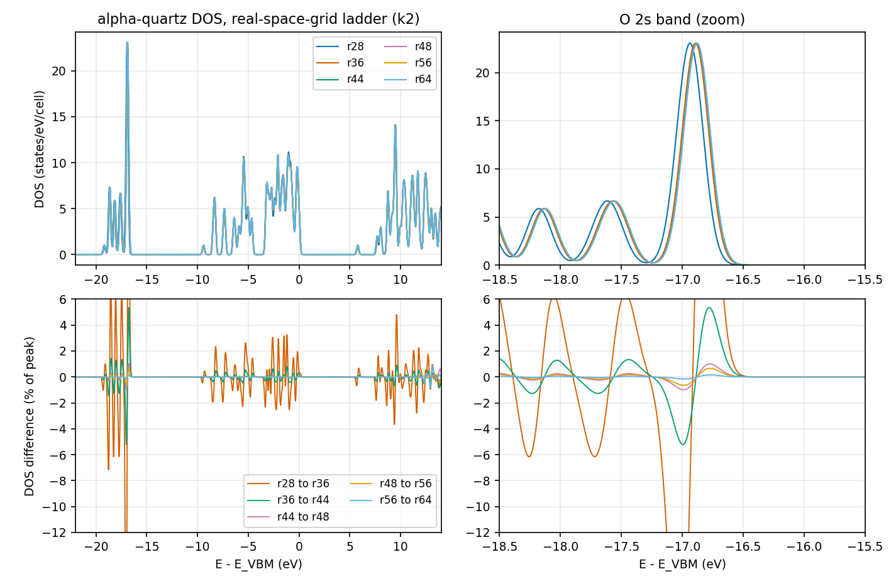
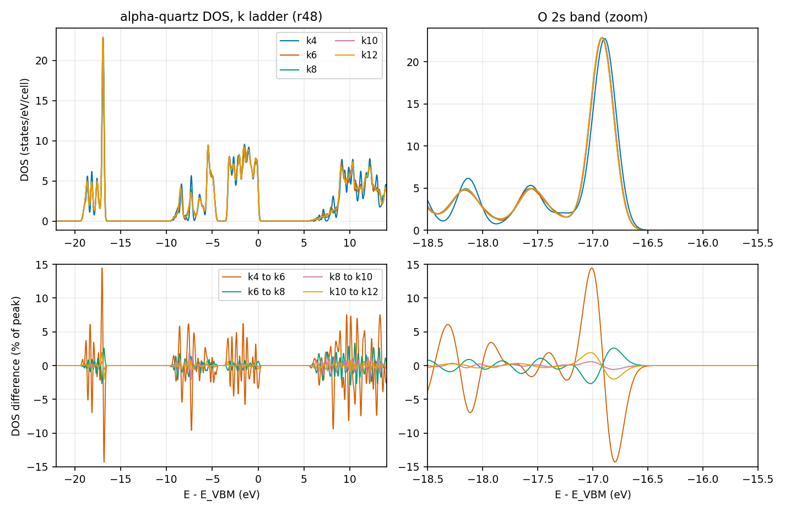
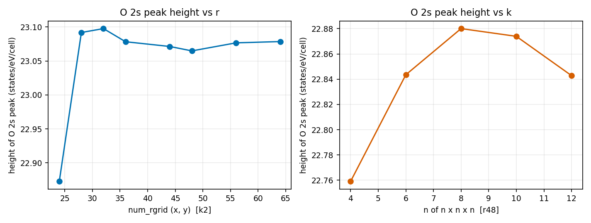

# Learning objective

Choose `num_rgrid` and `num_kgrid` for the ground state of an oxide insulator
with a localized O 2s band, judging convergence from DOS overlays, and learn
which feature of the DOS limits each of the two parameters.

> **Draft; pending maintainer confirmation.** Both convergence choices in this
> tutorial (`num_rgrid` = 48,48,54 and `num_kgrid` = 10,10,10) are
> **provisional (Claude) — awaiting maintainer confirmation**. They were made
> by the AI assistant that drafted this tutorial, from the overlays and
> numbers shown below. No human has judged these figures yet. The structure,
> pseudopotentials, and every setting that was not varied were also
> assumptions of the assistant; see
> [Assumptions](#assumptions-made-by-the-assistant).

# Summary

We ran a real-space-grid ladder at a thin k mesh and then a k ladder at the
chosen grid, for the 9-atom primitive cell of alpha-quartz (LDA, FHI98PP Si
and O, SALMON v2.3.0). The results were as follows.

- **Real-space grid.** The localized O 2s peak at -16.8 eV below the valence-band
  maximum dominates the DOS difference between neighbouring grids at every
  rung. Its maximum change falls from 5.35% (36 to 44) to 1.01% (44 to 48) and
  0.66% (48 to 56). Provisional choice: **`num_rgrid` = 48,48,54** (r48).
- **k mesh.** The conduction-band DOS converges steadily with the mesh (3.3%,
  2.0%, 0.87% for 6 to 8, 8 to 10, 10 to 12). The valence-band DOS reaches a
  plateau of about 2% of the peak that does not fall from 8 to 12; it sits on
  the O 2s peak and at -7.3 eV. The total energy is flat from k6 (0.3 meV per
  cell between k6 and k12). Provisional choice: **10 x 10 x 10**
  (Gamma-centred, 1000 k points, no symmetry).
- **Cost.** The adopted run needs 50 nodes for 7 minutes; k12 needs 54 nodes for
  12 minutes.

These are observations for one model: experimental alpha-quartz geometry,
PZ-LDA, FHI98PP pseudopotentials, `nstate = 48`, a Gaussian DOS width of
0.1 eV, and SALMON v2.3.0. They must not be transferred to other oxides
without repeating the ladders.

## Context and objective

alpha-quartz is a wide-gap insulator whose oxygen 2s states form a narrow,
localized band far below the valence band. It is a good test of how a
localized band and a set of dispersive bands pull the real-space grid and the
k mesh in different directions. We wanted a ground state whose DOS over the
whole range from the O 2s band to about 14 eV above the valence-band maximum
could be reported. Tutorial [005](../005-si-gs-convergence-bands-dos/) showed
for bulk Si that each observable needs its own convergence check; this
tutorial applies the approach to a two-species oxide in a hexagonal cell.

**Judgment rule used in this tutorial.** Convergence is judged from overlays
of the DOS and of the differences between neighbouring rungs. The numbers
below are reference values. No script decides convergence. For each
judgment, the reasons and rejected alternatives are written in the
[Judgment record](#judgment-record). The definitions are:

- `max_dev` = 100 * max|D_b - D_a| / max(D_b) over the whole DOS window, where
  b is the denser rung of the pair; "valence" and "conduction" values use the
  part of the window below and above the valence-band maximum;
- `rel-L1` = 100 * sum|D_b - D_a| / sum(D_b) over the same window;
- a rule "two consecutive pairs below a tolerance" is used only as a reference.
  It names the first rung from which the next two neighbour differences are
  both below the tolerance.

## Conditions

- SALMON: v2.3.0, tag `v.2.3.0`, commit
  `30ba64694ec761cdb6288f01a75b8bcabf05721f`, unmodified for every run.
- Platform: Fugaku (A64FX), Fujitsu compiler (`mpifrtpx`), `-Kfast`, SSL2.
  Four MPI processes per node and 12 OpenMP threads per process.
  `nproc_k` equals the number of MPI processes, `nproc_ob = 1`,
  `nproc_rgrid = 1,1,1`. The number of k points is divisible by `nproc_k` in
  every run. Runs used 2 to 54 nodes.
- Structure: 9-atom primitive hexagonal cell. The lattice constants
  (a = 4.913357 Angstrom, c = 5.405155 Angstrom) and the internal parameters
  (Si u = 0.4701; O at 0.1460, 0.4136, 0.1191 in the orthorhombic setting)
  are those of the published SALMON-inputs SiO2 ground-state input
  ([`AYamada2024_PhysRevB109_245130/SiO2_ms/gs`](https://github.com/SALMON-TDDFT/SALMON-inputs/tree/e5cf45d7378cc1aec6bb4dd4c3b534cbee8a81b9/inputfiles/AYamada2024_PhysRevB109_245130/SiO2_ms/gs)),
  which uses the 18-atom orthorhombic cell (a x a sqrt(3) x c, exactly two
  primitive cells). We rewrote it for the primitive cell with
  a1 = (a/2, -a sqrt(3)/2, 0), a2 = (a/2, a sqrt(3)/2, 0), a3 = (0, 0, c).
  Every Si has four O neighbours at 1.608-1.610 Angstrom, every O has two Si
  neighbours at 1.608 and 1.610 Angstrom, and the O-O distance is
  2.615 Angstrom. The published input itself uses `psp8` pseudopotentials
  and the TB-mBJ potential; we used neither.
- Pseudopotentials: ABINIT FHI98PP LDA, Si `14-Si.LDA.fhi` (4 valence
  electrons, `lloc_ps = 2`) and O `08-O.LDA.fhi` (6 valence electrons,
  `lloc_ps = 2`); no nonlinear core correction. `xc = 'PZ'`. Checksums are in
  [provenance/run.yaml](provenance/run.yaml).
- Electronic structure: `theory = 'dft'`, spin-unpolarized, fixed occupations
  (`temperature_k = -1`), `yn_symmetry = 'n'` (all k points kept, no
  `sym.dat`), `nelec = 48`, `nstate = 48` (24 occupied and 24 empty bands).
- SCF: `ncg = 4`, `nscf = 600`, `threshold = 1d-9`, Broyden mixing with the
  v2.3.0 defaults, default initial orbitals. All 13 runs converged.
- DOS: `yn_out_dos = 'y'`, `yn_out_dos_set_fe_origin = 'y'` (origin at the
  valence-band maximum), Gaussian width 0.1 eV, window -22 to +14 eV, 2881
  points (0.0125 eV).
- k meshes: n x n x n on the reciprocal primitive axes with
  `dk_shift = 0.5, 0.5, 0.5`, which is Gamma-centred for even n. (The Si and Al
  tutorials use the default half-shifted mesh, which has no Gamma point. We
  expected the band edges of quartz to lie at Gamma, from earlier
  calculations that we did not repeat here, so we kept Gamma on the mesh.)

## Procedure

1. **Decide what will be judged.** The DOS over the whole window, with the
   total energy and the printed gap as side information.
2. **r ladder at a thin k mesh.** `num_rgrid` = n,n,round(9n/8) with
   n = 24, 28, 32, 36, 44, 48, 56, 64 and a 2 x 2 x 2 k mesh (8 k points). The
   ratio 9/8 keeps the ratio of the three grid spacings of the primitive
   cell (n = 48 gives 0.1024 Angstrom along a1 and a2 and 0.1001 Angstrom
   along z). A thin mesh is used for the r ladder because the cost of a rung
   scales with the grid and the number of k points; the pairs compare the same
   sampling. A rung at n = 40 was prepared but not run.
3. **Choose r from the r ladder.** (See the judgment below.)
4. **k ladder at the chosen r.** n x n x n with n = 4, 6, 8, 10, 12 at
   `num_rgrid` = 48,48,54; the k2 point is the r48 rung of the r ladder.
   Only even n were used, so that the mesh stays Gamma-centred.
5. **Compare neighbouring rungs on overlays and differences**, and look at
   where the largest difference sits in energy.

The representative input [inputs/sio2-gs-adopted.inp](inputs/sio2-gs-adopted.inp)
is the (r48, k10) deck. Only `sysname`, the pseudopotential paths, and
comments differ from the executed deck.

## Observed result

All 13 runs reached `#GS converged`, wrote nothing to standard error,
finished with `end SALMON`, and printed a DOS whose energy axis equals the
requested window (no clamping). The DOS integral up to the valence-band
maximum was 48.000 electrons in the k10 run.

### 1. r ladder (k2)

| pair | max_dev (% of peak) | where | max_dev valence / conduction | rel-L1 valence / conduction | ΔE_total (meV/atom) | Δgap (meV) |
|---|---:|---|---|---|---:|---:|
| r24→r28 | 18.9 | -16.85 eV | 18.9 / 5.5 | 13.7% / 8.2% | -93.5 | +21.1 |
| r28→r32 | 15.6 | -16.81 eV | 15.6 / 2.9 | 7.8% / 3.4% | -72.9 | +16.3 |
| r32→r36 | 10.1 | -16.79 eV | 10.1 / 1.9 | 4.3% / 2.1% | -40.0 | +9.7 |
| r36→r44 | 5.35 | -16.77 eV | 5.35 / 0.90 | 2.4% / 1.3% | -27.6 | +5.2 |
| r44→r48 | 1.01 | -16.77 eV | 1.01 / 0.62 | 0.38% / 0.31% | -4.8 | +0.83 |
| r48→r56 | 0.66 | -16.77 eV | 0.66 / 0.44 | 0.30% / 0.35% | -3.6 | +0.62 |
| r56→r64 | 0.86 | +13.1 eV | 0.16 / 0.86 | 0.08% / 0.48% | -1.0 | +0.17 |

- In every pair, the largest valence difference is at the O 2s peak (about
  -16.8 eV). The peak moves toward the valence-band maximum as the grid is
  refined (maximum at -16.975, -16.9375, -16.9125, -16.8875, -16.8875,
  -16.875, -16.875, -16.875 eV for r24 to r64, in steps of the 0.0125 eV
  output grid) and stops moving from r44 on. Its height rises from 22.87 to
  23.09 states/eV/cell at r28 and stays between 23.06 and 23.10 afterwards.
- The conduction-band DOS differences are at most 0.9% from r36→r44 on. The
  largest conduction difference in 56→64 is at +13.1 eV, near the upper edge
  of the window; we did not examine it further.
- The total energy keeps falling with r: -4.8, -3.6, and -1.0 meV/atom for
  44→48, 48→56, and 56→64. It is not converged to 1 meV/atom at r48, and it
  was not used as a criterion.
- The number of SCF iterations grows with r (66 at r24 to 280 at r64).

### 2. k ladder (r48)

| pair | max_dev (% of peak) | where | max_dev valence / conduction | rel-L1 valence / conduction | ΔE_total (meV/atom) | printed gap (eV) at the denser rung |
|---|---:|---|---|---|---:|---:|
| k2→k4 | 36.1 | +9.5 eV | 18.9 / 36.1 | 22.8% / 52.7% | -0.887 | 5.7775 |
| k4→k6 | 14.5 | -17.0 eV | 14.5 / 9.4 | 13.0% / 19.7% | -0.053 | 5.7526 |
| k6→k8 | 3.31 | +10.5 eV | 2.68 / 3.31 | 2.7% / 7.1% | -0.019 | 5.7571 |
| k8→k10 | 2.11 | -7.3 eV | 2.11 / 2.00 | 1.1% / 3.5% | -0.009 | 5.7561 |
| k10→k12 | 2.01 | -16.8 eV | 2.01 / 0.87 | 1.2% / 1.6% | -0.005 | 5.7526 |

- **Conduction band.** The maximum deviation falls from 3.31% to 2.00% to
  0.87%, and the rel-L1 from 7.1% to 3.5% to 1.6%.
- **Valence band.** The maximum deviation is 2.68%, 2.11%, and 2.01% for
  6→8, 8→10, and 10→12. It does not fall from k8 on. It is located at the O 2s
  peak (-17.0 and -16.8 eV) and at -7.3 eV. The rel-L1 over the valence band
  is about 1.1-1.2% for the last two pairs.
- **O 2s peak.** Its maximum height is 22.76, 22.84, 22.88, 22.87, and 22.84
  states/eV/cell for k4 to k12, that is, a change of at most 0.2% of the
  height. The 2% difference of 10→12 lies on the flanks of the peak, not at
  the apex, as the zoom in the right-hand panels shows. We did not measure
  what changes in the band: the flank difference could be a small change of
  the sampled band width.
- **Total energy.** It changes by 0.05 meV/atom from k4 to k6, and by 0.03
  meV/atom (0.29 meV per cell) between k6 and k12.
- **Printed gap.** The printed gap is a minimum over the mesh points. For k6 to
  k12 it stays within 5.7526-5.7571 eV; a mesh that includes Gamma was used
  throughout. We did not track the 4 meV spread to its cause.
- **Cost.** k8 needs 16 nodes (21 GiB per node, 693 s), k10 needs 50 nodes (14 GiB,
  408 s), and k12 needs 54 nodes (21 GiB, 698 s).

### 3. Adopted set (provisional)

| parameter | value | deciding observation | judged by |
|---|---|---|---|
| structure | alpha-quartz, 9-atom primitive cell, published lattice and internal parameters | not varied | assumed by Claude |
| pseudopotentials / `xc` | FHI LDA Si (4e), O (6e) / `'PZ'` | not varied | assumed by Claude |
| `num_rgrid` | 48,48,54 (0.102 Angstrom in plane, 0.100 Angstrom along z) | O 2s peak change 44→48 1.01%, 48→56 0.66% | **provisional (Claude) — awaiting maintainer confirmation** |
| `num_kgrid` | 10,10,10, Gamma-centred (1000 k points) | conduction DOS 0.87% at the next step; valence plateau about 2% | **provisional (Claude) — awaiting maintainer confirmation** |
| `nstate` | 48 | DOS window checked to be complete up to its end (+14 eV) | not varied |
| DOS | Gaussian, 0.1 eV, window -22 to +14 eV | convention carried over from tutorials 005 and 006 | not varied |

The (r48, k10) run is the k10 rung of the k ladder, so it is itself the run at
the intersection of the two choices. It converged in 150 iterations
(residual 2.8e-10) with `E_total = -2949.178496` eV and a printed gap of
5.7561 eV, and took 408 s on 50 nodes with 14.1 GiB per node.

### 4. All runs

| run | nodes | k points | iterations | E_total (eV) | printed gap (eV) | calc. time (s) | memory (GiB/node) |
|---|---:|---:|---:|---:|---:|---:|---:|
| r24 k2 | 2 | 8 | 66 | -2947.020210 | 5.732682 | 6 | 1.6 |
| r28 k2 | 2 | 8 | 74 | -2947.861639 | 5.753815 | 10 | 2.0 |
| r32 k2 | 2 | 8 | 95 | -2948.517968 | 5.770135 | 17 | 2.3 |
| r36 k2 | 2 | 8 | 127 | -2948.877628 | 5.779864 | 31 | 2.8 |
| r44 k2 | 2 | 8 | 132 | -2949.126377 | 5.785042 | 58 | 4.3 |
| r48 k2 | 2 | 8 | 171 | -2949.169784 | 5.785876 | 97 | 5.2 |
| r56 k2 | 2 | 8 | 224 | -2949.202063 | 5.786492 | 212 | 7.7 |
| r64 k2 | 2 | 8 | 280 | -2949.211259 | 5.786664 | 427 | 10.9 |
| r48 k4 | 16 | 64 | 163 | -2949.177769 | 5.777514 | 93 | 5.3 |
| r48 k6 | 9 | 216 | 170 | -2949.178249 | 5.752631 | 544 | 16.4 |
| r48 k8 | 16 | 512 | 163 | -2949.178417 | 5.757116 | 693 | 20.8 |
| r48 k10 | 50 | 1000 | 150 | -2949.178496 | 5.756122 | 408 | 14.1 |
| r48 k12 | 54 | 1728 | 161 | -2949.178539 | 5.752626 | 698 | 20.8 |

The iteration column is the number printed after `#GS converged at`.

## Judgment record

| # | object | conclusion | judged by | what was looked at | reason, including rejected alternatives |
|---|---|---|---|---|---|
| 1 | r | r48 | provisional (Claude) — awaiting maintainer confirmation | r24 to r64 overlays at k2 and neighbour differences (DOS, ΔE_total, Δgap) | The largest difference of every pair is at the localized O 2s peak (-16.8 eV) and falls monotonically with r: 5.35%, 1.01%, 0.66% for 36→44, 44→48, 48→56; the conduction band is at most 0.9% from r44. The peak position stops moving at r44 and the gap at r48 is within 0.6 meV of r56. A rule "two consecutive pairs below the tolerance" gives r44 at 5% and at 3%, and r48 at 1% (44→48 is 1.01%, then 0.66% and 0.86%). r48 was taken because it is the 1% lock and because the k ladder was prepared at r48; r40 was not run (36→44 is 5.35%, so r40 would not have been usable). r44 is the alternative and costs about 1.7 times less time (58 s against 97 s on 2 nodes at k2). If the O 2s peak must be accurate to below 1%, r56 is the alternative; r48 is at the edge. |
| 2 | k | 10 x 10 x 10 | provisional (Claude) — awaiting maintainer confirmation | k4 to k12 overlays and neighbour differences, split into valence and conduction; O 2s peak height; ΔE_total and printed gap | Conduction DOS converges monotonically (3.31%, 2.00%, 0.87%). Valence DOS stays at 2.7%, 2.1%, 2.0%, located on the O 2s peak and at -7.3 eV; the peak height changes by only 0.2%, so the plateau is a flank effect that does not shrink with k in this range. The total energy is flat from k6. The rule gives k6 at 5% and k8 at 3%, and no lock at 1%. k10 was taken because the conduction side is still at 2% between k8 and k10, and beyond k10 the only difference above 1% is the valence plateau that k12 does not remove. k8 is the alternative if a conduction DOS accurate to 2% is enough (it uses 16 nodes instead of 50); k12 is the alternative if the conduction DOS must be below 1%, at about 1.9 times the node-time of k10 (698 s on 54 nodes against 408 s on 50). |
| 3 | structure, pseudopotentials, `nstate`, DOS settings | not varied | assumed by Claude | | see [Assumptions](#assumptions-made-by-the-assistant) |

## Assumptions made by the assistant

These were fixed by the drafting assistant, not varied, and are not
convergence results.

- The geometry is the published (experimental) structure of the SALMON-inputs
  input, not an LDA-relaxed one. The LDA equilibrium geometry was not
  computed.
- FHI98PP LDA pseudopotentials for Si and O were used without checking against
  another pseudopotential set. The gap printed here must not be quoted as the
  SiO2 gap without such a check.
- Fixed occupations (`temperature_k = -1`) with the origin at the
  valence-band maximum. For an insulator this does not change the DOS shape,
  the energy, or the bands. A Fermi-level origin at 300 K would put the origin
  inside the gap.
- `nstate = 48`, `ncg = 4`, `nscf = 600`, Gaussian width 0.1 eV, and the DOS
  window -22 to +14 eV (the valence-band bottom is at about -19 eV).
- The r ladder was run at k2 because it is cheap. k2 is not a converged
  sampling; the pairs compare the same sampling.

## Validation

- Each run was checked for `#GS converged`, an empty standard error, no NaN,
  the namelists read without error, `nelec` equal to the sum of the valence
  charges of the atoms (3 x 4 + 6 x 6 = 48), the `num_rgrid` echoed by SALMON,
  the number of k points, and the DOS energy axis equal to the requested
  window. The DOS integral up to the valence-band maximum is 48.000.
- Controlled comparisons: every deck was checked before submission against
  one plan manifest that pins all keys except the ladder variables and
  `nproc_k`.
- **Not validated:** no human has judged the figures. The r ladder was run at
  k2 only, so the r judgment has not been repeated at the chosen k mesh. The
  conduction-band difference at +13 eV in 56→64 was not examined. No
  pseudopotential set other than FHI98PP LDA, and no other functional, was
  tried. A response calculation (linear-response or real-time) was not run;
  see Limitations.

## Surprises recorded

- **The localized band, not the dispersive bands, sets the grid.** The
  differences between grids were largest at the O 2s band at every rung, and
  the conduction band converged faster. The printed gap follows the same
  trend as the O 2s peak (5.2, 0.83, 0.62 meV for 36→44, 44→48, 48→56).
- **The total energy was the slowest quantity in r.** It is still moving by
  1.0 meV/atom at r56→r64, long after the DOS differences are below 1% of the
  peak.
- **The valence DOS did not converge in k beyond a 2% plateau**, while the
  total energy was flat from k6 and the conduction DOS kept converging. The
  plateau is on the flanks of the O 2s peak. We do not know whether it would
  fall at a much denser mesh; k12 is the densest we ran.
- **The printed gap varies by a few meV with k** even on a Gamma-centred mesh
  (5.7526, 5.7571, 5.7561, 5.7526 eV for k6 to k12); it is a minimum over mesh
  points (see [SALMON-TS-002](../../troubleshooting/SALMON-TS-002-printed-gap-depends-on-k-mesh.md)).
  We did not run a band path to find the band edges.
- **The number of SCF iterations rises steeply with r** (66 at r24, 280 at r64),
  and a k ladder at fixed r changes it only a little (150 to 171).

## Lessons learned

- **Look at where the largest DOS difference is.** Here it was always the
  localized O 2s peak for the grid, and the valence O 2s peak and conduction
  bands for the k mesh. The location tells you what to look at next.
- **Do not use the total energy as a convergence criterion for the grid.** It
  falls with r long after the DOS has stopped changing.
- **Judge the k ladder on separate parts of the DOS.** The conduction side and
  the valence side behaved differently, and a single number would have hidden
  that.
- **Keep Gamma on the mesh when the band edges are at Gamma**, and use
  `dk_shift = 0.5` for even n.
- **Thin-k r ladders are cheap but compare equal sampling only.** Repeat the
  chosen r at the chosen k if the answer matters.

## Limitations and applicability

This tutorial covers alpha-quartz in the published geometry, PZ-LDA, FHI98PP
Si and O, fixed occupations, a Gaussian DOS broadening of 0.1 eV, and SALMON
v2.3.0 on Fugaku (A64FX).

- The k mesh needed for a ground-state DOS is a necessary condition for a
  response calculation, not a sufficient one.
- A broader DOS width would converge at a coarser mesh; only 0.1 eV was studied.
- The O 2s peak is the demanding feature of this study. If the O 2s band is not
  needed, a coarser grid may do.
- The absolute total energy was not shown to be converged in r.
- Both judgments are provisional.

## References

- [SALMON-inputs `AYamada2024_PhysRevB109_245130/SiO2_ms/gs`](https://github.com/SALMON-TDDFT/SALMON-inputs/tree/e5cf45d7378cc1aec6bb4dd4c3b534cbee8a81b9/inputfiles/AYamada2024_PhysRevB109_245130/SiO2_ms/gs) (structure)
- [ABINIT LDA FHI pseudopotential collection](https://www.abinit.org/atomic_data/psps/miscellaneous/ATOMICDATA/LDA_FHI/)
- Related tutorial: [005 Si ground-state convergence](../005-si-gs-convergence-bands-dos/)
- Troubleshooting: [TS-002](../../troubleshooting/SALMON-TS-002-printed-gap-depends-on-k-mesh.md),
  [TS-003](../../troubleshooting/SALMON-TS-003-sample-deck-has-no-dos-output.md)
- Run provenance: [provenance/run.yaml](provenance/run.yaml). Raw outputs are not committed.
