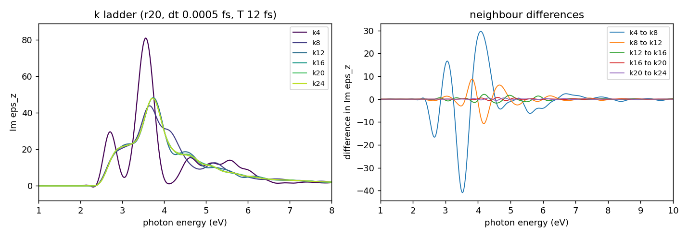
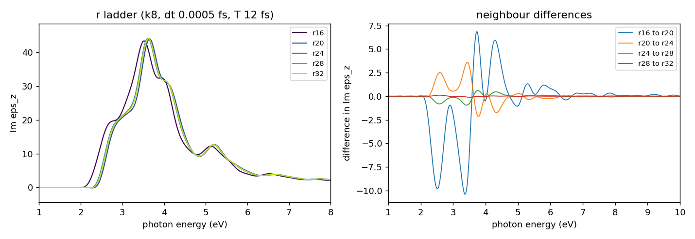
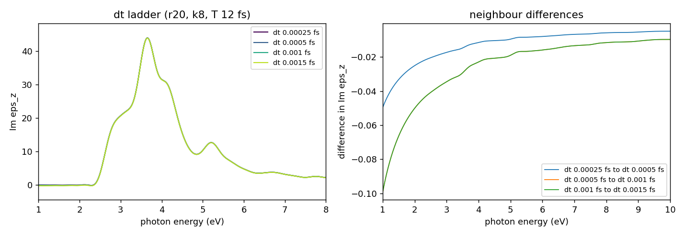
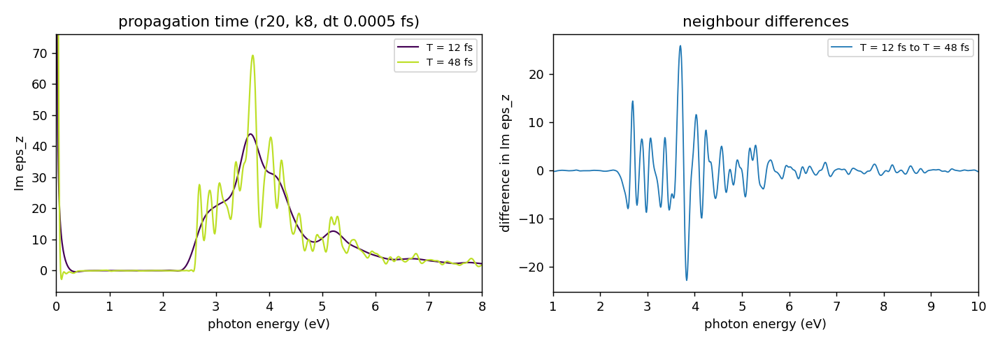

# Learning objective

Choose the k mesh, the real-space grid, the time step and the propagation time
for a real-time linear-response calculation (`theory = 'tddft_response'`,
impulse field) of an insulator whose dielectric function will be reported.
Learn which of these parameters the spectrum is sensitive to, why the
propagation time cannot be "converged" without also choosing a broadening, why
the number of empty bands (`nstate`) does not matter for the response although
it matters for the ground state, and how to read an overlay of `Im eps` to judge
convergence.

> **Draft; pending maintainer confirmation.** Every convergence choice in this
> tutorial (`num_kgrid`, `num_rgrid`) is **provisional (Claude) — awaiting
> maintainer confirmation**. They were made by the AI assistant that drafted this
> tutorial, from the overlays and numbers shown below. No human has judged these
> figures yet. The time step and the propagation time are *not* chosen from a
> convergence test but fixed (see the Judgment record). The run at the
> intersection of the two chosen values finished and is consistent with them; see
> [Final check at the intersection](#final-check-at-the-intersection).
> Everything that was not varied was an assumption of the assistant; it is listed in
> [Assumptions](#assumptions-made-by-the-assistant).

# Summary

We ran one-variable ladders around one base point, (`num_rgrid` = 20^3,
`num_kgrid` = 8^3, `nstate` = 32, `dt` = 0.0005 fs, `T` = `nt` * `dt` = 12 fs),
for bulk Si (8-atom cubic cell, a = 5.43 Angstrom, FHI98PP LDA, `xc = 'PZ'`,
SALMON v2.3.0), and compared `Im eps_z` of the spectrum written to
`*_response.data`. The comparison number is the **largest point-wise
difference of `Im eps_z` between neighbouring rungs over 1-10 eV, as a
percentage of the peak of the denser rung** ("max diff" below). The results were
as follows.

- **k mesh** (r20, T 12 fs). Max diff: k8 to k12 22%, k12 to k16 4.4%,
  k16 to k20 1.5%, k20 to k24 1.2%. The main peak (3.72-3.74 eV, height 48.0-48.4)
  is fixed from k16 on; the remaining difference is a shoulder at 4-5 eV.
  Provisional choice: **k = 20^3** (16^3 is the alternative).
- **Real-space grid** (k8, T 12 fs). Max diff: r16 to r20 24%, r20 to r24 8.2%,
  r24 to r28 2.2%, r28 to r32 0.25%. The differences are a small displacement of
  the absorption edge at 3.4-3.5 eV. Provisional choice: **r = 28^3** (r24 is the
  alternative if 2% is acceptable).
- **Time step.** `dt` = 0.00025, 0.0005, 0.001, 0.0015 fs agree within 0.23%
  of the peak. **`dt` = 0.0005 fs** was kept; it is not a convergence result at
  r28 (the ladder was run at r20).
- **Propagation time.** T = 12 fs against 48 fs differs by 38% (the peak rises
  from 43.9 to 69.2 and narrows). With the SALMON default analysis (a window
  stretched to T, no damping) the spectrum **does not converge in T**; it must be
  compared at one T, or with one explicit broadening. See SALMON-TS-008 (named
  without a link, because it was on a draft branch when this was written).
- **`nstate`.** 16, 32 and 64 give identical spectra (difference below 0.005%
  of the peak, printed as 0.00). The ground state, however, must contain empty
  bands: with `nstate` = 16 (occupied bands only) the SCF converges very slowly
  and at denser k hits the `nscf` cap, see SALMON-TS-007 (named without a link,
  because it was on a draft branch when this was written). The ground state
  uses `nstate` = 32.
- **Low frequency.** The default `yn_lr_w0_correction = 'n'` leaves a spurious
  `1/omega` rise of `Im eps` below about `2 pi hbar / T` (0.35 eV for 12 fs). We
  recommend `yn_lr_w0_correction = 'y'` in the adopted deck. That was **verified
  offline only**, not in a SALMON run.

These are observations for one model: one bulk Si cell, PZ-LDA, FHI98PP, no
spin-orbit coupling, an undamped impulse, polarisation z, SALMON v2.3.0.

## Context and objective

Tutorial [005](../005-si-gs-convergence-bands-dos/) converged the Si ground
state for energy, bands and DOS. A linear-response spectrum is a different
observable: it is a Fourier transform of a time-dependent current, so it adds a
time step and a propagation time, and it is more demanding in k than the
ground-state energy. This tutorial applies the same per-observable approach to
`Im eps`.

**Judgment rule used in this tutorial.** Convergence is judged from overlays of
`Im eps_z` and of the differences between neighbouring rungs. The numbers
are reference values. No script decides convergence. For each judgment, the
reasons and the alternatives that were rejected are written in the
[Judgment record](#judgment-record). The definitions are:

- max diff = 100 * max over 1-10 eV of |Im eps(b) - Im eps(a)| / max over 1-10 eV
  of Im eps(b), where b is the denser or longer rung of the pair;
- a rule "two consecutive pairs below a tolerance" is used only as a reference.

No tolerance was imported from the ground-state tutorials: the linear-response
ladders carry no pass/fail threshold.

## Conditions

- SALMON: v2.3.0, tag `v.2.3.0`, commit
  `30ba64694ec761cdb6288f01a75b8bcabf05721f`, unmodified for every run.
- Platform: Fugaku (A64FX), Fujitsu compiler, `-Kfast`, SSL2. Four MPI processes
  per node, 12 OpenMP threads per process. `nproc_k` equals the number of MPI
  processes (k parallelisation only). Runs used 4 to 54 nodes (planned shapes);
  every run was checked for the right number of steps.
- Structure: bulk Si, 8-atom cubic cell, a = 5.43 Angstrom, diamond positions
  (reduced coordinates in the deck).
- Pseudopotential: ABINIT FHI98PP LDA `14-Si.LDA.fhi`, 4 valence electrons per
  atom (`nelec` = 32), `lloc_ps = 2`; checksum in
  [provenance/run.yaml](provenance/run.yaml). `xc = 'PZ'`.
- Ground state: `theory = 'dft'`, shifted Monkhorst-Pack k mesh (SALMON default,
  no symmetry reduction), `nscf = 300`, `threshold = 1d-9`. Every response run
  restarts from **its own** ground state (same r, k, `nstate`).
- Response: `theory = 'tddft_response'`, `ae_shape1 = 'impulse'`,
  `epdir_re1 = 0,0,1`, `de = 0.01` eV, `nenergy = 2000`, `yn_restart = 'n'`
  with `directory_read_data = './restart/'`. The response k mesh equals the
  ground-state mesh. The analysis uses SALMON's default: the current is
  multiplied by the polynomial window `1 - 3 (t/T)^2 + 2 (t/T)^3`, with T = `nt` * `dt`,
  before the Fourier transform; no damping; `yn_lr_w0_correction = 'n'`.
- Base point: r = 20^3, k = 8^3, `nstate` = 32, `dt` = 0.0005 fs, `nt` = 24000
  (T = 12 fs, the window of the official sample), polarisation z.
- Cost: one real-time step costs about one ground-state SCF iteration per
  orbital, so the cost grows with the number of k points, with r^3 and with T/`dt`.
  The k ladder was the expensive one (k20: 8000 k points).

## Procedure

1. **Decide what will be judged.** `Im eps_z` over 1-10 eV; the main peak near
   3.7 eV and the edge near 3.4 eV are what a reader would look at.
2. **Run the ground state for each (r, k, `nstate`) and then its response.** A response
   run is only valid with the matching ground state, and SALMON does not
   check that the restart data matches the deck, so the job script checked the number
   of k points, `nstate`, the grid and the file sizes of the ground state before
   starting the response.
3. **Ladders, one variable at a time**, all other parameters identical:
   - k: 4^3, 8^3, 12^3, 16^3, 20^3, 24^3 at r20, `dt` 0.0005 fs, T 12 fs (the k4
     run used `nstate` = 16, see the `nstate` control);
   - r: 16^3, 20^3, 24^3, 28^3, 32^3 at k8, `dt` 0.0005 fs, T 12 fs;
   - `dt`: 0.00025, 0.0005, 0.001, 0.0015 fs at r20, k8 with T fixed at 12 fs
     (`nt` = 48000, 24000, 12000, 8000);
   - T: 12 fs and 48 fs at r20, k8, `dt` 0.0005 fs (`nt` = 24000 and 96000);
   - `nstate`: 16, 32, 64 at r20, k4 (each with its own ground state).
4. **Compare neighbouring rungs on overlays and on the point-wise differences.**
   [scripts/make_figures.py](scripts/make_figures.py) draws the figures and prints
   the numbers (`make_figures.py <data dir> <figure dir>`; the data directory
   holds one sub-directory per run with its `*_response.data`).
5. **Fix `dt` and T, then choose k and r**, and run one response at the
   intersection of the two chosen values.

The representative inputs are
[inputs/si-lr-gs-adopted.inp](inputs/si-lr-gs-adopted.inp) (ground state) and
[inputs/si-lr-response-adopted.inp](inputs/si-lr-response-adopted.inp)
(response), both at the provisional (r28, k20) point. They differ from the
executed ladder decks in `sysname`, the pseudopotential path and comments, and
the response deck adds `yn_lr_w0_correction = 'y'`, which no executed ladder run used.

## Observed result

All sixteen response runs finished with the requested number of steps and wrote
a `*_response.data` file. In the figures the y axis is cut to the range of the
peak; the low-frequency `1/omega` part (see below) is outside it. Column 13 of
`*_response.data` is `Im eps_z`, column 10 is `Re eps_z`.

### 1. k ladder (r20, dt 0.0005 fs, T 12 fs)

| pair | max diff (% of peak, 1-10 eV) | where (eV) | peak position (eV) | peak value |
|---|---:|---:|---:|---:|
| k4 to k8 | 93.0 | 3.52 | 3.65 | 43.92 |
| k8 to k12 | 22.2 | 4.18 | 3.74 | 48.36 |
| k12 to k16 | 4.36 | 4.19 | 3.73 | 48.17 |
| k16 to k20 | 1.48 | 4.61 | 3.72 | 48.09 |
| k20 to k24 | 1.17 | 4.56 | 3.73 | 48.04 |

(The k4 to k8 pair compares spectra of clearly different shape; the percentage
is not meaningful beyond "not close".) The peak
position and height are fixed from k16 (3.72-3.73 eV, 48.1-48.2); the differences
that remain are a shoulder at 4-5 eV. The differences decrease slowly, from 1.5% to
1.2% between the last two pairs, so more k points may still change the shoulder
at the 1% level. The cost of the last step is large (k24 has 13824 k points
against 8000 at k20).

### 2. r ladder (k8, dt 0.0005 fs, T 12 fs)

| pair | max diff (% of peak, 1-10 eV) | where (eV) | peak position (eV) | peak value |
|---|---:|---:|---:|---:|
| r16 to r20 | 23.7 | 3.37 | 3.65 | 43.92 |
| r20 to r24 | 8.15 | 3.44 | 3.61 | 44.08 |
| r24 to r28 | 2.17 | 3.42 | 3.62 | 44.06 |
| r28 to r32 | 0.25 | 3.50 | 3.62 | 43.98 |

The differences are located at the rise of the absorption edge (3.4-3.5 eV): the
curve moves slightly in energy with the grid. The ground-state bands of
tutorial 005 needed r24; the response is not converged at r20 either.
The grid ladder was run at k8, where the spectrum is not yet converged in k; the
pairs compare the same sampling.

### 3. Time step (r20, k8, T 12 fs)

| pair | max diff (% of peak, 1-10 eV) | where (eV) | peak position (eV) | peak value |
|---|---:|---:|---:|---:|
| dt 0.00025 to 0.0005 | 0.11 | 1.00 | 3.65 | 43.92 |
| dt 0.0005 to 0.001 | 0.23 | 1.00 | 3.65 | 43.89 |
| dt 0.001 to 0.0015 | 0.23 | 1.00 | 3.65 | 43.86 |

All four time steps agree within 0.23% of the peak and none was unstable. The
largest differences lie at 1.0 eV, far from the peak. The explicit time
stepping (4th-order Taylor) has a stability limit that depends on the grid
spacing: an estimate from the finite-difference stencil gives about 0.0018 fs at
r20 and about 0.0009 fs at r28 (scaling as the square of the spacing; an
estimate from the stencil, not a measurement). `dt` = 0.0015 fs ran at r20, i.e.
at about 83% of the estimated limit there; at r28 the chosen 0.0005 fs is about
half of the estimated limit. The dt ladder was not repeated at r28.

### 4. Propagation time (r20, k8, dt 0.0005 fs)

| pair | max diff (% of peak, 1-10 eV) | where (eV) | peak position (eV) | peak value |
|---|---:|---:|---:|---:|
| T 12 fs to T 48 fs | 37.5 | 3.70 | 3.69 | 69.2 |

The longer run is not "more converged": the peak is taller (43.9 to 69.2) and
much narrower, and satellite peaks appear. The static dielectric constant
(`Re eps_z` at 0.5 eV) barely changes (12.90 to 12.86). The reason is that the
current of a finite k mesh does not decay; SALMON's built-in window is stretched
to T, so its spectral width falls as 1/T. This is the content of
SALMON-TS-008.
In this tutorial every ladder except this one uses T = 12 fs, so the ladders
are comparable with each other; the T = 12 fs spectrum is **a broadened
spectrum whose broadening is set by T**, not a T-independent one.
(In this figure the y axis starts at zero and the spike at the left edge is the
low-frequency artefact.)

### 5. nstate control (r20, k4, dt 0.0005 fs, T 12 fs)

`nstate` = 16, 32 and 64, each with its own ground state, give spectra that
agree to within 0.005% of the peak (the script prints 0.00 for 16 to 32 and 32 to
64). We expected this from reading the code: in v2.3.0 the density and the
current are weighted by the occupation, and empty orbitals have occupation zero,
so they are propagated but contribute nothing. The empty orbitals do cost time
(`nstate` = 32 is twice and 64 four times the cost of 16), so there is no benefit
from a larger `nstate` in the response run. **But** the ground state has to be
solved with empty bands, see below.

### 6. Low-frequency artefact and `yn_lr_w0_correction`

Below about `2 pi hbar / T` (0.35 eV for T = 12 fs) `Im eps` of the default analysis is
not small. At k4 it is -4102 at 0.01 eV; at k8 it is +133 (the first row of the
k8 file). `Re sigma` is not zero at the lowest energy even for an insulator. The
option `yn_lr_w0_correction = 'y'` (namelist `&analysis`, default `'n'`) removes
the window-weighted mean of the current before the transform. We checked this
**offline**: the transform of `src/io/write.f90` was redone from the `Jm_z` column of
`*_rt.data` (it reproduces the written `*_response.data` to 3e-7 of the peak) and
the mean was subtracted. At k4, T 12 fs: `Im eps_z`(0.01 eV) goes from -4102 to
-0.09 and `Re eps_z`(0.01 eV) from 237 to 12.5. The main peak is unchanged to
0.01%. SALMON acts on this option only when `yn_periodic = 'y'` and fixed
occupations (`temperature < 0`, the default) are used. The option was **not**
used in any SALMON run of this tutorial.

### 7. Adopted set (provisional)

| parameter | value | deciding observation | judged by |
|---|---|---|---|
| structure, pseudopotential, `xc` | Si 8-atom cubic, a = 5.43 Angstrom; FHI98PP LDA; PZ | not varied | assumed by Claude |
| `num_kgrid` | 20 x 20 x 20 (GS and response) | k16 to k20 1.5%, k20 to k24 1.2%; peak fixed from k16 | **provisional (Claude) — awaiting maintainer confirmation** |
| `num_rgrid` | 28 x 28 x 28 | r24 to r28 2.2%, r28 to r32 0.25% | **provisional (Claude) — awaiting maintainer confirmation** |
| `dt` | 0.0005 fs | 0.00025 to 0.0015 fs within 0.23% (at r20) | provisional (Claude) — awaiting maintainer confirmation |
| T = `nt` * `dt` | 12 fs (`nt` = 24000) | not a convergence choice; broadening set by T | assumed by Claude |
| `nstate` | 32 for the GS; any value in the response | 16/32/64 identical; GS needs empty bands | provisional (Claude) — awaiting maintainer confirmation |
| `yn_lr_w0_correction` | `'y'` | offline check only | recommended, not run |

## Final check at the intersection

The run at the intersection of the chosen values, (r28, k20, `nstate` = 32,
`dt` = 0.0005 fs, T = 12 fs), finished normally: the ground state converged in
97 iterations on 40 nodes (a first attempt on 20 nodes ran out of memory, see
SALMON-TS-010), and the response ran all 24000 steps in 1 h 50 min on 80 nodes
(0.275 s per step), with the electron number constant to 2e-8 and no growth of
the current.

Maximum pointwise difference of `Im eps_z` over 1-10 eV, in % of the peak:

| pair | difference | where |
|---|---:|---|
| r28 vs r20, at k20 | 5.2 | 3.5 eV (rising edge of the main peak) |
| r28 vs r20, at k8 (the r ladder) | 6.0 | 3.4 eV |
| r28 vs r32, at k8 | 0.25 | 3.5 eV |
| k20 vs k24, at r20 (the k ladder) | 1.2 | 4.6 eV |

The main peak is 48.5 at 3.70 eV at (r28, k20), against 48.1 at 3.72 eV at
(r20, k20). The r effect seen on the r ladder at k8 reappears at k20 with the
same size and sign, so the two axes behave consistently and (r28, k20) is the
combination the per-axis choices predict. They are not exactly additive: adding
the k8 r-shift to the r20 k20 spectrum misses the r28 k20 spectrum by 3.6% of
the peak, so the r correction depends mildly on k. An (r32, k20) run would pin
this down if a tighter criterion is needed; it was not run.

The k ladder was run at r20 and the r ladder at k8 to keep the cost down; this
run is the test of that shortcut.

## Judgment record

| # | object | conclusion | judged by | what was looked at | reason, including rejected alternatives |
|---|---|---|---|---|---|
| 1 | k mesh | 20^3 (16^3 also possible) | provisional (Claude) — awaiting maintainer confirmation | Im eps_z overlays and max diff of k4 to k24 at r20 | k12 to k16 is 4.4%, k16 to k20 1.5%, k20 to k24 1.2%. The peak height and position are fixed from k16, and the remaining differences are a shoulder at 4-5 eV. A rule "two consecutive pairs below 5%" gives k12 and was rejected because k12 to k16 still moves the shoulder; "below 2%" gives k16. k20 was taken because the last steps fall slowly (1.5%, 1.2%) and the decision should be re-examined after r is fixed; k24 has 1.7 times as many k points as k20 (13824 against 8000) and gains only 0.3 percentage points between the last two pairs. The r ladder moved the spectrum by 8% between r20 and r24, so the k judgment is conditional on r. |
| 2 | real-space grid | 28^3 (24^3 possible) | provisional (Claude) — awaiting maintainer confirmation | Im eps_z overlays and max diff of r16 to r32 at k8 | r20 to r24 8.2%, r24 to r28 2.2%, r28 to r32 0.25%. The "two consecutive pairs below 5%" rule gives r24 and "below 1%" gives r28. r24 is also the value that tutorial 005 needed for the bands, so r24 is the alternative if 2% is acceptable. r28 was taken as the conservative side (the spectrum stops moving at r28 to r32). r32 has 1.5 times as many grid points as r28 and was not needed. |
| 3 | time step | 0.0005 fs | provisional (Claude) — awaiting maintainer confirmation | dt 0.00025 to 0.0015 fs at r20, k8 | All within 0.23%. 0.0005 fs is a factor of 2 below the stencil-based stability estimate at r28 (0.0009 fs). 0.001 fs would be cheaper but lies above that estimated limit at r28 and was not tested there. The ladder was not repeated at r28. |
| 4 | propagation time | 12 fs, fixed | assumed by Claude | T = 12 fs against 48 fs at r20, k8 | Not a convergence judgment: the spectrum changes by 38% and keeps changing with T under the SALMON default analysis. 12 fs is the window of the official sample. Spectra must be compared at the same T. |
| 5 | nstate | 16, 32, 64 give identical spectra; use 32 for the GS | provisional (Claude) — awaiting maintainer confirmation | r20, k4 triplet; the slow SCF of the ground state at `nstate` = 16 | See the observation above and SALMON-TS-007. The response run could use the cheapest `nstate` its ground state offers. |
| 6 | yn_lr_w0_correction | recommend `'y'` | provisional (Claude) — awaiting maintainer confirmation | offline re-transform of `*_rt.data` at k4 and k8 | Removes the low-frequency artefact without changing the peak. Not run inside SALMON. |

## Assumptions made by the assistant

These were fixed by the drafting assistant, not varied, and are not
convergence results.

- Bulk Si at the experimental lattice constant (5.43 Angstrom), not an LDA-relaxed one.
- FHI98PP LDA pseudopotential (4 valence electrons, `lloc_ps = 2`), `xc = 'PZ'`. No
  other pseudopotential or functional was tried.
- No spin-orbit coupling, no symmetry reduction of the k mesh, shifted
  Monkhorst-Pack mesh with the same mesh in the response run as in the ground state.
- Polarisation along z only (cubic cell; x and y are equivalent by symmetry, which
  was not verified here); impulse strength is SALMON's default.
- `de` = 0.01 eV, `nenergy` = 2000 (spectrum to 20 eV), the official values.
- The comparison window of 1-10 eV and the use of the peak of the denser rung as
  the scale are the assistant's choice.
- k, r, `dt` and T ladders were taken as independent one-variable studies around the
  base point k8, r20.
- The ground-state convergence settings (`threshold = 1d-9`, `nscf = 300`) were
  taken from the official sample.

## Validation

- Each response run was checked for the right number of steps and for a
  `*_response.data` with the full energy grid before it was used.
- A response run was started only after its own ground state had converged, with
  the same number of k points, `nstate`, grid and cell, and file sizes matching
  the expectation.
- Controlled comparisons: every deck was checked before submission against one plan
  manifest that pins all keys except the ladder variable. The ladders share the
  base point.
- The offline `yn_lr_w0_correction` check reproduced the written `*_response.data`
  from `*_rt.data` to 3e-7 of the peak before the mean was subtracted.
- The max diff table was produced by the script in this directory from the
  `*_response.data` files of the runs.
- **Not validated:** the maintainer has looked at the overlays and could not see a
  difference above k16 or above r24, but has not confirmed the choice. The `dt` ladder
  was run at r20 only, not at r28. The k ladder at r20 and the r ladder at k8 were
  checked together only at the single intersection run (r28, k20); no (r32, k20) run. `yn_lr_w0_correction = 'y'`
  was not run in SALMON. The x and y polarisations, other broadenings, other materials
  and other pseudopotentials were not examined. The convergence of the response in
  k beyond k24 was not examined.

## Surprises and failures recorded

- **The ground state with only occupied bands stalls.** Our first plan used
  `nstate` = 16 (equal to `nelec`/2) because the response does not depend on
  empty bands. The ground-state SCF with `nstate` = 16 converged very slowly
  and reached the `nscf` cap at denser k, so the ground
  states were rerun with `nstate` = 32. See SALMON-TS-007 for the mechanism and
  the observations. The `nstate` that is cheapest for the response is not
  automatically the `nstate` the ground state can use.
- **The k4 rung has a different `nstate`.** It was run with `nstate` = 16 while
  the other rungs use 32. This is harmless for the response (control above) but it
  means that the k4 pair is not a one-variable comparison in the strictest sense.
- **The spectrum depended on T, not on any numerical parameter.** We expected T to
  behave like `dt`; it behaves like a broadening. See SALMON-TS-008.
- **The default analysis has a low-frequency artefact** (Im eps -4102 at 0.01 eV at
  k4), which blows up the y axis of every plot unless the axis is cut.

## Lessons learned

- **Judge a response spectrum on `Im eps` overlays and neighbour differences** and
  report where the differences are (a shift of the edge, the peak height, a shoulder).
- **The propagation time is a broadening choice.** Compare spectra at the same T,
  or after the same explicit damping, and always give T with the spectrum.
- **`nstate` is a ground-state parameter** for a real-time linear response of an
  insulator; the response is independent of it once the ground state is
  converged, but the ground state needs empty bands.
- **Fix `dt` from a stability estimate and one test at the finest grid.** The
  stability limit scales with the square of the grid spacing, so a `dt` that is
  safe at r20 has a smaller margin at r28.
- **Decide k only after r is settled**, or check them together at the intersection:
  the k ladder was run at r20 and the r ladder at k8.
- **Use `yn_lr_w0_correction = 'y'`** for periodic insulators with fixed occupations
  if the static limit or the low-frequency region is read.

## Limitations and applicability

This tutorial covers one bulk Si cell, PZ-LDA, FHI98PP, no spin-orbit coupling, an
undamped impulse with the SALMON default window, polarisation z, SALMON v2.3.0 on
Fugaku (A64FX).

- The k mesh needed here is for the 12 fs spectrum with the default window; a
  longer T or a narrower broadening will need denser k.
- The intersection run is consistent with the per-axis choices, but the choices
  are still proposals: on the overlays alone k16 and r24 look the same as the
  denser rungs (maintainer comment); the point-wise differences at those rungs
  are 1.5% (k16 to k20) and 2.2% (r24 to r28), at the shoulder and the rising
  edge of the main peak.

## References

- SALMON official samples `exercise_04_bulkSi_gs` and `exercise_05_bulkSi_lr` in the
  SALMON v2.3.0 source tree (tag `v.2.3.0`), as the base of the decks.
- [ABINIT LDA FHI pseudopotential collection](https://www.abinit.org/atomic_data/psps/miscellaneous/ATOMICDATA/LDA_FHI/)
- Related tutorial: [005 Si ground-state convergence](../005-si-gs-convergence-bands-dos/)
- Troubleshooting: SALMON-TS-007 (ground state with occupied bands only converges
  slowly) and SALMON-TS-008 (linear-response spectrum depends on the propagation
  time); both were on draft branches when this card was written and are named here
  without links. Also on the main branch:
  [TS-002](../../troubleshooting/SALMON-TS-002-printed-gap-depends-on-k-mesh.md).
- Run provenance: [provenance/run.yaml](provenance/run.yaml). Raw outputs are not committed.
