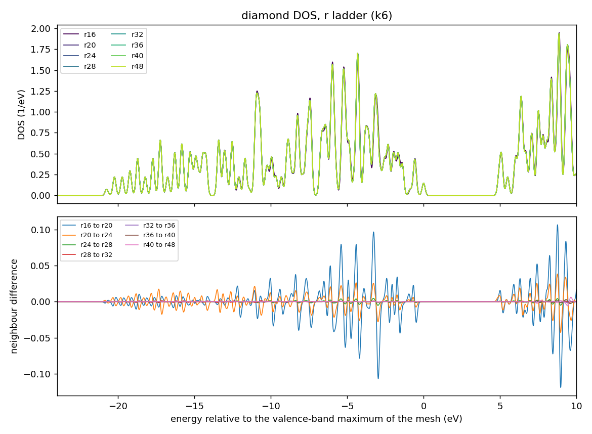
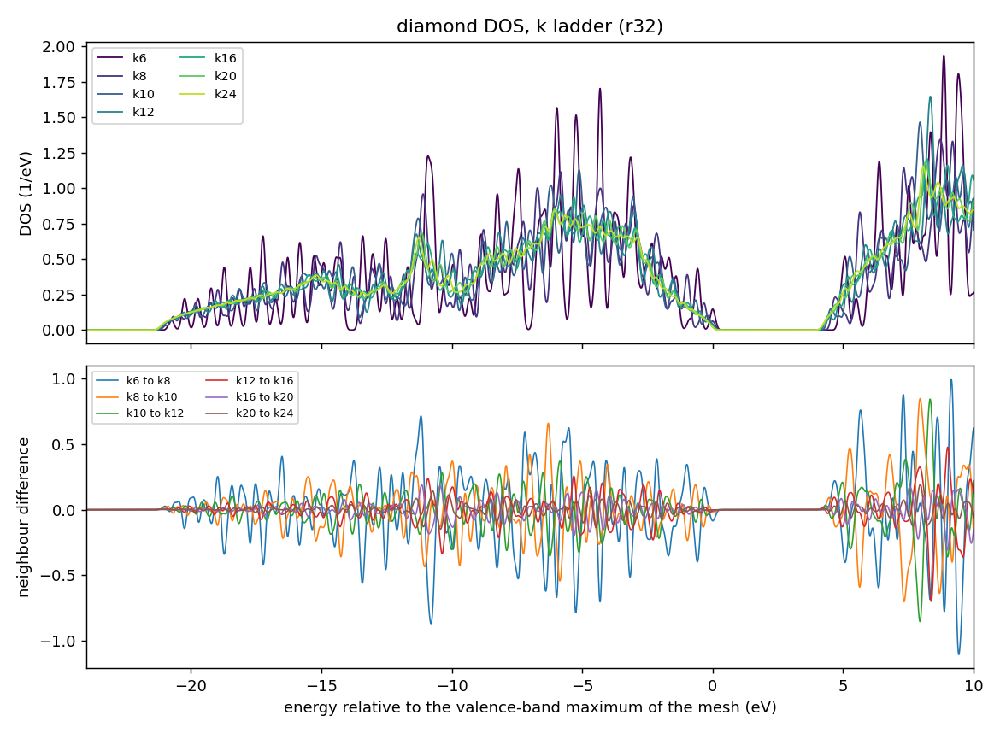
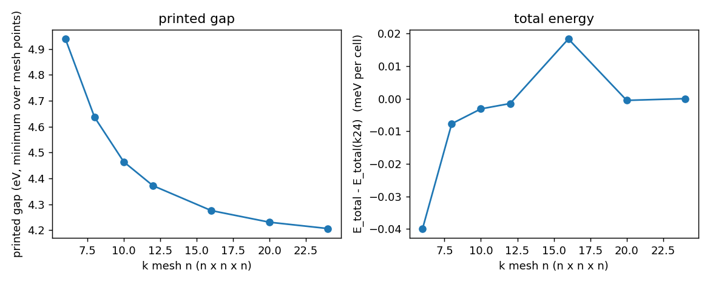

# Learning objective

Choose `num_rgrid` and the k mesh for the ground state of a hard, light-element
crystal (diamond, 2-atom primitive cell) whose density of states (DOS) will be
reported. Learn that the grid needed for diamond is far finer than for Si, that
the total energy is flat in k long before the DOS is, that a DOS of a small
primitive cell may still not be converged on a 24 x 24 x 24 mesh, and that the
gap SALMON prints is a minimum over mesh points and keeps falling with the mesh.

> **Draft; pending maintainer confirmation.** The convergence choice in this
> tutorial (`num_rgrid`) is **provisional (Claude) — awaiting maintainer
> confirmation**. It was made by the AI assistant that drafted this tutorial, from
> the overlays and numbers shown below. **The k mesh was not converged and no
> value is proposed.** No human has judged these figures yet. The structure, the
> pseudopotential, and every numerical setting that was not varied were
> assumptions of the assistant; they are listed in
> [Assumptions](#assumptions-made-by-the-assistant).

# Summary

We ran two one-variable ladders around one point: the real-space grid at a thin
6 x 6 x 6 k mesh, and the k mesh at the grid chosen from the first ladder, for
diamond (primitive 2-atom fcc cell, a = 3.567 Angstrom, FHI98PP LDA, `xc = 'PZ'`,
SALMON v2.3.0, no symmetry reduction). The results were as follows.

- **Real-space grid** (k6). The DOS converges between r24 and r28: the largest
  difference between neighbouring DOS curves, as a percentage of the DOS peak
  ("max_dev"), is 6.1% for r16 to r20, 2.2% for r20 to r24, 0.27% for r24 to r28,
  0.08% for r28 to r32, and at most 0.32% beyond. The total energy keeps falling:
  -0.66 meV per atom from r28 to r32, and -0.37 meV per atom in total from r32 to
  r48. Provisional choice: **r = 32** (r28 is the alternative).
- **k mesh** (r32). The total energy is flat from 8 x 8 x 8 on: all k8 to k24 values lie
  within 0.02 meV per cell. The DOS is **not converged at 24 x 24 x 24**: max_dev
  is 26% for k16 to k20 and 17% for k20 to k24 (13% in the valence band), and the
  overlays still show a ripple of the van Hove structure. No k mesh is proposed.
- **Printed gap.** The gap that SALMON prints (the minimum over mesh points)
  falls from 4.94 eV at k6 to 4.21 eV at k24 and is still falling by 24 meV from k20
  to k24, although the total energy is flat. It is a mesh artefact of the same type as in
  [SALMON-TS-002](../../troubleshooting/SALMON-TS-002-printed-gap-depends-on-k-mesh.md),
  not a converged gap.
- **Forward pointer (time propagation).** The r32 grid is very fine for a
  real-time run: an analytic estimate of the explicit-stepping limit is about
  1.0e-4 fs at r32 (see below). Short probes of the real-time stage cost 0.0697 s
  per step on 6 nodes.

These are observations for one model: a fixed, unrelaxed diamond cell at the
experimental lattice constant, PZ-LDA, FHI98PP with 4 valence electrons per atom,
`nstate = 8`, a Gaussian DOS width of 0.1 eV, and SALMON v2.3.0. They must not be
transferred to other materials without repeating the ladders.

## Context and objective

Tutorial [005](../005-si-gs-convergence-bands-dos/) converged bulk Si, with a
5.43 Angstrom cubic cell, at r24 and showed that energy, bands and DOS need
different k meshes. Diamond has a short bond and a hard pseudopotential, and its
cell has only two atoms. This tutorial asks how far the same approach goes.

**Judgment rule used in this tutorial.** Convergence is judged from overlays of the
DOS and of the differences between neighbouring rungs. The numbers are reference
values; no script decides convergence. For each judgment the reasons and the
alternatives that were rejected are written in the
[Judgment record](#judgment-record). The definitions are:

- `max_dev` = 100 * max|D_b - D_a| / max(D_b) over the whole DOS window, where b is
  the denser rung of the pair;
- `rel-L1` = 100 * sum|D_b - D_a| / sum(D_b) over the same window;
- valence = energy <= 0 eV, conduction = energy > 0 eV (origin at the valence-band
  maximum of the mesh);
- a rule "two consecutive pairs below a tolerance" is used only as a reference. It
  names the first rung from which the next two neighbour differences are both
  below the tolerance.

## Conditions

- SALMON: v2.3.0, tag `v.2.3.0`, commit
  `30ba64694ec761cdb6288f01a75b8bcabf05721f`, unmodified for every run.
- Platform: Fugaku (A64FX), Fujitsu compiler, `-Kfast`, SSL2. Four MPI processes per
  node, 12 OpenMP threads per process, k parallelisation only (`nproc_k` = number of
  processes, `nproc_ob = 1`, `nproc_rgrid = 1,1,1`). The r ladder used 6 nodes per
  run; the k ladder used 6 to 24 nodes.
- Structure: diamond, primitive 2-atom fcc cell, a = 3.567 Angstrom (experimental).
  Primitive vectors (0,h,h), (h,0,h), (h,h,0) with h = a/2 = 1.7835 Angstrom; atoms at
  reduced coordinates (0.05, 0.05, 0.05) and (0.30, 0.30, 0.30). `yn_symmetry = 'n'`.
- Pseudopotential: ABINIT FHI98PP LDA `06-C.LDA.fhi` (4 valence electrons, `lloc_ps = 2`,
  no nonlinear core correction); checksum in [provenance/run.yaml](provenance/run.yaml).
  `xc = 'PZ'`. `nelec = 8`, `nstate = 8` (4 occupied and 4 empty bands), fixed occupations
  (`temperature_k` not set).
- SCF: `ncg = 4`, `nscf = 800`, `threshold = 1d-9`, Broyden mixing with the SALMON v2.3.0
  defaults. All 13 runs converged (97 to 543 iterations, always below the cap).
- DOS: `yn_out_dos = 'y'`, `yn_out_dos_set_fe_origin = 'y'`, Gaussian width 0.1 eV,
  window -24 to +10 eV, 2721 points (0.0125 eV). Without `temperature_k` the origin
  is the valence-band maximum of the **k mesh**, which for an even n does not contain the
  true maximum at Gamma; the origin therefore shifts slightly with k.
  SALMON prints how far above that maximum the DOS is complete; it was 11.1 to
  12.2 eV, above the window end in every run.
- k mesh: n x n x n on the reciprocal primitive axes, which is SALMON's half-shifted
  Monkhorst-Pack mesh (no Gamma point for even n), with no symmetry reduction (n^3 k
  points: 216 for k6 up to 13824 for k24).

## Procedure

1. **Decide what will be judged.** The DOS over the whole window (valence and
   conduction separately), the total energy, and the printed gap.
2. **r ladder at a thin k mesh.** `num_rgrid` = r,r,r with r = 16, 20, 24, 28, 32, 36,
   40, 48 at 6 x 6 x 6 (216 k points), 6 nodes per run. A thin k mesh was used to keep the
   ladder cheap; this is legitimate for a one-variable comparison where both rungs
   of a pair see the same sampling, but the pairs were not repeated at denser k.
3. **k ladder at the chosen r.** n x n x n with n = 6, 8, 10, 12, 16, 20, 24 at r32
   (n = 6 is the r32 rung of the first ladder).
4. **Compare neighbouring rungs on overlays and differences**, then look at the
   total energy and the printed gap separately from the DOS.
   [scripts/make_figures.py](scripts/make_figures.py) draws the figures and prints the
   numbers (`make_figures.py <data dir> <figure dir>`; one sub-directory per run with
   its `*_dos.data` and standard output).

The representative input [inputs/diamond-gs-r32k24.inp](inputs/diamond-gs-r32k24.inp) is the
(r32, k24) deck. Only `sysname`, the pseudopotential path and comments differ from the
executed deck.

## Observed result

All 13 runs (r ladder: 8, k ladder: 7, sharing the r32 k6 run) reached `#GS converged`
and printed a DOS whose energy axis equals the requested window; the integral of the DOS
up to the maximum of the valence band equals 8.0000 electrons in the runs where it was
printed.

### 1. r ladder (k6)

| pair | max_dev (% of peak) | where (eV) | max_dev valence / conduction | rel-L1 | ΔE_total (meV/atom) |
|---|---:|---:|---|---:|---:|
| r16 to r20 | 6.14 | +8.97 | 5.50 / 6.14 | 3.47% | -41.2 |
| r20 to r24 | 2.20 | +8.96 | 1.44 / 2.20 | 1.68% | -8.64 |
| r24 to r28 | 0.27 | -2.99 | 0.27 / 0.26 | 0.17% | -2.20 |
| r28 to r32 | 0.08 | -10.64 | 0.08 / 0.06 | 0.07% | -0.66 |
| r32 to r36 | 0.07 | +9.39 | 0.04 / 0.07 | 0.04% | -0.24 |
| r36 to r40 | 0.15 | +9.34 | 0.02 / 0.15 | 0.04% | -0.06 |
| r40 to r48 | 0.32 | +9.64 | 0.01 / 0.32 | 0.04% | -0.06 |

The differences beyond r28 are all below 0.35% and sit at the upper end of the window
(+9 eV to +10 eV, in the conduction band near the limit where `nstate = 8` is still
complete), not in the valence band. The printed gap is 4.9418, 4.9417, 4.9389, 4.9388, 4.9390, 4.9390,
4.9389, 4.9389 eV for r16 to r48: it changes by less than 0.3 meV from r24 on. The
total energy keeps falling with the grid (-0.73 meV per cell from r32 to r48); it was not
used as a criterion. The number of SCF iterations
grows with the grid (97, 136, 165, 208, 276, 338, 440, 543 for r16 to r48) and the
wall time with it (12 s at r16, 78 s at r32, 16.5 minutes at r48, on 6 nodes).

### 2. k ladder (r32): the energy is flat, the DOS is not

| pair | max_dev (% of peak) | where (eV) | max_dev valence / conduction | rel-L1 | ΔE_total (meV/cell) |
|---|---:|---:|---|---:|---:|
| k6 to k8 | 82.3 | +9.44 | 64.7 / 82.3 | 53.7% | +0.033 |
| k8 to k10 | 58.0 | +7.95 | 45.1 / 58.0 | 33.9% | +0.004 |
| k10 to k12 | 51.9 | +7.95 | 22.5 / 51.9 | 24.2% | +0.002 |
| k12 to k16 | 58.0 | +8.38 | 27.8 / 58.0 | 17.2% | +0.020 |
| k16 to k20 | 25.9 | +9.00 | 16.6 / 25.9 | 10.2% | -0.019 |
| k20 to k24 | 16.8 | +7.96 | 12.9 / 16.8 | 6.77% | -0.0003 |

- **Total energy.** Within 0.02 meV per cell of the k24 value for every mesh from k8 on
  (the k6 value is 0.04 meV away). The values are not monotonic: k16 lies above k20 and
  k24 by 0.02 meV, comparable with the iteration-to-iteration scatter of an SCF converged
  to 1e-9.
- **Printed gap.** 4.9390, 4.6365, 4.4644, 4.3724, 4.2761, 4.2310, 4.2066 eV for k6, k8, k10,
  k12, k16, k20, k24: successive drops of 0.30, 0.17, 0.09, 0.10, 0.045 and 0.024 eV. Each rung
  prints the minimum over its own mesh points; a coarser mesh misses the points near
  the true band edges, so the value falls as the mesh gets denser. It is not
  converged at k24 and is not an estimate of the diamond gap.
- **DOS.** The overlay shows spiky van Hove structure at k6 to k10 that becomes a
  ripple, not a shift, at k16 to k24. The pairwise max_dev has fallen to 17% at k20 to k24;
  it is larger in the conduction band than in the valence band for every pair and is largest
  at 8 to 9 eV above the valence-band maximum. We did not extrapolate; the trend does
  not allow a statement about the k mesh at which 1% or 5% will be reached. The
  ladder stopped at k24 (13824 k points); no denser mesh was run.
- **Cost.** The k24 run took 8.6 minutes on 24 nodes; the SCF iterations (222 to 286)
  were roughly constant across k.

### 3. Adopted set (provisional)

| parameter | value | deciding observation | judged by |
|---|---|---|---|
| structure | diamond, a = 3.567 Angstrom, 2-atom primitive cell | not varied | assumed by Claude |
| pseudopotential / `xc` | FHI98PP LDA C (4e) / `'PZ'` | not varied | assumed by Claude |
| `num_rgrid` | 32,32,32 | r24 to r28 0.27%, r28 to r32 0.08%, ΔE r28 to r32 -0.66 meV/atom | **provisional (Claude) — awaiting maintainer confirmation** |
| k mesh | **none: not converged at 24 x 24 x 24** | DOS max_dev 17% at k20 to k24 | not judged |
| `nstate` | 8 | DOS complete to 11.1-12.2 eV above the valence-band maximum | not varied |
| DOS | Gaussian, 0.1 eV, window -24 to +10 eV | convention | not varied |

## Judgment record

| # | object | conclusion | judged by | what was looked at | reason, including rejected alternatives |
|---|---|---|---|---|---|
| 1 | grid | r32 (r28 also possible) | provisional (Claude) — awaiting maintainer confirmation | DOS overlays and neighbour differences of r16 to r48 at k6; ΔE_total; printed gap | r24 to r28 0.27% and r28 to r32 0.08% are below 0.3%. The "two consecutive pairs below the tolerance" rule applied mechanically gives r20 at 5% and 3% (r20 to r24 is 2.2%, r24 to r28 0.27%) and r24 at 1%; r20 was rejected because r20 to r24 still moves the energy by 8.6 meV/atom and the DOS by 2.2%. r28 is the alternative: it is cheaper (fewer iterations, 208 against 276) and the DOS differs from r32 by 0.08%. r32 was kept as the conservative side, because the energy is still falling by 0.66 meV/atom at r28 to r32 and the real-time stage later needs the same grid. The differences beyond r32 are all at the top of the window. Diamond needs a far finer grid than the r24 that Si needed in a 5.43 Angstrom cell (grid spacing 0.079 Angstrom at r32 here, 0.226 Angstrom at r24 for Si); we expect this to come from the hard C pseudopotential and the short bond but did not test it. |
| 2 | k mesh | no value; not converged at 24 x 24 x 24 | not judged | DOS overlays and differences of k6 to k24 at r32; E_total and the printed gap | The DOS max_dev falls from 82% to 17% but has not reached a level (conduction band 17%). E_total and the printed gap say nothing about this: the energy was flat from k8, and the gap kept falling. A denser mesh (k32 or more) would be needed; it was not run. A k mesh may also be chosen separately from the DOS by the observable that follows (for example the spectrum of a linear-response run), as for Si. |
| 3 | printed gap | not a converged quantity | provisional (Claude) — awaiting maintainer confirmation | printed gap k6 to k24 | It is the minimum over mesh points of a half-shifted mesh (no Gamma for even n) and falls with every refinement; see SALMON-TS-002. The valence-band maximum used as the DOS origin has the same limitation. |
| 4 | structure, pseudopotential, `nstate`, DOS settings | not varied | assumed by Claude | | see [Assumptions](#assumptions-made-by-the-assistant) |

## Assumptions made by the assistant

These were fixed by the drafting assistant, not varied, and are not
convergence results.

- The lattice constant a = 3.567 Angstrom is the experimental value, not an LDA-relaxed one.
- The primitive 2-atom fcc cell was used, with the atoms at (0.05, 0.05, 0.05) and
  (0.30, 0.30, 0.30) in reduced coordinates, i.e. the ideal positions displaced together by
  0.05 of a lattice vector. The shift does not change the physics but puts the atoms off the
  grid points; whether this affects the grid ladder (an "egg-box" effect on the total
  energy) was not tested.
- FHI98PP LDA with 4 valence electrons and no nonlinear core correction; no other
  pseudopotential or functional was tried.
- Scalar-relativistic, no spin-orbit coupling, no symmetry reduction of the k mesh.
- `nstate = 8` (twice the number of occupied bands). A smaller `nstate` would reduce the
  cost of later real-time runs; it was not examined.
- Fixed occupations without `temperature_k`, so that the DOS origin is the valence-band
  maximum of the mesh. With `temperature_k >= 0` SALMON takes the chemical potential as the
  origin, which for an insulator sits at an arbitrary position in the gap (on an earlier run
  of this material it sat 0.67 eV below the conduction-band minimum), and the axis would move
  between rungs.
- `ncg = 4`, `nscf = 800`, `threshold = 1d-9`, Broyden mixing with the defaults, Gaussian
  width 0.1 eV, and the DOS window -24 to +10 eV.
- The r ladder at k6 was assumed to carry over to denser k.

## Validation

- Each run was checked for `#GS converged`, an empty standard error, no NaN, the namelists
  read without error, `nelec` equal to twice the number of occupied bands, the number of
  k points and their weight sum (1), and the DOS energy axis equal to the requested window.
- The maximum of the valence band printed by SALMON agreed with the one that was used as the
  DOS origin; the DOS integral up to it was 8.0000 electrons.
- Controlled comparisons: every deck was checked before submission against one plan manifest
  that pins all keys except the ladder variable, `nproc_k` and the k mesh. The two ladders share
  the r32 k6 run.
- **Not validated:** no human has judged the figures. The k mesh is not converged and no value
  is proposed. The r ladder was run at k6 only and was not repeated at denser k. No other
  pseudopotential (for example one with a nonlinear core correction), no LDA-relaxed structure
  and no other functional was tried, and the displaced atom positions were not compared with the
  ideal ones. The DOS beyond about +11 eV is not complete for `nstate = 8`.

## Surprises and failures recorded

- **The DOS of a 2-atom cell needed more than 24 x 24 x 24 k points.** Energy and printed gap
  are not the limiting observables: the energy was flat from k8, and the DOS was still moving by
  17% at the end of the ladder. We expect that the sharp van Hove structure of a small cell at
  0.1 eV broadening is the cause, but this was not investigated.
- **The printed gap kept falling with k** (4.94 to 4.21 eV) while the total energy was flat: the
  same effect as SALMON-TS-002, with the extra twist that the half-shifted mesh does not contain
  Gamma, where the valence-band maximum is, for any even n.
- **The total energy is not monotonic in k** (k16 above k20 and k24 by 0.02 meV): differences at
  this level are of the size of the SCF convergence noise and should not be interpreted.
- **The grid ladder needed far finer r than Si.** The DOS locks at r24 to r28 for diamond; the
  energy is still changing at r48.

## Lessons learned

- **Do not use the printed gap, or the total energy, as the check for the DOS k mesh.** Both
  converged long before the DOS here.
- **A coarse thin-k r ladder is a valid first step**, but record that it was run at thin k.
- **The conduction band of the DOS carries the k error** in this ladder (max_dev 17% against
  13% in the valence band); judge the two bands separately.
- **For a real-time stage, choose the grid from the cost as well.** A fine grid forces a small
  time step, as below.
- **Compare total energies only for the same grid.** The energy changes by 0.73 meV per cell
  from r32 to r48 while the DOS does not.

### Pointer to the time-propagation stage

The Taylor-4 propagator is stable only for |dt * E_max| < 2.83, where E_max is the highest
kinetic energy on the grid. For the primitive diamond cell at r32 an analytic estimate from
the finite-difference stencil gives E_max of about 659 Hartree and a time-step limit of
about 1.0e-4 fs, falling with the square of the grid spacing (about 1.9e-4 fs at r24, 6.6e-5 fs
at r40). The estimate ignores the potential energy and is not a measurement. Three short probes
(400 steps, k6, 6 nodes) at 5.2e-5, 7.8e-5 and 1.0e-4 fs stayed finite; 400 steps is too few
to judge long-time stability. They measured 0.0697 s per step (216 k points on 6 nodes). A
50 fs run at 5.2e-5 fs is about 9.6e5 steps, i.e. about 19 hours on 6 nodes at that rate, which is
why the choice of the grid for a real-time calculation is a cost decision as well as a
convergence one.

## Limitations and applicability

This tutorial covers one diamond cell at the experimental lattice constant, PZ-LDA, FHI98PP
with 4 valence electrons and no core correction, no spin-orbit coupling, `nstate = 8`, a
Gaussian DOS width of 0.1 eV, and SALMON v2.3.0 on Fugaku (A64FX).

- The grid judgment is provisional. The k mesh is not converged.
- A broader DOS width would converge at a coarser mesh; only 0.1 eV was studied.
- The r ladder was done at k6.
- The numbers of this tutorial are not a diamond gap.

## References

- SALMON official sample `exercise_04_bulkSi_gs` (SALMON v2.3.0, tag `v.2.3.0`), as the
  starting point of the deck; no published diamond input was used.
- [ABINIT LDA FHI pseudopotential collection](https://www.abinit.org/atomic_data/psps/miscellaneous/ATOMICDATA/LDA_FHI/)
- Related tutorial: [005 Si ground-state convergence](../005-si-gs-convergence-bands-dos/)
- Troubleshooting: [TS-002](../../troubleshooting/SALMON-TS-002-printed-gap-depends-on-k-mesh.md)
- Run provenance: [provenance/run.yaml](provenance/run.yaml). Raw outputs are not committed.
