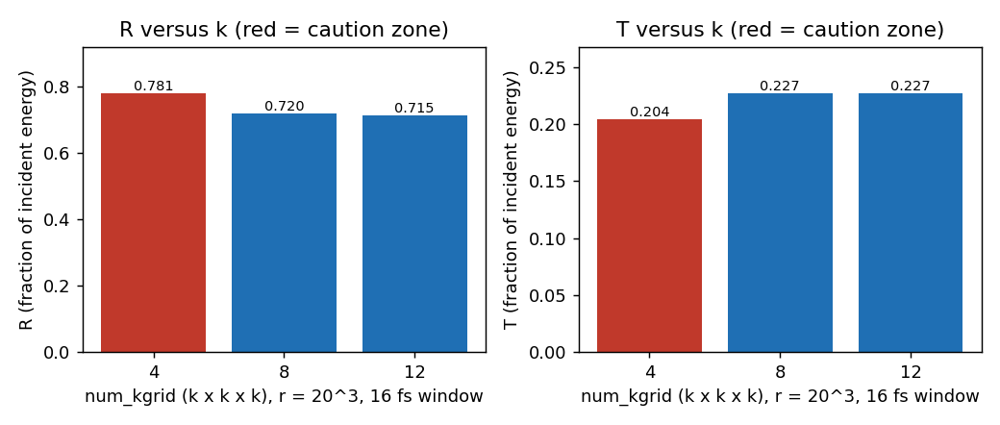
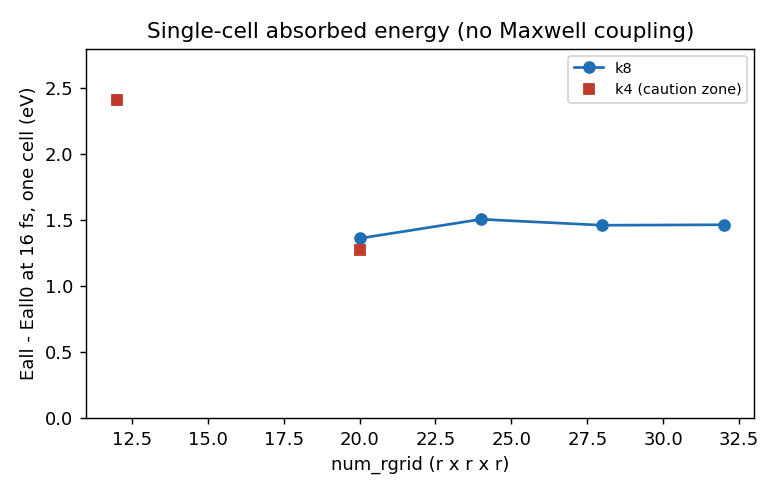
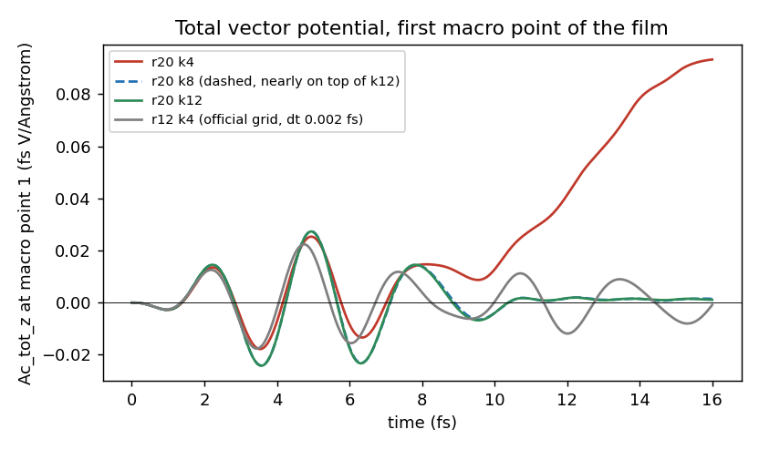
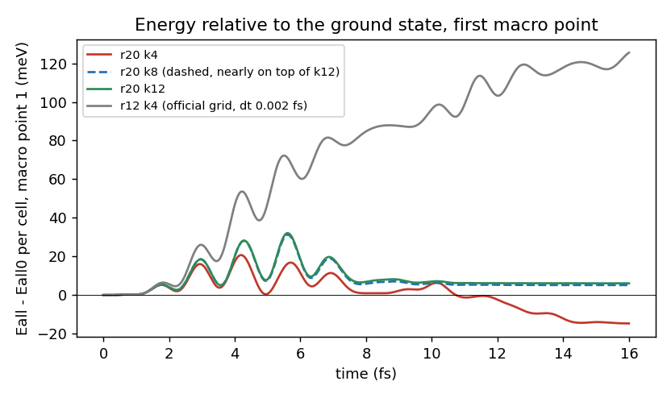

# Learning objective

Set up a Maxwell-TDDFT multiscale calculation (`theory = 'multi_scale_maxwell_tddft'`)
of a thin film starting from the official sample `exercise_07_bulkSi_ms`, and learn
which of its numerical parameters change which output. The outputs are the
reflected and transmitted energy fractions (R, T) and the energy absorbed per unit
cell. The parameters are the k mesh and the real-space grid of the microscopic
cell, the time step, the length of the propagation window and the macro grid of the
Maxwell solver. The central lesson: R and T can look converged while the
absorbed energy is not, and the official sample grid is a functional test, not a
converged setting.

> **Draft; pending maintainer confirmation.** The k zones below (safe zone and
> caution zone) are a **maintainer judgment**, given in a review of an earlier
> version of this draft. Every other convergence statement (window, `dt`, macro
> grid, r, and "R/T converged, absorbed energy not") is **provisional (AI assistant) —
> awaiting maintainer confirmation**: it was made by the AI assistant that drafted
> the tutorial, from the figures and numbers below. No converged setting for the
> absorbed energy is claimed. Everything that was not varied was an assumption of
> the assistant and is listed in [Assumptions](#assumptions-made-by-the-assistant).

# Summary

One film, one pulse, one pseudopotential: a 400 Angstrom Si film (8 macro points of
50 Angstrom, 1000 vacuum cells on each side, absorbing boundaries), an `Acos2` pulse
of 1.55 eV, 1e12 W/cm^2, `tw1` = 10.672 fs, polarized along z, FHI98PP LDA Si, SALMON
v2.3.0. The official sample uses r = 12^3, k = 4^3, `dt` = 0.002 fs; the base point
here is r = 20^3, k = 8^3, `dt` = 0.001 fs, `nstate` = 32 (ground state with empty
bands, see [SALMON-TS-007](../../troubleshooting/SALMON-TS-007-gs-with-only-occupied-states-converges-slowly.md)).

- **k mesh** (r20, `dt` 0.001 fs, 16 fs). R / T: k4 0.781 / 0.204, k8 0.720 / 0.227,
  k12 0.715 / 0.227. **Maintainer judgment: safe zone k >= 8** (R and T within 1% of
  k12: R changes by 0.7%, T by 0.2%); **caution zone k = 4 to 6** (R and T off by
  several percent, and a spurious static field can appear, see [SALMON-TS-009](../../troubleshooting/SALMON-TS-009-multiscale-coarse-k-spurious-static-field.md)).
- **Absorbed energy is not converged at k12.** Per cell, Eall - Eall0 at 16 fs grows
  by +9% to +18% from k8 to k12 at every macro point (film mean 0.0538 to 0.0594 eV,
  +10.4%). This is the same 10% as the change of the absorbed fraction
  1 - R - T (5.3% to 5.85%), which is a small difference of two large numbers.
- **Real-space grid** (single cell, k8, absorbed energy at 16 fs): r20 1.361, r24 1.506,
  r28 1.461, r32 1.465 eV. The sequence is not monotone; r28 and r32 agree to 0.26%.
  The official grid r12 at k4 gives 2.41 eV, 1.9 times the r20 k4 value (1.276 eV):
  **the official grid is a functional test, not converged.**
- **Time step.** `dt` 0.002 to 0.001 fs at r12, and 0.001 to 0.0005 fs at r20 (k4),
  change the film-mean absorbed energy by 0.05% and R, T by 1e-4. Negligible.
- **Window.** At r20 k8, 16 fs and 32 fs windows give R and T that differ by at most
  1.6e-4 (the reflected and transmitted waves are at 0.3% of the incident peak at
  32 fs): 16 fs is enough there. It is **not** enough at the official grid
  (r12 k4: R 0.699 to 0.722, T 0.140 to 0.151 between 16 and 32 fs).
- **Macro grid** (r12 k4, `dt` 0.002 fs): 8, 16, 32 macro points give a film-mean
  absorbed energy of 0.16230, 0.16237, 0.16239 eV and R / T within 0.1% / 0.6%.
  8 points of 50 Angstrom are enough at this setting; flat from 16 points on.
- **The r20 k4 anomaly.** At r20 k4 the total vector potential grows as a ramp after
  the pulse, a static field of about -0.015 V/Angstrom stays in the film, and the
  energy of the first macro points falls below the ground-state energy
  (-14.7 meV per cell). It does not depend on `dt`, it is absent in the single-cell
  calculation, and it is gone at k8. See [SALMON-TS-009](../../troubleshooting/SALMON-TS-009-multiscale-coarse-k-spurious-static-field.md).

These are observations for one model: one film, one pulse, one pseudopotential, SALMON
v2.3.0.

## Context and objective

Tutorial [005](../005-si-gs-convergence-bands-dos/) converged the Si ground state;
a separate linear-response tutorial (in review) converged `Im eps`. A Maxwell-TDDFT run
adds a new layer: every macro point of the film holds its own TDDFT cell, and the
cells see the field of the Maxwell solver, which they in turn change. The observables
are different from the earlier tutorials: the energy fractions R and T are read from the
waves outside the film, and the energy absorbed in each cell from `*_rt_energy.data`.

**Judgment rule used in this tutorial.** Convergence is judged from the numbers
printed in the tables and from the overlays of the time series, one parameter at a
time with every other parameter identical. No script decides convergence. For each
judgment the reasons and the rejected alternatives are written in the
[Judgment record](#judgment-record). The definitions are:

- R = integral of E_ref_z^2 dt divided by the integral of E_inc_z^2 dt over the window
  (columns 7 and 4 of `*_wave.data`); T likewise with E_tra_z (column 10);
- absorbed energy = Eall - Eall0 at the last step (column 3 of `*_rt_energy.data`),
  per unit cell; "film mean" is the mean over the macro points inside the film;
- the zones for k (safe, caution) are the maintainer's wording; the percentages next
  to them are the numbers behind that wording, not thresholds that were fixed in
  advance.

## Conditions

- SALMON: v2.3.0, tag `v.2.3.0`, commit
  `30ba64694ec761cdb6288f01a75b8bcabf05721f`, unmodified for every run.
- Platform: Fugaku (A64FX), Fujitsu compiler, `-Kfast`, SSL2. Four MPI processes
  per node, 12 OpenMP threads per process. For the multiscale runs `nproc_k` is the
  number of processes of **one** macro-point group; SALMON splits the world into
  `nx_m` groups (8 groups x 64 processes on 128 nodes for r20 k8).
- Structure: bulk Si, 8-atom cubic cell, a = 5.43 Angstrom, diamond positions
  (reduced coordinates in the deck). Pseudopotential: ABINIT FHI98PP LDA
  `14-Si.LDA.fhi`, `lloc_ps = 2`, `xc = 'PZ'`; checksum in
  [provenance/run.yaml](provenance/run.yaml).
- Ground state: `theory = 'dft'`, shifted Monkhorst-Pack mesh (no symmetry reduction),
  `nstate` = 32, `nscf` = 300, `threshold` = 1d-9. **Every multiscale run restarts from
  its own ground state** (same r, k, `nstate`). SALMON does not check that the
  restart data matches the deck.
- Multiscale: `nx_m` = 8, `hx_m` = 50 Angstrom (film 400 Angstrom), `nxvacl_m` =
  `nxvacr_m` = 1000 (5 um of vacuum on each side), `boundary_em = 'abc'`. When the
  macro grid was refined (16 and 32 macro points) the vacuum cell counts were scaled so
  that the vacuum stayed 5 um on each side, so that a macro-grid rung changes only the
  macro grid. The run starts from the ground state (`yn_restart = 'n'`, restart
  directory given by `directory_read_data`).
- Pulse: `ae_shape1 = 'Acos2'`, `omega1` = 1.55 eV, `I_wcm2_1` = 1.0d12, `tw1` =
  10.672 fs, `epdir_re1` = (0, 0, 1). Window `nt` * `dt` = 16 fs unless stated.
- Single-cell runs: `theory = 'tddft_pulse'` (same cell, same pulse, no Maxwell
  coupling), used to separate the microscopic cell from the Maxwell coupling.
- Base point: r = 20^3, k = 8^3, `nstate` = 32, `dt` = 0.001 fs, 8 macro points.

## Procedure

1. **Run the ground state for each (r, k)** with empty bands (`nstate` = 32). A
   deck with `nstate` = 16 stalls ([SALMON-TS-007](../../troubleshooting/SALMON-TS-007-gs-with-only-occupied-states-converges-slowly.md)).
2. **Run the official-sample setting first as a functional test** (r12, k4,
   `dt` 0.002 fs, 8 macro points) and read R, T and the absorbed energy per macro point.
3. **Vary one parameter at a time**, all other parameters identical (decks were
   compared pairwise before each submission):
   - k at r20: 4, 8, 12 (`dt` 0.001 fs);
   - r at k8, single cell: 20, 24, 28, 32 (`dt` 0.001 fs for r20, 0.0005 fs for the others);
   - `dt`: r12 k4 0.002 to 0.001; r20 k4 0.001 to 0.0005 (multiscale); r24 k8 single
     cell 0.001 to 0.0005;
   - window: 16 fs against 32 fs at r20 k8 and r12 k4;
   - macro grid: 8, 16, 32 macro points at r12 k4.
4. **Read R and T, the absorbed energy per macro point and the time series of the first
   macro point** (`Ac_tot_z`, `Eall - Eall0`). A calculation can finish normally and
   still be wrong: the r20 k4 run conserved the electron number and had no NaN.
5. [scripts/make_figures.py](scripts/make_figures.py) draws the figures and prints the
   numbers (`make_figures.py <data dir> <figure dir>`; the data directory holds one
   sub-directory per run).

The representative inputs are
[inputs/si-ms-gs-adopted.inp](inputs/si-ms-gs-adopted.inp) (ground state) and
[inputs/si-ms-maxwell-tddft-adopted.inp](inputs/si-ms-maxwell-tddft-adopted.inp)
(multiscale), both at the base point (r20, k8). They differ from the executed decks in
`sysname`, the pseudopotential path, the restart directory and comments. The executed
multiscale decks read the ground-state restart in place through an absolute
`directory_read_data`; in the tutorial it is `./restart/`, a copy of the `data_for_restart/`
directory of the ground state, as in the official exercise. **These decks are a base
point, not a converged production setting.**

## Observed result

All runs shown finished with the requested number of steps and conserved the electron
number; the single-cell and multiscale decks were checked for NaN. Time series are
those of the first macro point (the one facing the incident pulse) unless stated.

### 1. k mesh: R and T converge at k8, the absorbed energy does not

| run (r20, 16 fs) | R | T | R + T |
|---|---:|---:|---:|
| k4 | 0.781 | 0.204 | 0.985 |
| k8 | 0.720 | 0.227 | 0.947 |
| k12 | 0.715 | 0.227 | 0.942 |

R and T move by -0.005 and -0.0004 from k8 to k12 (0.7% and 0.2% of their values);
from k4 to k8 they move by -0.061 and +0.023. **Zones (maintainer judgment):**

- **safe zone, k >= 8**: R and T within 1% of the k12 value;
- **caution zone, k = 4 to 6**: R and T off by several percent, and the run may carry a
  spurious static field (section 3). k = 5 and 6 were not run here; the zone edge at 6
  is the maintainer's wording, the runs are k4, k8, k12.

The cost of safety is real (k12 took about three times as long as k8 on the same 128
nodes), which is why the zones are given as a trade-off and not as a single value.

Absorbed energy per unit cell at 16 fs (eV):

| macro point (front to back) | 1 | 2 | 3 | 4 | 5 | 6 | 7 | 8 | film mean |
|---|---:|---:|---:|---:|---:|---:|---:|---:|---:|
| k4 | -0.0147 | -0.0133 | -0.0087 | 0.0011 | 0.0159 | 0.0331 | 0.0484 | 0.0574 | 0.0149 |
| k8 | 0.0051 | 0.0105 | 0.0215 | 0.0385 | 0.0600 | 0.0823 | 0.1009 | 0.1115 | 0.0538 |
| k12 | 0.0061 | 0.0124 | 0.0246 | 0.0432 | 0.0664 | 0.0904 | 0.1103 | 0.1216 | 0.0594 |
| k8 to k12 | +18% | +18% | +15% | +12% | +11% | +10% | +9% | +9% | +10% |

**The absorbed energy is not converged at k12** (provisional, AI assistant). The reading is
simple arithmetic: R + T at 32 fs, r20 k8, is 0.9472 (tails negligible), so about 5.3%
of the incident energy is absorbed; at k12 the 16 fs value gives 5.85%, and assuming
the tails are similarly negligible the absorbed fraction rose by 10%, as the film mean
of the cell energies did (+10.4%). R and T are close to converged because they
are large numbers; the absorption is the small remainder and is sensitive to the
count of transitions. There is no k16 run, so the size of the remaining change is
unknown.

### 2. Real-space grid: the official grid is a functional test

Single-cell pulse (`tddft_pulse`, no Maxwell coupling), k8 unless stated, absorbed
energy at 16 fs:

| r | k | `dt` (fs) | Eall - Eall0 (eV) |
|---|---|---:|---:|
| 12 | 4 | 0.001 | 2.411 |
| 20 | 4 | 0.001 | 1.276 |
| 20 | 8 | 0.001 | 1.361 |
| 24 | 8 | 0.001 | 1.506 |
| 24 | 8 | 0.0005 | 1.506 |
| 28 | 8 | 0.0005 | 1.461 |
| 32 | 8 | 0.0005 | 1.465 |

r24 to r28 is -3.0% and r28 to r32 +0.26%. The sequence r20, r24, r28, r32 is **not
monotone**: r24 sits 3% above r28 and r32, so only "r28 and r32 agree to 0.26%" is
shown, not a converging sequence. The ground-state total energy at t = 0 is also not
monotone in r (r20 -864.43, r24 -864.63, r28 -864.50, r32 -864.73 eV), so the
irregularity is already in the ground state and not introduced by the dynamics.
Whether r28 is enough or r36 is needed was **not decided** (maintainer's call).

The official grid, r12 at k4, gives 2.41 eV, 1.9 times the r20 k4 value (same k, 1.276
eV). R + T at r12 k4 is 0.839 at 16 fs against 0.985 at r20 k4. **The official
sample grid (r12, k4) is a functional test, not a converged setting.** The r and k
ladders here were run at the base values of the other (r at k8, k at r20); they were
assumed independent and the intersection (for example r28 with k12) was not run.

### 3. The r20 k4 anomaly (summary; mechanism in [SALMON-TS-009](../../troubleshooting/SALMON-TS-009-multiscale-coarse-k-spurious-static-field.md))

At r20 k4 the total vector potential at the first macro point rises as a ramp after the
pulse and reaches 0.0933 fs V/Angstrom at 16 fs, still rising, at every macro point with
the same value; the mean total field over 10 to 15 fs is -0.0151 V/Angstrom. At the
same time the energy of the first three macro points falls below the ground-state energy
(Eall - Eall0 = -0.0147 eV per cell at 16 fs, negative for about a third of the run). At
r20 k8 and k12 the vector potential returns to about zero after the pulse (0.0015 and
0.0011 at 16 fs) and the energy is not negative. The r12 k4 run of the official grid
does not show it either (the gray curve oscillates around zero). The run passes the
usual checks (electron number conserved, no NaN): **a clean finish does not show it**.

The diagnosis chain, summarized:

1. **Not the time step.** `dt` 0.001 and 0.0005 fs give the same ramp (0.0933), the same
   field (-0.0151 V/Angstrom), the same energy at the first macro point (-0.0147 eV) and the
   same R and T (0.781, 0.204) to 1e-4. Explanations that depend on `dt` (non-unitarity of
   the Taylor propagator, an O(dt) inconsistency between the current and the vector
   potential, a one-step delay of the Maxwell solver) are therefore not the cause.
2. **Not the microscopic cell alone.** The single-cell run at r20 k4 has no negative
   energy (+1.276 eV at 16 fs) and no ramp.
3. **Gone at k8** (and k12), at the same r, grid and `dt`.
4. The remaining candidate is the sum over the Brillouin zone at k4: the uniform
   component of the vector potential that the Maxwell solver keeps acts as a constant
   field on a coarse mesh instead of a gauge. This is a hypothesis; the tutorial does not claim
   it is proven. [SALMON-TS-009](../../troubleshooting/SALMON-TS-009-multiscale-coarse-k-spurious-static-field.md) holds the diagnosis and the check list.

Practical rule: at k4 to k6 look at the time series of `Ac_tot_z` and of
`Eall - Eall0` after the pulse before trusting R, T or the absorbed energy.

### 4. Time step

| pair | quantity | change |
|---|---|---:|
| r12 k4, `dt` 0.002 to 0.001 fs | film-mean absorbed energy (0.16230 to 0.16237 eV) | +0.05% |
| r12 k4, `dt` 0.002 to 0.001 fs | R, T (0.6993 to 0.6994, 0.1395 to 0.1396) | 1e-4 |
| r20 k4, `dt` 0.001 to 0.0005 fs | film-mean absorbed energy (0.01490 to 0.01491 eV) | +0.05% |
| r20 k4, `dt` 0.001 to 0.0005 fs | R, T (0.7809 to 0.7810, 0.2042) | 1e-4 |
| r24 k8, single cell, `dt` 0.001 to 0.0005 fs | absorbed energy (1.50623 to 1.50618 eV) | -3e-5 (relative) |

`dt` is not a factor at this level. The r20 test was made at k4 (the anomalous run) and
r24, not at the base point k8, and it was not repeated at r28 and r32. The explicit
time stepping has a stability limit that falls with the grid spacing (estimate from the
finite-difference stencil, as in a separate linear-response tutorial (in review): about
0.0018 fs at r20 and 0.0009 fs at r28, an estimate and not a measurement); r28 and r32
were run at 0.0005 fs, at about half of it.

### 5. Propagation window

| run | window | R | T |
|---|---|---:|---:|
| r20 k8 | 16 fs | 0.71969 | 0.22730 |
| r20 k8 | 32 fs | 0.71971 | 0.22746 |
| r12 k4 (official grid) | 16 fs | 0.6993 | 0.1395 |
| r12 k4 (official grid) | 32 fs | 0.7220 | 0.1508 |

At r20 k8 the 32 fs window changes R by 2e-5 and T by 1.6e-4: **16 fs is enough at the
base point** (provisional, AI assistant). At the official grid the reflected and transmitted
waves are still 3 to 6% of the incident peak at 32 fs (so R and T at 32 fs are not final
either) and R, T change by 3% and 8% between 16 and 32 fs. The needed window is a property
of the setting: check it for each grid.

### 6. Macro grid

Film of 400 Angstrom at r12 k4, `dt` 0.002 fs:

| macro grid | spacing | film-mean absorbed energy (eV) | R | T |
|---|---:|---:|---:|---:|
| 8 points | 50 Angstrom | 0.16230 | 0.6993 | 0.1395 |
| 16 points | 25 Angstrom | 0.16237 | 0.6984 | 0.1404 |
| 32 points | 12.5 Angstrom | 0.16239 | 0.6981 | 0.1406 |

The film mean is flat from 16 points on (0.04% from 8 to 16, 0.01% from 16 to 32), and
the per-point absorbed energies differ by at most 1.2% after block-averaging the fine
grids onto the 8 points. The reflected and transmitted **waveforms** differ by 3 to 5% of
their peaks between the macro grids (a phase shift of the front surface was suspected;
not explained), while their time-integrated energies agree within 0.1% (R) and 0.6% (T).
The macro-grid test was made at the official setting (r12 k4) and not at the base point.
For the quantities in this tutorial, 8 macro points of 50 Angstrom are enough (provisional,
AI assistant).

### 7. Setting used here (provisional)

| parameter | value | deciding observation | judged by |
|---|---|---|---|
| structure, pseudopotential, `xc` | Si 8-atom cubic, 5.43 Angstrom; FHI98PP LDA; PZ | not varied | assumed by the AI assistant |
| pulse | `Acos2`, 1.55 eV, 1e12 W/cm^2, `tw1` 10.672 fs, z | not varied | assumed by the AI assistant |
| `num_kgrid` | k >= 8 safe zone; k4 to k6 caution zone; absorbed energy not converged at k12 | R/T k8 against k12 within 1%; spurious field at k4 | **maintainer judgment (zones)**; "absorbed energy not converged" provisional (AI assistant) |
| `num_rgrid` | not settled; r28 and r32 agree to 0.26% (single cell); r20 is the cheap base point | non-monotone sequence | provisional (AI assistant) — awaiting maintainer confirmation |
| `dt` | 0.001 fs at r20 (0.0005 fs at r28, r32) | changes of 0.05% | provisional (AI assistant) — awaiting maintainer confirmation |
| window | 16 fs at r20 k8; check at every grid | 16 against 32 fs: 1.6e-4 | provisional (AI assistant) — awaiting maintainer confirmation |
| macro grid | 8 points of 50 Angstrom | flat from 16 points (r12 k4) | provisional (AI assistant) — awaiting maintainer confirmation |
| `nstate` | 32 for the ground state | [SALMON-TS-007](../../troubleshooting/SALMON-TS-007-gs-with-only-occupied-states-converges-slowly.md) | provisional (AI assistant) — awaiting maintainer confirmation |

## Judgment record

| # | object | conclusion | judged by | what was looked at | reason, including rejected alternatives |
|---|---|---|---|---|---|
| 1 | k zones for R and T | safe zone k >= 8; caution zone k = 4 to 6 | **maintainer** (review comment, 2026-10-06) | R and T at k4, k8, k12 at r20; time series at k4 | The maintainer wrote that k >= 8 is preferable, that smaller k looks much less accurate, and that since it is a cost trade-off a "safe zone / caution zone" wording is acceptable. Numbers behind it: k8 to k12 R -0.7%, T -0.2%; k4 to k8 R -8%, T +11%, and a spurious static field at k4. A single recommended k was rejected because the cost of k12 (about three times k8) matters for the user. |
| 2 | R and T converged at k8 | yes at r20 | provisional (AI assistant) — awaiting maintainer confirmation | R, T at k4, k8, k12; 16 fs against 32 fs | The assistant took "within 1% of k12" as the working meaning. Not tested: k16, other r (the k ladder is at r20 only). |
| 3 | absorbed energy | not converged at k12 | provisional (AI assistant) — awaiting maintainer confirmation | per-point Eall - Eall0, k8 against k12 | +9% to +18% per point, +10.4% film mean, equal to the change of 1 - R - T (5.3% to 5.85%). No k16 run, so it is not known where it settles. |
| 4 | real-space grid | not settled; r28 to r32 within 0.26%, r24 3% higher | provisional (AI assistant) — awaiting maintainer confirmation | single-cell absorbed energy r20 to r32 at k8; ground-state energy at t = 0 | The sequence is not monotone, so "converged" was rejected; r36 or another observable would be needed. The choice between r28 and a finer grid is left to the maintainer. |
| 5 | official sample grid (r12, k4) | functional test, not converged | provisional (AI assistant) — awaiting maintainer confirmation | single-cell energy 2.41 against 1.28 eV (r12 against r20, k4); R + T 0.839 against 0.985; window sensitivity | The size of the differences (a factor of 1.9 in the absorbed energy, 3 to 8% in R and T with the window) is far from the other rungs' changes. |
| 6 | time step | `dt` = 0.001 fs at r20 is enough | provisional (AI assistant) — awaiting maintainer confirmation | `dt` pairs in section 4 | Changes of 0.05% in absorbed energy and 1e-4 in R and T. Tested at r12 k4, r20 k4 and r24 k8 (single cell) and not at the base point; the stability estimate says the margin shrinks with the grid. |
| 7 | window | 16 fs at r20 k8 | provisional (AI assistant) — awaiting maintainer confirmation | R, T at 16 and 32 fs | 1.6e-4 at r20 k8, but 3% and 8% at r12 k4. A fixed 16 fs was rejected as a general rule. |
| 8 | macro grid | 8 points of 50 Angstrom | provisional (AI assistant) — awaiting maintainer confirmation | film mean and R, T for 8, 16, 32 points at r12 k4 | Flat from 16 points; the waveform difference of 3 to 5% of the peak was not explained and the test was at the official setting. |
| 9 | origin of the r20 k4 anomaly | not `dt`, not the microscopic cell alone, gone at k8; mechanism left as a hypothesis | provisional (AI assistant) — awaiting maintainer confirmation | `dt` pair, single-cell run, k ladder | Alternatives that depend on `dt` were rejected by the `dt` pair; the Brillouin-zone sum hypothesis is not proven. See [SALMON-TS-009](../../troubleshooting/SALMON-TS-009-multiscale-coarse-k-spurious-static-field.md). |

## Assumptions made by the assistant

Fixed by the drafting assistant, not varied, and not convergence results.

- Bulk Si at the experimental lattice constant (5.43 Angstrom); FHI98PP LDA, `xc = 'PZ'`;
  no spin-orbit coupling; shifted Monkhorst-Pack mesh without symmetry reduction, with the
  same mesh in the real-time and ground-state runs.
- The film (8 macro points x 50 Angstrom) and the vacuum (1000 cells = 5 um on each side
  at 50 Angstrom spacing), `abc` boundaries and the pulse come from the official sample;
  the pulse peak intensity, frequency and duration were not varied; z polarization only.
- The comparison quantities are the assistant's choice: R and T as time-integrated energy
  ratios over the whole window, and the absorbed energy as Eall - Eall0 at the last step.
  The R and T values were not checked against a transfer-matrix reference.
- The 16 fs window was taken from the official sample and the 32 fs window as the test.
- The k, r, `dt`, window and macro-grid studies were taken as independent one-variable
  studies at different base points (k and window at r20; r at k8, single cell; macro grid
  at r12 k4), not at one common point.
- The single-cell absorbed energy was used as the probe of the microscopic cell; it is not
  the absorbed energy of the film.
- The ground-state convergence settings (`threshold = 1d-9`, `nscf = 300`) were taken from
  the official sample.

## Validation

- Every run was checked for the requested number of steps, for electron-number
  conservation and for non-finite values in the output files before it was used.
- Controlled comparisons: decks were compared pairwise before submission and differ only in
  the ladder variable (and, for the macro grid, the vacuum cell count that keeps 5 um).
- Every multiscale or single-cell run used the ground state with the same r, k and
  `nstate`; the restart data is not validated by SALMON, so each run directory was checked
  against its plan.
- The tables are produced by the script in this directory from the output files; the
  single-cell energies, R and T agree with the values read during collection.
- **Not validated:** no human has judged the figures other than the k zones. k5, k6 and k16
  were not run. The `dt`, window and macro-grid studies were not made at the base point.
  The r ladder is single cell only; no multiscale run exists at r28 or r32. The absorbed
  energy is not converged and no converged value is given. The r36 check was not run. The
  mechanism of the r20 k4 anomaly is a hypothesis. Other pulses (intensity, frequency,
  polarization), film thickness, vacuum size and boundary condition were not examined.

## Surprises and failures recorded

- **A calculation that finishes cleanly can be wrong.** The r20 k4 run ended normally, kept
  the electron number and had no NaN, and still carried a static field and negative
  energies. Only the time series after the pulse show it.
- **The official sample setting (r12 k4) looked reasonable and is far from converged.**
  Its absorbed energy is 1.9 times larger than at r20 (same k), and its window is too short.
- **R and T hide the absorbed energy error.** They are within 1% at k8 and k12 while the
  absorbed energy moves by 10%; the absorption is a small difference of two large numbers.
- **The r dependence of the absorbed energy is not monotone** (r24 above r28 and r32), and
  the ground-state energy has the same irregularity.

## Lessons learned

- **Start from the official sample as a functional test and do not treat its grid as
  converged.** Check R, T and the absorbed energy at a denser r and k before using the
  numbers.
- **Look at the time series after the pulse** (`Ac_tot_z`, `Eall - Eall0`) at every
  macro point, especially at small k: a ramp or a negative energy means the run is not valid
  even if it finished.
- **Give k as zones when the cost matters:** safe zone k >= 8 for R and T, caution zone
  k = 4 to 6. Say which observable the zone is for.
- **R and T converge earlier than the absorbed energy.** Judge the absorbed energy on its
  own, per macro point, and do not infer it from R and T.
- **Check the window for each grid:** it was enough at r20 k8 and not at r12 k4.
- **The time step and the macro grid were not the limiting parameters** here; the
  microscopic k mesh and grid were.
- **Keep k-points per node low** at large r ([SALMON-TS-010](../../troubleshooting/SALMON-TS-010-fugaku-gs-killed-too-many-k-points-per-node.md)), and run a ground state with
  `nstate` above the number of occupied bands ([SALMON-TS-007](../../troubleshooting/SALMON-TS-007-gs-with-only-occupied-states-converges-slowly.md)).

## Limitations and applicability

This tutorial covers one 400 Angstrom Si film, one pulse (1.55 eV, 1e12 W/cm^2, z), PZ-LDA,
FHI98PP, no spin-orbit coupling, SALMON v2.3.0 on Fugaku (A64FX).

- The k zones are for R and T at r20; they say nothing about other thicknesses, other
  pulses or the absorbed energy.
- The absorbed energy is not converged at k12 and r is not settled; no converged
  setting is given for it.
- All judgments except the k zones are provisional.

## References

- SALMON official samples `exercise_04_bulkSi_gs` and `exercise_07_bulkSi_ms` in the SALMON
  v2.3.0 source tree (tag `v.2.3.0`), as the base of the decks.
- [ABINIT LDA FHI pseudopotential collection](https://www.abinit.org/atomic_data/psps/miscellaneous/ATOMICDATA/LDA_FHI/)
- Related tutorial: [005 Si ground-state convergence](../005-si-gs-convergence-bands-dos/)
- A separate linear-response tutorial for the same Si cell (in review) converged `Im eps`.
- Troubleshooting: [TS-007](../../troubleshooting/SALMON-TS-007-gs-with-only-occupied-states-converges-slowly.md),
  [TS-009](../../troubleshooting/SALMON-TS-009-multiscale-coarse-k-spurious-static-field.md),
  [TS-010](../../troubleshooting/SALMON-TS-010-fugaku-gs-killed-too-many-k-points-per-node.md)
- Run provenance: [provenance/run.yaml](provenance/run.yaml). Raw outputs are not committed.
