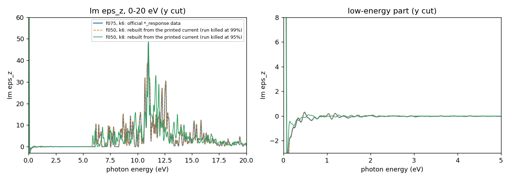
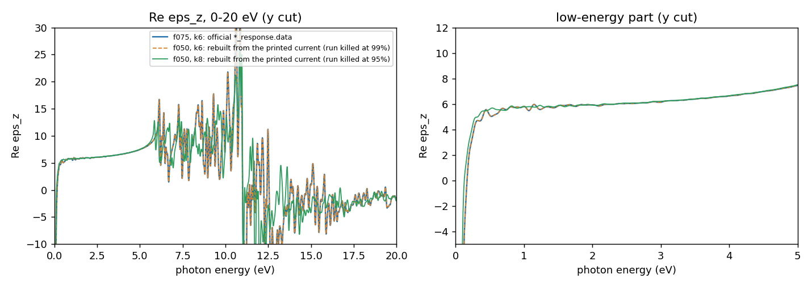
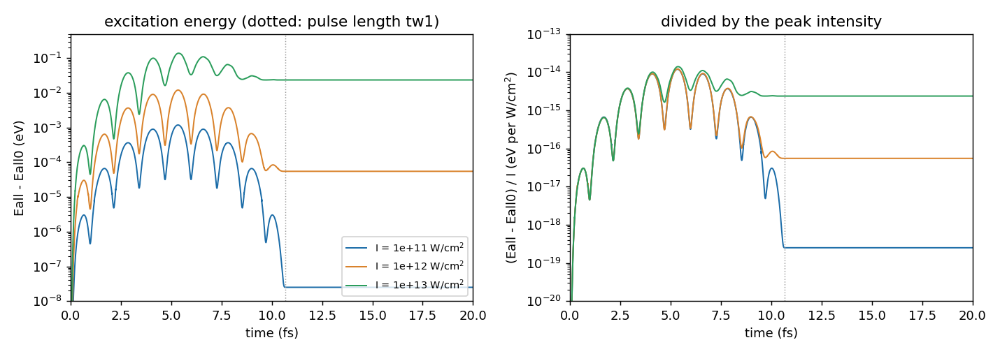
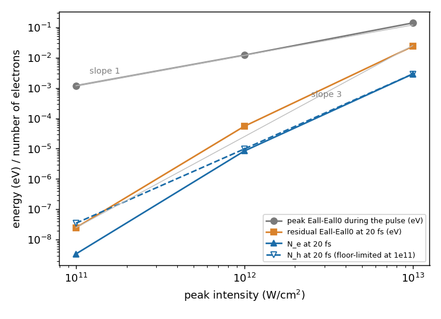

# Learning objective

Run a real-time linear response (`theory = 'tddft_response'`, impulse) and a
real-time pulse (`theory = 'tddft_pulse'`) for a hard, light-element crystal on
the fine grid that its ground state suggested, and read what the results do and
do not show. Learn how the explicit time-step limit follows the grid and drives
the cost; how to check a time step by comparing two spectra; why a k mesh that
looks fine for the ground state energy is not converged for the high-energy part
of `Im eps`; how the energy and the number of excited electrons left after a
pulse scale with intensity; and what to do when a long linear-response run is
killed before SALMON writes its spectrum.

> **Draft; pending maintainer confirmation.** Every convergence statement in
> this tutorial is **provisional (Claude) — awaiting maintainer confirmation**
> unless a row of the [Judgment record](#judgment-record) says that the
> maintainer judged it. They were made by the AI assistant that drafted this
> tutorial, from the figures and numbers shown below. No human has judged these
> figures. **The k mesh is not converged and no value is proposed. The grid
> (r = 32) was not tested for the linear-response or pulse runs at all; the
> maintainer commented that it is probably stricter than needed.** The pulse
> runs were done at one k mesh (6 x 6 x 6) and one grid. Everything that was not
> varied was an assumption of the assistant; it is listed in
> [Assumptions](#assumptions-made-by-the-assistant).

# Summary

All runs are for diamond (2-atom primitive fcc cell, a = 3.567 Angstrom, FHI98PP
LDA, `xc = 'PZ'`, `nstate` = 8, `num_rgrid` = 32^3, SALMON v2.3.0), starting from
the ground state of SALMON-TUTORIAL-010 at k = 6^3. The time step was set as a
fraction (50, 75, 100 %) of an analytic estimate of the stability limit of the
4th-order Taylor propagator, 1.04e-4 fs at this grid. The results were as
follows.

- **Time step.** 400-step probes at 50, 75 and 100 % of the estimated limit were
  all stable. Two full 50 fs linear-response runs, at 75 % (finished) and 50 %
  (killed at 99 % of the steps, spectrum rebuilt from the printed current), agree
  within 0.043 % of the peak of `Im eps_z` over 1-15 eV; above 5 eV the difference
  is at most 0.009 %. Provisional choice for the response: **75 % of the estimate
  (7.8e-5 fs)**. The pulse runs used 50 % (5.2e-5 fs) and were not repeated at
  75 %.
- **Spectrum.** `Im eps_z` is zero below an onset at 6.1 eV (|Im eps_z| < 0.3 from
  1 to 5 eV) and its largest peak is 48.3 at 11.0 eV. `Re eps_z` has a plateau of
  5.8 to 5.9 at 1-2 eV. The spectrum is a forest of narrow lines: the 6 x 6 x 6 mesh
  is coarse and the 50 fs current is not damped.
- **k mesh, 6^3 against 8^3** (50 % time step, both rebuilt). Below 5 eV, where
  `Im eps_z` is empty, the difference is 0.6 % of the peak, and the `Re eps_z` plateau
  moves by +0.5 %. From 5 eV up, `Im eps_z` differs by up to 32 % (5-10 eV) and 48 %
  (10-15 eV) of the peak. **Not converged in k for the high-energy structure**; no
  denser mesh was run, so no value is proposed.
- **Low frequency.** As for Si (SALMON-TS-008, named without a link because it was
  on a draft branch when this was written), the default analysis leaves a spurious
  rise below about 0.1 eV (`Im eps_z` = 646 at 0.01 eV). The `yn_lr_w0_correction = 'y'`
  option removes the divergence (`Re eps_z` at 0.01 eV from -150 to -0.6 in an offline
  re-transform) but not the ringing; the static value is read from the 1-2 eV plateau.
- **Pulse, 1.55 eV, 20 fs, 1e11 / 1e12 / 1e13 W/cm^2** (k6). The peak excitation
  energy during the pulse scales linearly with intensity (exponent 1.03). The energy
  and the number of excited electrons left after the pulse scale as I^2.6 to I^3.4
  (average I^3.0), i.e. as a multiphoton process, with about 6.5 to 8 eV per excited
  electron. At 1e11 the printed excited-hole number is ten times the electron number
  and is at the resolution floor of the projection.
- **Cost.** The time step at this grid is tiny (5e-5 fs), so 20 fs is 3.8e5 steps and
  50 fs is 0.64 to 0.96 million steps: 5 to 6.5 h per run. The cost per step does
  not fall in proportion to the k points per process, and two runs sized from such a
  scaling were killed at the elapse limit. The maintainer commented that r = 32 is too
  strict for the ground state and that the grid for the time-dependent runs depends on
  the laser conditions. By the r^5 cost scaling, r = 24 would cost about 4 times less;
  it was not run.

These are observations for one model: one diamond cell at the experimental
lattice constant, PZ-LDA, FHI98PP without a core correction, no spin-orbit coupling,
one grid, one coarse k mesh for the pulse, SALMON v2.3.0.

## Context and objective

Tutorial SALMON-TUTORIAL-010 (named without a link, because it was on a draft branch
when this was written) converged the ground state of the same cell and found that
the density of states needs a finer grid and a much denser k mesh than the total
energy. This tutorial uses its ground-state restart data for the next two
observables, both time-dependent: the linear dielectric response and the
response to a few-cycle pulse. SALMON-TUTORIAL-009 (the Si linear response, also named
without a link) fixed the time-step and propagation-time questions for Si. Diamond
differs by its short bond and hard pseudopotential, which force a fine grid and
therefore a small time step.

**Judgment rule used in this tutorial.** Convergence is judged from overlays of
`Im eps_z` and `Re eps_z`, and from point-wise differences. The numbers are
reference values; no script decides convergence. For each judgment the reasons and
the alternatives that were rejected are in the
[Judgment record](#judgment-record). The definitions are:

- max diff = 100 * max over a stated energy range of |y(b) - y(a)| / (peak of
  `Im eps_z` of rung b over 1-15 eV), where b is the denser or finer rung of the pair
  and y is `Im eps_z` unless stated otherwise;
- "peak" = the largest `Im eps_z` over 1-15 eV;
- a range is called empty where `Im eps_z` is below 0.3 (the 1-5 eV range here); a
  percentage of the peak taken there describes numerical noise, not agreement of
  physics.

## Conditions

- SALMON: v2.3.0, tag `v.2.3.0`, commit
  `30ba64694ec761cdb6288f01a75b8bcabf05721f`, unmodified for every run.
- Platform: Fugaku (A64FX), Fujitsu compiler, `-Kfast`, SSL2. Four MPI processes per
  node, 12 OpenMP threads per process, k parallelisation only (`nproc_k` = number of
  processes, `nproc_ob = 1`, `nproc_rgrid = 1,1,1`). Runs used 6 to 64 nodes.
- Structure: diamond, primitive 2-atom fcc cell, a = 3.567 Angstrom (experimental),
  atoms at reduced coordinates (0.05, 0.05, 0.05) and (0.30, 0.30, 0.30),
  `yn_symmetry = 'n'`.
- Pseudopotential: ABINIT FHI98PP LDA `06-C.LDA.fhi` (4 valence electrons,
  `lloc_ps = 2`, no nonlinear core correction), `xc = 'PZ'`, `nelec` = 8,
  `nstate` = 8, fixed occupations (`temperature_k` not set).
- Ground state: `theory = 'dft'`, 32^3 grid, k mesh 6^3 (and 8^3 for the k comparison),
  `write_gs_restart_data = 'all'`, converged to `threshold = 1d-9` (276 and 286
  iterations). Each time-dependent run reads the restart data of the ground state with
  its own k mesh.
- Response: `theory = 'tddft_response'`, `ae_shape1 = 'impulse'`, polarisation z,
  `de` = 0.01 eV, `nenergy` = 3000, analysis with SALMON's default window and no damping,
  `yn_lr_w0_correction = 'n'` (default). Length 50 fs (`nt` x `dt`).
- Pulse: `theory = 'tddft_pulse'`, `ae_shape1 = 'Acos2'`, `omega1` = 1.55 eV,
  `tw1` = 10.672 fs, polarisation z, `I_wcm2_1` = 1e11, 1e12, 1e13 W/cm^2, total
  length 20 fs, `projection_option = 'gs'` with `out_projection_step = nt/100`.
- Time step: the stability of the 4th-order Taylor propagator requires |dt * E_max| <
  2.83, where E_max is the highest kinetic energy on the grid. For this primitive cell
  at r32, an analytic estimate from the finite-difference stencil gives
  E_max = 659 Hartree and a limit of 1.04e-4 fs (an estimate that ignores the
  potential energy, not a measurement). The time step of a run is a fraction of it:
  50 % = 5.2e-5 fs, 75 % = 7.8e-5 fs, 100 % = 1.04e-4 fs.

## Procedure

1. **Ground states with restart data** at 32^3, k6 and k8 (`write_gs_restart_data = 'all'`).
   SALMON does not check that a restart matches the deck, so the job script checked the
   grid, the k mesh, `nstate`, the cell and the exact file sizes (`wfn.bin` = number of k
   points x `nstate` x grid points x 16 bytes) of the ground state before every
   time-dependent run.
2. **Time-step probes**: 400 steps of the response run at 50, 75 and 100 % of the estimated
   limit, k6, 6 nodes. They show stability and measure the cost per step; they cover
   only 0.02 to 0.04 fs.
3. **Linear response, 50 fs**: k6 at 75 % (finished), k6 and k8 at 50 % (killed, see the
   results). The time-step comparison is one pair at k6, the k comparison one pair at 50 %.
4. **Pulse runs**: three intensities at k6 and 50 % of the limit, one per intensity.
5. **Compare** with [scripts/make_figures.py](scripts/make_figures.py)
   (`make_figures.py <data dir> <figure dir>`; one sub-directory per run). It draws the
   figures, prints every number quoted below (the printed output is in
   [provenance/figure-script-output.txt](provenance/figure-script-output.txt)) and
   contains the rebuild of a spectrum from the printed current.

**Rebuilding a spectrum from a killed run.** SALMON writes `*_response.data` only after
the last time step. If the job is killed earlier, the file does not exist, but the
standard output of the root rank prints every 10th step the time, the three components of
the current `Jm` (atomic units), the electron number and the total energy. The script
redoes the transform of `write_response_3d` (`src/io/write.f90`): current times the
window `1 - 3 x^2 + 2 x^3` (`x` = time over the planned length), Fourier sum, division by
the impulse strength (1e-2 atomic units, the default) and `eps = 1 + 4 pi i sigma / omega`,
summing over the printed steps. On the run that finished (75 %) the rebuild reproduces the
official file to 0.004 % of the peak (`Im eps_z`) and 0.0007 % (`Re eps_z`), 1-15 eV.
The killed runs stopped at 49.50 fs (99.0 %) and 47.37 fs (94.7 %) of the planned 50.00 fs;
the window there is 3e-4 and 8e-3, and cutting the series of the finished run at those
times changes its spectrum by 0.008 % and 0.038 % of the peak. These spectra are
diagnostics, **not official outputs**, and are labelled as such in the figures.

The representative inputs are
[inputs/diamond-gs-restart-r32k06.inp](inputs/diamond-gs-restart-r32k06.inp) (ground state
with restart data),
[inputs/diamond-lr-impulse-r32k06-f075.inp](inputs/diamond-lr-impulse-r32k06-f075.inp)
(response, 75 %) and
[inputs/diamond-rt-pulse-r32k06-1e12.inp](inputs/diamond-rt-pulse-r32k06-1e12.inp)
(pulse, 1e12 W/cm^2). They differ from the executed decks in `sysname`, the
pseudopotential path, the restart path and comments. The executed decks read the
ground state through a relative path to the neighbouring run directory (`../<ground state>/data_for_restart/`);
the representative decks use `./restart/`, which must hold `info.bin`, `occupation.bin`,
`rho_inout.bin` and `wfn.bin` of the matching ground state. The path SALMON reads is
stored in a 100-character string, so a long absolute path is truncated.

## Observed result

### 1. Time step (k6, 32^3)

| fraction of the estimated limit | dt (fs) | probe, 400 steps | full 50 fs run |
|---|---:|---|---|
| 50 % | 5.2e-5 | stable | killed at 99.0 %, spectrum rebuilt |
| 75 % | 7.8e-5 | stable | finished (official spectrum) |
| 100 % | 1.04e-4 | stable, no growth within 400 steps | not run |

In the probes the current has the same value at equal physical time for the three time
steps (to 6 digits at 0.0208 fs), the electron number is constant to 1e-8 and no value
is non-finite. 400 steps (0.02 to 0.04 fs) are far too few to exclude a slow instability
at 100 %; that was not tested.

Pairwise comparison of the two 50 fs runs at k6, `Im eps_z`:

| range (eV) | max diff (% of peak) | where (eV) |
|---|---:|---:|
| 1-5 (empty) | 0.043 | 1.04 |
| 5-10 | 0.009 | 5.05 |
| 10-15 | 0.006 | 10.83 |
| 1-15 | 0.043 | 1.04 |

The largest difference is in the empty part of the spectrum (`Im eps_z` of about 0.2
there, an absolute difference of 0.02). It is not the truncation of the killed run: with
both series cut at the same time it is 0.037 %, and the rebuild error is 0.004 %. Where the
spectrum is not empty the two time steps agree to 0.01 % (0.007 % over 5-10 eV with the
matched cut). The time-step ladder has two members;
it was not run at 25 % (the pre-run estimate was 11.6 h at 27 nodes) and the pulse was not repeated
at another time step.

### 2. The spectrum (k6, 75 %, official)

The three curves are: official `*_response.data` of the 75 % run at k6 (blue, partly under
the dashed curve), the 50 % run at k6 and at k8, both **rebuilt from the printed current
(run killed at 99 % / 95 %)**. In the figures the y axis is cut; the low-frequency spike
is outside it.

- `Im eps_z` is empty (|value| < 0.3) from 1 to 5 eV and rises at 6.1 eV. The largest
  peak is 48.3 at 11.00 eV; there are further lines near 12.5 eV (about 30) and 6-10 eV.
  The onset is the lowest vertical transition on this k mesh; the gap printed by the ground
  state is a different, smaller number and is not compared here.
- `Re eps_z` is flat at 5.8 to 5.9 over 1 to 2 eV (mean 5.808, 5.475 to 5.963) and is
  5.84 at 1.5 eV. Its value at 0.5 eV (5.11) is still affected by the low-frequency artefact
  of section 4. The static dielectric constant is read here from the plateau and is
  not a converged diamond value: the spectrum is for one coarse k mesh.
- The lines are narrow because the k mesh is coarse and the current is undamped (the
  current at the end of the 50 fs run is still about 10 % of its initial value).

### 3. k mesh, 6^3 against 8^3 (50 % time step, 32^3)

Both spectra rebuilt from the printed current and from the series cut at the shorter stop time
(47.37 fs):

| range (eV) | max diff (% of the k8 peak) | where (eV) |
|---|---:|---:|
| 1-5 (empty) | 0.62 | 1.19 |
| 5-10 | 32.4 | 9.80 |
| 10-15 | 48.2 | 11.65 |

The largest peak is 48.26 at k6 and 48.92 at k8 (+1.4 %), both at 11.0 eV. The `Re eps_z`
plateau (1-2 eV mean) is 5.808 at k6 and 5.837 at k8 (+0.5 %) and its spread narrows
(5.47 to 5.96 against 5.74 to 5.97). The 0.6 % below 5 eV is the difference between two
empty spectra and says nothing about convergence; the large differences are the line
positions and heights above 5 eV, which a denser mesh redistributes. The truncation
error of the rebuild (0.04 % of the peak) is about a thousand times smaller than these
differences, so they are the k mesh. This is the same kind of statement as for the
ground-state DOS of SALMON-TUTORIAL-010: a coarse mesh gives a spiky spectrum, and
k8 is only slightly less coarse. **Not converged in k; no denser mesh was run.**

### 4. Low-frequency artefact and `yn_lr_w0_correction`

Below about 0.1 eV the default analysis gives a large spurious value: `Im eps_z` = 646 at
0.01 eV and -5.6 at 0.1 eV, `Re eps_z` = -150 at 0.01 eV and -14 at 0.1 eV (official
file). With the option `yn_lr_w0_correction = 'y'` (namelist `&analysis`; acts only for a
periodic system with fixed occupations) the window-weighted mean of the current is removed
before the transform. We checked it **offline**, on the printed current of the finished
75 % run, with the same rebuild: `Im eps_z` at 0.01 eV goes from 646 to -1.0 and
`Re eps_z` from -150 to -0.6 (-0.61); the peak is unchanged (48.2636 against 48.2634; max
difference 0.005 % of the peak over 1-15 eV). The ringing of the undamped response
remains: `Re eps_z` is 5.5 at 0.1 eV against 5.8 on the plateau, and the 1-2 eV mean
changes from 5.808 to 5.897 (1.5 %). The static value therefore depends on this analysis
choice at the 1 to 2 % level. The option was **not** used in any SALMON run of this
tutorial. The mechanism for Si is described in SALMON-TS-008.

### 5. Pulse: intensity scaling (k6, 32^3, 50 % time step)

`Eall - Eall0` is column 3 of `*_rt_energy.data`; the number of excited electrons and holes
(`N_e`, `N_h`) are columns 2 and 3 of `*_nex.data`, written 101 times. In the left panel
the energy rises and falls with the field and then stays at a constant residual after the
pulse (dotted line: `tw1`); in the right panel it is divided by the peak intensity, and
during the pulse the three curves coincide, i.e. the energy is linear in intensity there.

| I (W/cm^2) | peak Eall-Eall0 (eV), at t | residual at 20 fs (eV) | N_e at 20 fs | N_h at 20 fs | residual / N_e (eV) |
|---|---|---:|---:|---:|---:|
| 1e11 | 1.19e-3, 5.34 fs | 2.50e-8 | 3.41e-9 | 3.51e-8 | 7.3 |
| 1e12 | 1.20e-2, 5.34 fs | 5.49e-5 | 8.40e-6 | 9.81e-6 | 6.5 |
| 1e13 | 1.39e-1, 5.36 fs | 2.35e-2 | 2.89e-3 | 2.89e-3 | 8.2 |

Exponents p in (ratio of the quantity) = (ratio of intensities)^p:

| quantity | 1e11 to 1e12 | 1e12 to 1e13 | 1e11 to 1e13 (average) |
|---|---:|---:|---:|
| peak energy during the pulse | 1.01 | 1.06 | 1.03 |
| residual energy at 20 fs | 3.34 | 2.63 | 2.99 |
| N_e at 20 fs | 3.39 | 2.54 | 2.96 |
| N_h at 20 fs | 2.45 | 2.47 | 2.46 |

- The residual is the part of the energy that the system keeps after the field is gone,
  i.e. real excitation; it scales as the third power of the intensity, bending towards a
  lower exponent between 1e12 and 1e13. The photon energy (1.55 eV) is far below the
  lowest vertical transition on this mesh (6.1 eV; the LDA gap is about 4 eV), so this is
  multiphoton absorption. The exponent is below the number of photons that one would count
  from the gap (four photons are 6.2 eV); the reason was not examined (a pulse of 10.7 fs has
  a bandwidth of about 0.4 eV, and the effective order can differ from the photon count).
- Energy per excited electron is 6.5 to 8.2 eV, between four and five photons of 1.55 eV
  (6.2 and 7.75 eV). This is a reading of the numbers, not a test.
- At 1e11, `N_h` (3.5e-8) is ten times `N_e` (3.4e-9), and the electron-hole difference
  during the pulse (1e-4) is as large as the numbers themselves. The projection (CG to
  1e-6) is at its resolution there. The ratio residual / `N_e` (7.3 eV) agrees with the
  other two intensities, residual / `N_h` (0.7 eV) does not, so `N_e` and the energy are more
  credible than `N_h` at 1e11 (the dashed curve in the second figure).
- Each run finished all 384700 steps. The electron number printed in the standard output
  is 8.00000000 in every row (resolution 1e-8), no value in `rt.data`, `rt_energy.data`
  or `nex.data` is non-finite, and the current and the energy are flat after the pulse
  (at 1e13 the energy changes by below 1e-4 relative between 12 and 18 fs).

### 6. Cost

| run | nodes (k per process) | steps | elapse used / limit | seconds per step |
|---|---|---:|---|---:|
| response probe, 400 steps | 6 (9) | 400 | 39 s | 0.0698 |
| pulse, 1e12 | 9 (6) | 384700 | 5 h 14 min / 7 h 27 min | 0.049 |
| response, 75 %, k6 | 18 (3) | 641100 | 4 h 53 min / 6 h 13 min | 0.0273 |
| response, 50 %, k6 | 27 (2) | 961600 | killed at 99.0 %, 6 h 13 min / 6 h 13 min | 0.0235 |
| response, 50 %, k8 | 64 (2) | 961600 | killed at 94.7 %, 6 h 13 min / 6 h 13 min | 0.0246 |

(Seconds per step: the probe from SALMON's printed "rt iterations" time over 400 steps, the
pulse and the finished response run from the printed total calculation time over the steps, the two
killed runs from the elapse time over the steps reached, which includes the start-up. The pulse
runs include the periodic projections, so they are not a clean comparison with the response runs.
The 1e11 and 1e13 pulse runs took 5 h 09 min and 5 h 17 min.)

The number of steps is what makes diamond expensive: the stability limit scales with the
square of the grid spacing, so r = 32 needs 5e-5 fs where Si at r = 28 used 5e-4 fs. A
20 fs pulse is 3.8e5 steps and a 50 fs response is 0.64 to 0.96 million. The cost per step
scales with the grid points (r^3), so the cost of a run scales as r^5 at fixed k and
length. The pre-run estimate for k6 and 50 % was 36, 81, 157, 295 node-hours at r = 24, 28,
32, 36 (an extrapolated model, not a measurement), i.e. **r = 24 would cost about
4 times less than r = 32; it was not run.** The time per step is not proportional to the
number of k points per process: from 9 to 2 k points per process it falls only by a factor
of three (0.0698 to 0.0235 s) because a part of the step does not shrink.

## Judgment record

| # | object | conclusion | judged by | what was looked at | reason, including rejected alternatives |
|---|---|---|---|---|---|
| 1 | time step for the response | 75 % of the estimated limit (7.8e-5 fs) | provisional (Claude) — awaiting maintainer confirmation | stability probes at 50/75/100 %; pair of full 50 fs runs at 50 % and 75 % at k6 | The pair agrees to 0.043 % of the peak (0.009 % above 5 eV), so 50 % does not change the answer. 100 % was stable for 400 steps only and was not used in production; 25 % was not run (about 11.6 h at 27 nodes by the pre-run estimate). The estimate itself is analytic (it ignores the potential energy); the full runs at 75 % and 50 % are the evidence that it is usable. One pair at one grid and one k mesh. |
| 2 | time step for the pulse | 50 % used; not tested against another | assumed by Claude | none (no pulse was repeated at another time step) | The response test suggests that 75 % would do for a pulse too, but the pulse has a different field and a projection; a 75 % pulse run and a 25 % one were planned and not run. |
| 3 | k mesh | none; 6^3 and 8^3 differ by 32 % (5-10 eV) and 48 % (10-15 eV) of the peak | provisional (Claude) — awaiting maintainer confirmation (the observation, not a value) | overlays and point-wise differences of the rebuilt k6 and k8 spectra | The high-energy lines move between the two meshes; the pairs below 5 eV are empty and tell nothing. The ground-state DOS of SALMON-TUTORIAL-010 was not converged at 24^3 either. A denser mesh is expensive: the pre-run estimate was about 7e2 node-hours at k10 and 1.3e3 at k12 for one 50 fs run (extrapolated, not measured). The pulse runs were done at k6 for cost; their absolute numbers (energy, `N_e`) are for that mesh and were not tested against k8. |
| 4 | real-space grid | r = 32 used, not tested for the response or the pulse; maintainer: r = 32 is too strict for the ground state, and the final r depends on the laser conditions | maintainer (2026-10-06), about the ground state and the dependence on the laser parameters; no response or pulse ladder in r was run | none for the time-dependent runs | The grid came from the ground-state ladder (r28 to r32 DOS differences 0.08 %). The cost scales as r^5; r = 24 would cut it to about a quarter. Whether the response or the pulse observables converge at r = 24 was not run. |
| 5 | propagation time and window | 50 fs, default window, no damping | assumed by Claude | none | Not a convergence choice: with the default window the spectrum changes with the length (SALMON-TS-008 for Si). 50 fs resolves lines about 0.08 eV apart (2 pi hbar over 50 fs); diamond's undamped current is still about 10 % of its start at the end. Spectra from different lengths must not be compared as if converged. |
| 6 | static dielectric constant | read from the 1-2 eV plateau of `Re eps_z`: 5.8 to 5.9 (k6, k8); not a converged value | provisional (Claude) — awaiting maintainer confirmation | `Re eps_z` at 0.5-2 eV, with and without the offline `yn_lr_w0_correction` | The value at 0.5 eV (5.11) is inside the low-frequency artefact; the correction moves the plateau mean by 1.5 %; the mesh is coarse. |
| 7 | rebuilt spectra from the killed runs | usable as diagnostics, not as official results | provisional (Claude) — awaiting maintainer confirmation | rebuild against the official file of the finished run; cut-off test | Rebuild error 0.004 % of the peak; cut error 0.008 % and 0.038 %. Used only for the time-step pair and the k pair, which are 10 to 1000 times larger. |
| 8 | intensity scaling and the hole number at 1e11 | exponents as in the table; `N_h` at 1e11 is at the projection floor | provisional (Claude) — awaiting maintainer confirmation | energy, `N_e`, `N_h` at three intensities | `N_h` is ten times `N_e` at 1e11 and the energy per hole is inconsistent with the other two intensities, so it is not used. Which multiphoton channel dominates was not tested. |

## Assumptions made by the assistant

These were fixed by the drafting assistant, not varied, and are not convergence results.

- The lattice constant a = 3.567 Angstrom is the experimental value, not an LDA-relaxed one.
- The primitive 2-atom cell with the atoms at (0.05, 0.05, 0.05) and (0.30, 0.30, 0.30) in
  reduced coordinates, as in the ground-state tutorial; the displacement of the atoms from
  grid points was not tested.
- FHI98PP LDA with 4 valence electrons and no nonlinear core correction, `xc = 'PZ'`; no other
  pseudopotential or functional.
- `nstate` = 8 (four occupied and four empty bands). SALMON propagates the empty bands too;
  the Si tutorial found the response independent of `nstate`, which was not tested here,
  and the excited-electron projection needs the empty bands.
- Fixed occupations, no symmetry reduction, k mesh on the reciprocal primitive axes with the
  half-shifted Monkhorst-Pack mesh and the same mesh in the ground state and the time-dependent run.
- Polarisation along z only; impulse strength is SALMON's default (1e-2 atomic units).
- Analysis grid 3000 points of 0.01 eV (30 eV).
- Pulse: 1.55 eV, `tw1` = 10.672 fs (the value of the official sample), total 20 fs (about
  9 fs of ringdown), `Acos2` envelope, intensities 1e11, 1e12 and 1e13 W/cm^2; the number of
  excited electrons by projection on the ground-state orbitals, 101 times.
- The time step as a fraction of an analytic estimate of the stability limit (potential energy
  ignored).
- The comparison range 1-15 eV and the peak of the finer rung as the scale of the percentages
  are the assistant's choice.
- The ground-state convergence settings (`ncg = 4`, `nscf = 800`, `threshold = 1d-9`, Broyden
  mixing with the defaults) were those of the ground-state tutorial.

## Validation

- Every run was checked for the right number of steps, finite output (full scans of
  `rt.data`, `rt_energy.data`, `nex.data` and `response.data` where written), a constant
  electron number (8.00000000 in the standard output) and no growth of the current after
  the pulse or the impulse. The finished response run prints 8.0000000000 electrons in all
  64110 rows, and its largest current falls from 0.155 in the first tenth of the run to 0.0155
  in the last tenth (units of `rt.data`).
- A time-dependent run was started only after its ground state had converged and its restart
  files had the exact sizes; the job script also compared the grid, k mesh, `nstate` and the
  cell of the ground state with the deck.
- Controlled comparisons: every deck was checked before submission against one plan
  manifest that pins all keys except the compared variable (time step, k mesh, intensity).
- The rebuild from the printed current was validated on the run that finished (see Procedure).
- The excitation numbers (`N_e`, `N_h`) at 1e11 are at the resolution of the projection (see
  section 5).
- **Not validated:** no human has judged the figures. The k mesh is not converged and no value
  is proposed. The grid was not varied for the response or the pulse. The pulse was run at k6
  and one time step only, so the intensity exponents and the energy per electron are for that
  mesh and have not been tested at k8 or another grid. The time step 100 % of the estimate was
  stable for 400 steps only. The k comparison is between two rebuilt spectra of runs that were
  stopped before the end. `yn_lr_w0_correction = 'y'` was not run in SALMON. The dependence on
  the length of the response run, the x and y polarisations, other broadenings, other
  pseudopotentials and other materials were not examined. A current in x and y of about 10 %
  of the z current after a z impulse was seen in the finished run; it was not investigated (a
  candidate is that the half-shifted k mesh does not have the full cubic symmetry), and only
  `eps_z` is reported.

## Surprises and failures recorded

- **Two 50 fs response runs were killed at the elapse limit and left no spectrum.** The jobs
  were sized by an estimate of 0.0178 s per step (times 1.3) that came from a cost per step
  proportional to the number of k points per process, extrapolated from a 9 k-points-per-process
  probe to 2 per process. The measured 0.0235 to 0.0246 s per step (1.3 to 1.4 times more)
  used up the whole padding; the run needed about 6 h 17 min (k6) and 6 h 34 min (k8) at the
  measured rate against a limit of 6 h 13 min. SALMON writes `*_response.data` only after the
  last step, so nothing was written. The physics was healthy (electron number constant, no
  non-finite values); the current was in the standard output and the spectra were rebuilt from
  it. About 5.7e2 node-hours produced diagnostics only. A troubleshooting entry for this
  (**candidate**, not yet written): a killed linear-response run has no spectrum, the current
  can be recovered from the printed table, and the speed of a long run should be measured at
  the production number of k points per process before sizing the limit.
- **The low-frequency artefact was as large as for Si** (`Im eps_z` = 646 at 0.01 eV); the
  y axes of all figures are cut because of it.
- **The k mesh that serves the ground-state energy does not serve the spectrum**, in the same
  way as in the ground-state tutorial for the DOS: k6 and k8 differ by up to 48 % of the peak
  above 5 eV.
- **At 1e11 W/cm^2 the number of excited holes is ten times the number of electrons**, which
  cannot be physical (electrons and holes are created together). It is the resolution floor of
  the projection.

## Lessons learned

- **The time step of an explicit propagator follows the grid.** Diamond at r = 32 needs a
  step about ten times smaller than Si at r = 28. Estimate the limit from the stencil, test at
  a fraction of it with a short probe, then compare two full-length spectra at different
  fractions.
- **Compare spectra where they are not empty.** A percentage of the peak in a range where
  `Im eps` is zero says nothing; give differences by energy range and say where the spectrum
  lives.
- **Do not size a long run from a rate measured at a different number of k points per process.**
  The cost per step has a part that does not shrink. Measure the rate at the production shape,
  for example a few hundred steps on the same nodes and k points per process.
- **A killed response run is not lost if the standard output prints the current.** Rebuild
  the spectrum with the same transform and label it as a diagnostic; check the rebuild on a run
  that finished.
- **The grid for the time-dependent stage is a cost decision.** The ground state suggested
  r = 32; the cost scales as r^5, and the maintainer's comment is that the right r depends on the
  laser conditions. Test a coarser r for the observable that matters before running a long
  campaign at r = 32.
- **Scale with intensity on the residual, not on the in-pulse energy.** The energy during the
  pulse is linear in intensity (virtual polarisation); what is left after the pulse is the
  multiphoton excitation and scales with a high power.

## Limitations and applicability

This tutorial covers one diamond cell at the experimental lattice constant, PZ-LDA, FHI98PP with
4 valence electrons and no core correction, no spin-orbit coupling, `nstate` = 8, 32^3 grid,
k6 and k8 for the response and k6 for the pulse, SALMON v2.3.0 on Fugaku (A64FX).

- The response has two members in time step and two in k; the pulse has one time step, one k mesh
  and three intensities.
- The k mesh is not converged for the spectrum above 5 eV.
- The numbers (static constant, line positions, excitation per intensity) are for these meshes and
  must not be quoted as properties of diamond.
- The grid and the time step are costs as much as parameters here; other conditions (for example a
  coarser grid) change both.

## References

- SALMON official samples `exercise_05_bulkSi_lr` and `exercise_06_bulkSi_rt` in the SALMON v2.3.0
  source tree (tag `v.2.3.0`), as the starting point of the decks (translated here to the
  diamond primitive cell).
- [ABINIT LDA FHI pseudopotential collection](https://www.abinit.org/atomic_data/psps/miscellaneous/ATOMICDATA/LDA_FHI/)
- Related tutorials, named without links because they were on draft branches when this card was
  written: SALMON-TUTORIAL-010 (diamond ground state), SALMON-TUTORIAL-009 (Si linear response).
- Related troubleshooting: SALMON-TS-008 (linear-response spectrum depends on the propagation time;
  also on a draft branch). Also on the main branch:
  [TS-002](../../troubleshooting/SALMON-TS-002-printed-gap-depends-on-k-mesh.md).
- Run provenance: [provenance/run.yaml](provenance/run.yaml). Raw outputs are not committed.
